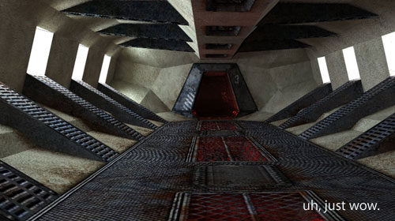
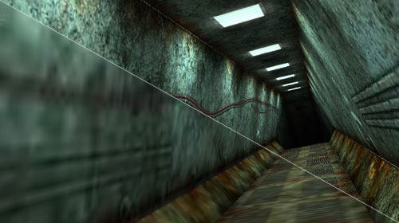

3D Flash engines seem to be popping up everywhere at the moment.  \[Although I wouldn't call that a bad thing\] - Each one tends to take a different approach, do a different demo to distinguish themselves.  Take this for example, a very impressive looking offering from Alternativa3D;

Papervision might have a lot of features and a large fan-base, but I have yet to see such a visually impressive demo \[as this one\].  And they've already sorted the first-person movement and collision detection.  It's also very cool that the demo seems to 'quickstart' - loading low-res textures to get you going as soon as possible, and streaming in higher res. ones while you play.

Progressive textures - how cool is that? (above)

Of course, there's visual trickery going on here - the fantastic visuals are more down to excellent textures, rather than dynamic lighting or raytracing.  But that doesn't mean that the Alternativa3D team doesn't have that on their 'to-do' list...

So, what are you waiting for?  Go check it out at [alternativaplatform.com](http://blog.alternativaplatform.com/en/ 'Open link in a new window').
