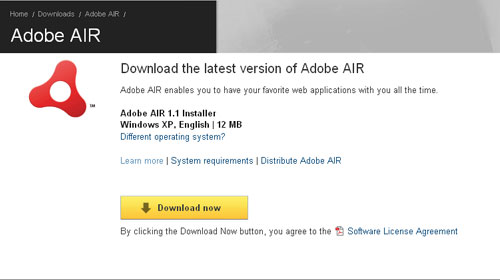

Adobe have just released their first major update to AIR since its release, Adobe AIR 1.1 (catchy!). - The release notes of which you can read [here](http://download.macromedia.com/pub/air/documentation/1_1/adobe_air_1-1_faq.pdf).

Aside from a few tweaks and general updates, and a few requested features making an appearance, the focus for most people seems to be the multilingual capabilities. There's a whole 10 new languages supported.

> Brazilian Portuguese, Chinese (Traditional and Simplified), French, German, Italian, Japanese, Korean, Russian and Spanish.

Strangely enough, that's not very exciting. Well, I guess it makes up a large proportion of the target markets, and covers most of the character sets - but 10 languages seems a little low. Meh.

Releasing a product (of this sort) to a global market - without multilingual support - seemed a bit strange, (or maybe it just highlighted how much we take for granted the features of established products), but now we have those important capabilities. Releasing AIR was always going to be a balancing act for Adobe - you want to release a market-ready product, but also get the product out of the realm of Beta.

## Getting serious?

While home users and developers may be fine with Beta products, businesses and corporations are not so hot with unestablished products, and we've had some concerns over the capabilities of AIR and AIR applications over 'locked-down' networks. Luckily AIR 1.1 goes some way to addressing these issues with it's enhanced Enterprise support;

> **Q: Are there any new deployment features for developers or enterprises?** A: Yes. Developers are now able to silently install the runtime and application with their native installers through the standard Adobe AIR Distribution License Agreement. Enterprises can deploy the runtime and Adobe AIR applications using tools such as Microsoft SMS, IBM Tivoli, or any deployment tool that supports silent installs.

So that's silent installs. And not the malware kind - it looks like this is more aimed at network administrators, and allowing them to manage AIR on a corporate network. So instead of AIR being a mysterious product that IT Support techies could dismiss out-of-hand for having no network control, AIR is now more compatible with the unilateral install policies of many business and educational institutions. - You can even install the runtime but restrict the products that can be installed, apparently.

All we need now is some more real-world information about how an AIR application, with all its' Desktop to Browser, File Saving, Database having magic works on various networks. There's a [useful document on the Adobe site for IT Administrators](http://download.macromedia.com/pub/air/documentation/1_1/air_admin_guide.pdf), that details a lot of the technical specifics, but it's time we found some time to check it out...

### **Bug highlights;**

Some of the bugs that have been fixed are just strange - the kind of things you'd never expect to find...

> Windows: copy/paste doesn't work if caps lock is on

On Windows, AIR applications can now be uninstalled even if AIR has already been uninstalled.

### **Getting updated;**

**Client:** All existing users of the Adobe AIR 1.0 runtime will get a notification and/or automatic download/update to the Adobe AIR 1.1 runtime within approx. 30 days of the 1.1 release (Adobe AIR has a 30 day automatic update check-cycle thingie).

**Developers:** Dreamweaver developers can [get the updated extension here](http://kb.adobe.com/selfservice/viewContent.do?externalId=kb403908&sliceId=1&devcon=f1b). Flash and Flex developers get a little kick in the teeth and have to go through [this technote for Flash](http://kb.adobe.com/selfservice/viewContent.do?externalId=kb403682&sliceId=1) or [this technote for Flex](http://www.adobe.com/devnet/flex/articles/flex_air1.1.html) to update to AIR 1.1.

## Resources;

- [Get Adobe AIR 1.1](http://get.adobe.com/air/)
- [AIR for IT administrators](http://www.adobe.com/go/air1-1faq)
- [Adobe AIR 1.1 Release notes](http://www.adobe.com/go/air1-1faq)
