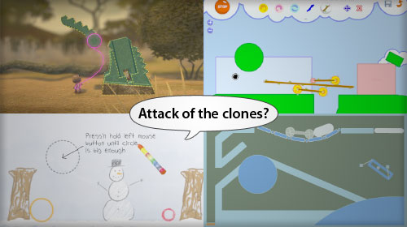

It seems like fun physics games are on the rise - there's [Launchball](http://www.sciencemuseum.org.uk/launchpad/launchball/), which I've [mentioned before](http://www.psyked.co.uk/adobe/flash/launchball-an-awesome-flash-game.htm) \- but there also seems to be a rise in the numbers of other simple physics games created in Flash. Maybe its because of as3 libraries like [APE](http://www.cove.org/ape/index.htm) making development easier, maybe commerical games like [Little Big Planet](http://www.littlebigplanet.com/en_GB/) are what drive innovation (imitation?), maybe its even just down to the arrival of Actionscript 3 and its enhanced processing abilities. Whatever the reason, games like [Fantasic Contraption](http://fantasticcontraption.com/) and [Magic Pen](http://www.miniclip.com/games/magic-pen/en/) have appeared on the scene, and are well worth a play.  (Just don't start playing when you should be working, otherwise you'll be in trouble.)

If you like those games, you can use classes like [APE](http://www.cove.org/ape/index.htm) to start building your own...

## Links;

*   [APE - Actionscript Physics Engine](http://www.cove.org/ape/index.htm)
*   [Launchball](http://www.psyked.co.uk/adobe/flash/launchball-an-awesome-flash-game.htm)
*   [Fantastic Contraption](http://fantasticcontraption.com/)
*   [Magic Pen](http://www.miniclip.com/games/magic-pen/en/)
*   [Little Big Planet](http://www.littlebigplanet.com/en_GB/)