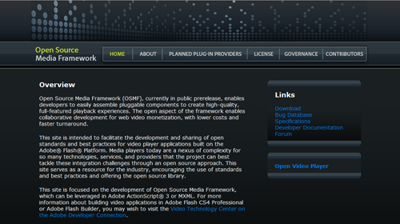

OSMF (Open Source Media Framework) is a new Open Source project from Adobe, designed to make deploying complex video players in the Flash Platform a little bit easier.  [Jodie O'Rourke did a presentation for FlashMidlands on "Intro to OSMF"](http://www.jodieorourke.com/view.php?id=111&blog=news), and here's my thoughts and notes from that presentation.

### Download OSMF (and the official project page):

*   [http://www.opensourcemediaframework.com/](http://www.opensourcemediaframework.com/)
*   [http://opensource.adobe.com/wiki/display/osmf/Open+Source+Media+Framework](http://midlands.webmail.mmtdigital.co.uk/exchweb/bin/redir.asp?URL=http://opensource.adobe.com/wiki/display/osmf/Open%2BSource%2BMedia%2BFramework)
*   You can find more technical details & code examples on [Jodie's blog.](http://www.jodieorourke.com/view.php?id=111&blog=news)

### Why OSMF is needed:

Flash video is one of the primary driving forces behind the popularity of the Flash Plugin, but for something so key to the plugin its awfully difficult to implement anything clever.  The basic components such as FLVPlayback are buggy and the basic elements, such as NetStream are frustratingly quirky and difficult to extend.  We’re all familiar with the idea of a playlist and also annoyingly familiar with the idea of in-content advertising, but to actually implement any of this ourselves we have to build it from the ground up.  YouTube have done it, Hulu have done it, CBS, BBC, ITV, E4 and many more all use similar concepts, but they’re all built from scratch each time.

OSMF is coming as a framework for developing exactly this kind of functionality in a completely flexible way, lowering the ‘barrier to entry’ for developing this sort of thing, and promising to encapsulate all of the known bugfixes and hacks for the inconsistencies of the current technologies in a nice clean new element.  (That, and because of something Silverlight does or is threatening to do.)

### For non-techies:

OSMF represents a scalable technology that can equally be deployed for really simple or really complex projects.  As the FLVPlayback component offers a single video file to play, MediaPlayer (the base class for OSMF) offers a playlist of files to play, and can play them either sequentially or in parallel, or both.  OSMF does not however, currently have a visual representation of the playback controls.  That has to be added in addition to the OSMF framework.

### In more detail:

Instead of passing a single file path to load and play, with OSMF you can pass a list of files, and details of how you’d like to play them.  (You can of course only pass a single file if you like.)  So you could pass in 5 flv files, and tell it to play them in sequence, or you could pass in an image file and an audio file and tell it to play them in parallel.  Or you could pass in a video file and an audio file separately and play them in parallel.  Or, using some of the more advanced features, you could pass a video file with audio and a separate audio file, and tell it to mute the video and play the audio instead.  OSMF is being built to handle practically any file type that Flash can play, and do anything with them.

The way it works is by using metadata, traits, and a whole lot of clever bytearray stuff on the files it loads.  The key traits that govern what you can do with files are ‘spatial’ and ‘temporal’ traits.  A video can be spatial and temporal, an image spatial but not temporal, and an audio file temporal but not spatial, and there’s a whole load of clever ways to work with it and make your code flexible.

It also has a load of features to deal with different content delivery methods, such as http, rtmp and streaming servers.  It has built-in support for things like stream switching (switching to lower quality source streams if your bandwidth is low) and session authentication tokens.

Further to that is the concept of plugins – the idea that you have the core OSMF code and then can bolt on extra features you need.  The first plugin that’s publicly available is for the _Akamai_ CDN, making streaming flash video from the Akamai network much much simpler.

### Current status:

OSMF is being actively developed by Adobe, it’s 3 or 4 months old, is on an average 4 week release cycle, and is on Alpha 0.4 – Alpha 0.5 is due in a few weeks’ time.  It, unfortunately, doesn't support SWF playback support alongside the normal video / audio / image files, but apparently it's in the works.

The downside right now is that the minimum requirement is Flash Player 10 (because of vector code and bytearray introspection), and it’s not a fully released product.  But at least we can start using some of its features soon, even if it’s not quite ready for the mainstream just yet.