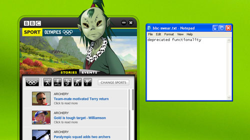

Well, that was fast (and rightly so).  This morning I posted about the [BBC Sports' Olympics AIR Application containing a text file of offensive language](http://www.psyked.co.uk/adobe/apollo/bbc-uses-air-to-install-a-list-of-swear-words-to-users-machines.htm) but now, roughly 1.5 hours after posting here, and 6.5 hours after it being initally posted, a new update has appeared for the Olympics AIR Application.

The release notes mention that it's updating the listing events schedule (which it may well be) but it's also changing the contents of the **bbc-swear.txt** file to say '**deprecated functionality**'. (Instead of 1399 ways to swear.)

Our experence is that the auto-updater appears a little buggy - clicking update seems to start a background download process, and the installer kicks in when the application is fully downloaded.  Unfortunately without a progress indicator, it seems that things just aren't working.  Nevertheless, a little patience and your application should launch the built in Adobe AIR installer soon enough.

Fast (frantic?) work from the BBC!