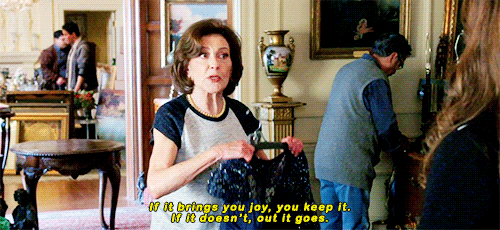
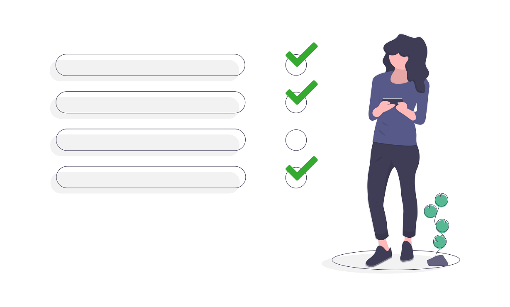

Code reviews are an essential part of developing software. And potentially one of the most challenging parts, because it involves exercising skills that aren’t necessary to write code, like diplomacy, tact and judgement.

A problem that can be solved with code might only have one correct solution, but that solution can be written in many different ways. And many of those different ways satisfy other unwritten criteria, such as execution time, capacity for reuse, simplicity, comprehensibility, portability and consistency.

The [Test-Driven-Development (TDD)](https://en.wikipedia.org/wiki/Test-driven_development) process makes checking technical solutions to problems simpler because it puts an emphasis on identifying problems to be solved and the ways of verifying the technical accuracy of a solution in advance of actually writing any code. But when we perform a code review, we’re looking for more than just the solution to a problem, because that verification is a boolean — the tests either pass, or they fail.

Code reviews are less about the solution and more about the shades of grey, and applying the unwritten rules of software development.

### Unwritten rules

> Having unwritten rules of software development is a bad thing.

Technical solutions are nice because they’re exact, precise and all aspects of them can be quantified. People solutions are complicated because they’re everything else.

Code reviews are the point at which another person comes and looks at the code you’ve written, and picks out its flaws. Maybe the code you’ve written is too complex, maybe it’s too simple. Maybe your variable names aren’t consistent with the rest of the codebase, or it’s not [Object-Oriented](https://en.wikipedia.org/wiki/Object-oriented_programming) enough or it’s not [Functional](https://en.wikipedia.org/wiki/Functional_programming) enough. Maybe, maybe, maybe.

That’s the trouble with code reviews — they can be subjective, inconsistent in their scrutiny or based on unpredictable criteria.

### Don’t stop reviewing!

We shouldn’t do away with code reviews. Code reviews are an excellent tool for maintaining consistency and a shared understanding in a team. Code reviews are an essential part of software development, and they should be done in all directions — juniors reviewing seniors and vice versa.

But code reviews can easily feel like personal attacks, which is why we have things like the [Prime Directive](https://retrospectivewiki.org/index.php?title=The_Prime_Directive):

> Regardless of what we discover, we understand and truly believe that everyone did the best job they could, given what they knew at the time, their skills and abilities, the resources available, and the situation at hand. — [Norm Kerth](http://www.retrospectives.com/pages/retroPrimeDirective.html)

We can’t control humans. We can encourage better behaviours and be more mindful about the feedback that’s delivered in a review process, but it’s always going to be subjective, for the reviewer and reviewee.

Part of the answer to making code reviews better might well lie in removing the unknown criteria from the process — either by restricting review comments to only criteria specified in the original task, or by broadening scope of the task definition to include all possible ways in which a solution could be evaluated.

### Restricting feedback

Restricting feedback during a review isn’t an approach that’s likely to result in long term happiness and team contentment. Reviews are an opportunity for engineers to express their thoughts, and censoring feedback in one place is only likely to make it emerge again in another channel. Isolating discussions to specific topics tends to lead to an endless series of disconnected conversations that distract from the original problem that spawned them.

### Broader acceptance criteria

Broader criteria can reduce the surprise elements of a code review, but it can quickly become overly prescriptive about the way a problem is solved rather than defining what an acceptable solution looks like. Not only that, broadening the criteria for a task to include all possible measures of acceptable code runs the risk of creating impossible tasks for engineers to take on — solving the problem becomes too daunting, the feasibility of achieving certain criteria might be unknown at the beginning or impossible to satisfy, or the proposed solution is over-engineered and needlessly complex when a simpler solution would suffice.

The best solution to the challenge of making code reviews better likely has nothing to do with what policy or process actually gets put into place to facilitate them. The technical solution is binary — it works, or it doesn’t — but the opinions and experiences of engineers vary, leading to unpredictable results and quality standards in reviews.

A code review has to be organic, as it’s an opportunity for all members of the development team to have oversight and give input on each others’ code prior to it being finalised. It’s an opportunity for everyone to learn and for the team to make collective decisions about the future direction of other tasks.

## The Problem with Code Reviews

The problem with having an organic approach to code reviews is that it seems to encourage purely functional commentary, which focuses only on the things that need to change, and not the elements which are good.

If a code review is only about highlighting the negatives, the overall result is negative. It should have some positives as well. Focussing exclusively on the bad elements, and where changes are perceived to be needed only serves to highlight and exacerbate any underlying divisions in the team. And that’s bad. However well-meaning a review might be, it can be received as a personal attack. We’re human and we respond emotionally to attacks, and negative reviews given improperly sow dissent and can reinforce any underlying differences in age, experience, gender, seniority, organisational structure, culture or personality.

I’m fortunate in that I’m a middle aged white male working in the tech industry, I have years of development experience, I’m the Technical Lead of my team and I’m familiar with my code base. I shouldn’t have a reason to feel attacked when someone reviews my code, and I have no underlying feelings of imposter syndrome or voices that tell me this industry isn’t for me. But not everyone has these luxuries of their background, and even I feel an emotional when my code is reviewed negatively.

### Be kind.

The bottom line to this is, be kind. Be respectful, be diplomatic and give feedback about the positives as well as the negatives — it doesn’t all have to be an actionable list of tasks to complete, and treat it as a review and not a nitpicking exercise. As a team you’re working to create a shared understanding and a unified codebase. Treat your code reviews accordingly.

## Code Review Checklist

I don’t believe that better code reviews can be mandated by any change in processes or ways of working. Code Reviews are a human-driven part of development and as such rely on the behaviours of humans. The best way to encourage behaviours is to lead with them, and to help me lead with them I follow an (informal) checklist which I’ve put together for myself, which looks as follows:

- Has this person contributed code before?

- Are they contributing in the format expected by the team?

- Are the automated tests passing?

- Have new automated tests been added?

- What’s bad about this code?

- What’s good about this code?

- What’s non-critical but worth considering as an extension?

- Is this code production ready?

- What else would I say if we were face-to-face?

And that’s it. No magic formulas I’m afraid, just be a better human.

Illustrations courtesy of [unDraw](https://undraw.co/)
