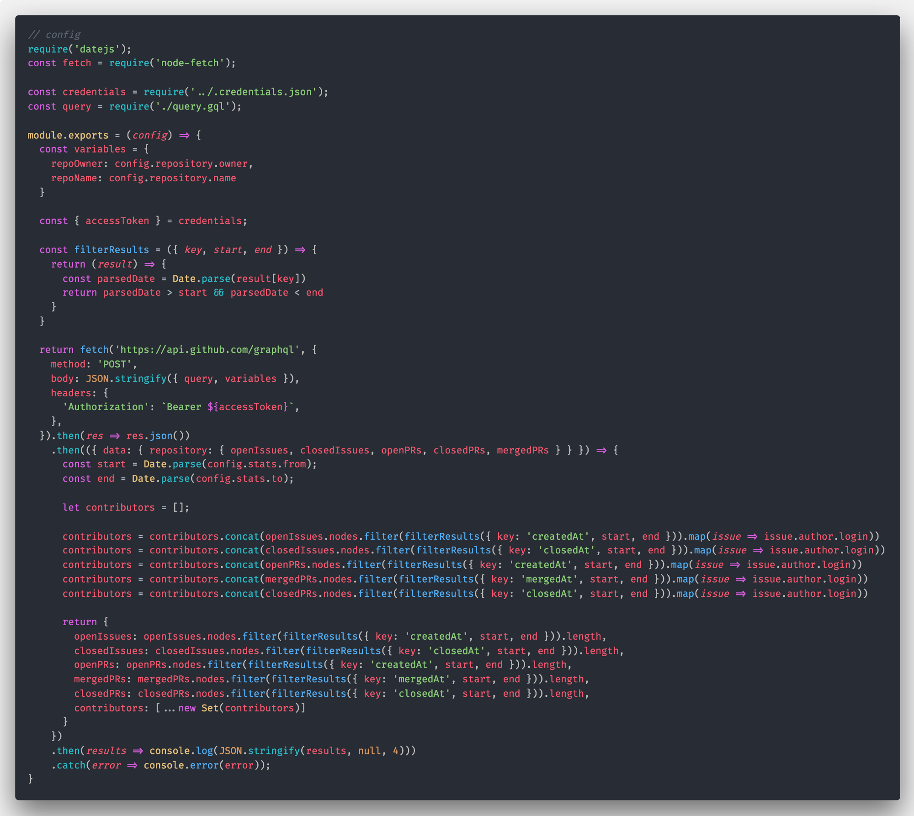
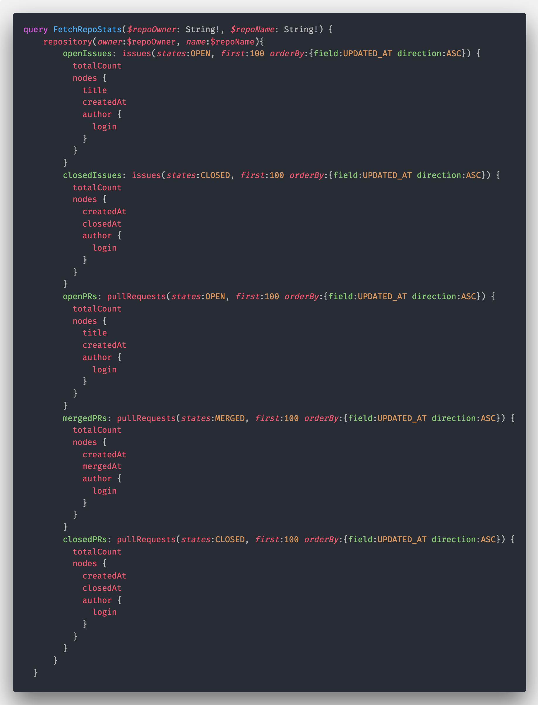
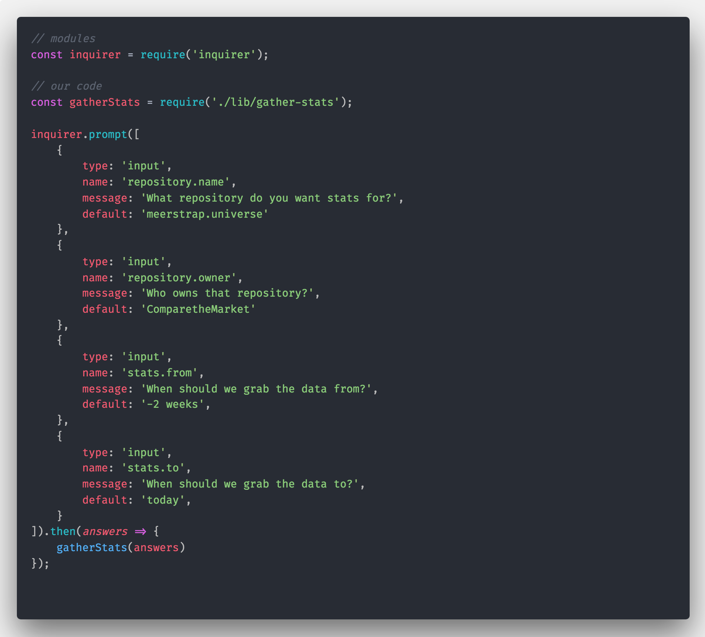

### Background

As a by-product of my day-to-day software development work I have created a lot of specific-task automation scripts. If there’s a task that I need to perform on a fairly regular basis that involves multiple steps and which _could_ be automated, I _will_ (eventually) write myself a script to automate it.

I do this because — generally speaking — I enjoy writing the scripts and because abstracting mundane tasks into these scripts reduces the cognitive overhead and frees my time up for thinking about other aspects of my day-to-day job.

#### Configurable code

It’s well established that hard-coding values into code instantly makes it less reusable, and that extracting those values into code variables is logical because it then becomes easier to reliably make broad changes to the code.

To make a script reusable without actually editing source code each time there are two common strategies. One of them is passing configuration as arguments on the command line, and the other is creating and editing a config file which stores the options in a more long-lived format. Command line arguments are good for one-off commands and config files are great for repeated reuse with the same settings.

#### Problem

Both command line arguments and configuration files require knowledge of the available options and a measure of preparation — neither is quite as easy as a GUI (Graphical User Interface) could make the experience, and neither of them typically have an intuitive interface.

I always assume that in a few months’ time I will have completely forgotten everything about how to configure my scripts, and with no hope of finding assistance on StackOverflow or Google I need to ensure that I make them straightforward and operator-friendly.

---

### A humanised experience 🤖

Essentially I want my command-line interfaces to be a little more human in their interactions with me and behave more like an artificial assistant like Alexa or Siri and less like a computer. That’s a _humanized experience._

Without further ado, let’s make a simple script _more human._

#### Core code

(Below) I have a Node.js script which communicates with the GitHub API to retrieve stats about a repository. It’s currently set up to take a configuration file in JSON format and also returns the output as JSON.

getstats.json

What the code (above) is doing is using the **node-fetch** module to make a request to the GitHub GraphQL API, and then it’s taking the response from that API and doing a bit of processing on the responses before spitting them back out as a string.

The information that’s absent from the source code and which is supplied by the config file is the **repository owner**, the **repository name**, a **start date** and an **end date**, all of which are used to identify the target repository and filter the response data.

For completeness, the GraphQL query used looks like this (below):

query.gql

Now we’ve got the code, how do we actually execute it and fetch our data?

#### Executing scripts with command line options

Without a humanised journey, I’d use a command like this (below) to execute my script return the repository stats:

node index.js psyked psyked.github.io 2018-08-08 2018-08-12

#### Executing scripts with config files

If I was taking the config file approach, I’d create a `.json` file with those settings in, save it as `psyked-config.json` in the same directory and then use the command (below) to run it:

node index.js ./psyked-config.json

It’s a little less to type on each execution and does ensure that the options would be the same each time, but it’s still not user friendly _enough._

#### Humanised command line experiences

The _humanised_ approach starts with only the simplest command (below):

node index.js

From then on it switches over to an interactive experience, which looks like this (below) — asking questions, hinting at responses and finally mapping inputs into the same data structure that would exist in a proper config file.

This experience is all facilitated by a module called **Inquirer**, which adds a really simple layer of code that supports several common types of question to the command line.

[**SBoudrias/Inquirer.js**  
\_Inquirer.js - A collection of common interactive command line user interfaces.\_github.com](https://github.com/SBoudrias/Inquirer.js 'https://github.com/SBoudrias/Inquirer.js')

Inquirer can prompt for several types of data, chain questions together, validate the responses and more. To achieve the questions used in the screen capture above I’m using the following code (below):

index.js

… and that’s about it. Humanised command-line interfaces with Node.js.

The big advantage that this approach has over other options is that playing around with the data feels so much easier. Putting all the values on a single line feels like an arduous process, especially if you make a mistake. Creating and editing multiple config files is much the same, but following an old-school wizard approach to running scripts? That’s fun. 🎩

---

### Conclusion?

The **Inquirer.js** module makes it easy to make command line interfaces more operator friendly. It’s simple to author the questions and map the results into our code, and the experience at the outcome far outweighs the effort spent configuring the module.
