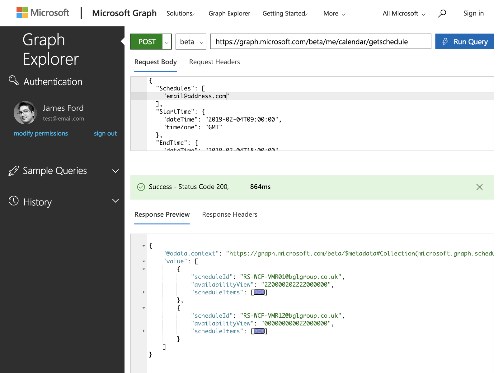

> Strange as it may seem this isn’t something that’s obvious to figure out, so allow me to save you half an hour of searching and just give you the answer.

### Background

At the office we have a range of virtual and physical meeting rooms, but as good as off-the-shelf tools are, it’s still a laborious task to find an available room at a moment’s notice. It would be nice to tap into some APIs and be able to build our own custom tooling to make the availability more… visible.

### The Answer; aka. How to do it:

1.  First, get an API Access Token.
2.  Make a Graph API request with a JSON payload that outlines the target email addresses and the time period to check.
3.  Parse the response into usable data.

#### Getting an Access Token

Before starting you need an _Access Token,_ which you can either get by following the steps in [the official documentation](https://docs.microsoft.com/en-us/graph/auth-overview), or to make things simpler you can try out requests using the Graph Explorer tool:

[**Graph Explorer - Microsoft Graph**  
\_The Microsoft Graph explorer is a tool that lets you make requests and see responses against the Microsoft Graph_developer.microsoft.com](https://developer.microsoft.com/graph/graph-explorer/ 'https://developer.microsoft.com/graph/graph-explorer/')

#### Making a Graph API request

Make a POST request to the `/me/calendar/getschedule` Graph API endpoint: [https://graph.microsoft.com/beta/me/calendar/getschedule](https://graph.microsoft.com/beta/me/calendar/getschedule), — which is currently only available in beta — using a JSON request body that looks something like this:

This request body includes the accounts for availability to be checked; _Schedules,_ the start and end of the time period to check and the level of detail to look at; the *availaibilityViewInterval* — all of which affects the level of detail that comes back in the response.

By way of example, we can make this request using CURL, like this:

Or to make this same request with Javascript, like this:

Or just use the Graph Explorer:

Using the Graph Explorer UI

#### Parse the response

The response that comes back from the API will look something like this:

This response contains a object for each Schedule requested, a representation of the schedule availability, and the available details of each item in the schedule.

I find the _availabilityView_ portion of the API response interesting — it’s a string that’s generated dynamically and represents the high-level availability for segments of time, beginning at the start time and split based on the initial _availabilityViewInterval_ property of the POST request. The values in this string correspond with the following availability:

0 = free  
1 = tentative  
2 = busy  
3 = out of office  
4 = working elsewhere

This response can save you recursively parsing the _scheduleItems_, and you only have to split the string on each character to calculate availability.

### Alternatives / the Explanation:

Checking calendars — whether it be for Meeting Rooms or for attendees — seems like it should be trivial task but it’s historically been quite complicated, because the APIs that expose the data needed to power this functionality usually requires read-level permissions from the calendar owner.

When I first attempted to build this functionality, I assumed that I could simply check the public calendar of the 20-or-so meeting rooms and collate the data myself, but I quickly discovered that the API doesn’t work that way, and each of the meeting rooms would require me to have been granted explicit permissions to their calendar, which wasn’t going to happen.

Fortunately, the _getSchedule_ endpoint of the API exists under`/me/calendar` , so it just works, without the need for additional permissions. Counter-intuitive? Maybe. But it works, so we’ll overlook that.

### Official Documentation

Here’s a link to the official documentation for this API endpoint:

[**Get free/busy schedule of users and resources (preview) - Microsoft Graph**  
\_In a work or school setting, a common scenario is to see when a user is free for meeting, or to browse the availability…\_docs.microsoft.com](https://docs.microsoft.com/en-us/graph/outlook-get-free-busy-schedule 'https://docs.microsoft.com/en-us/graph/outlook-get-free-busy-schedule')

That’s all for now — so let’s go check schedules!
