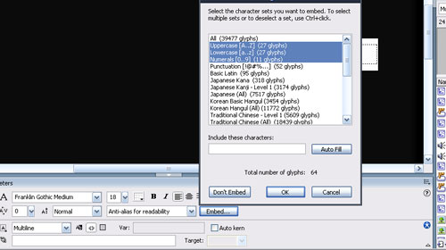

You know those lovely font embedding options?

Wouldn't it be great if you could make your own character sets?



As great as the default options are (All, Uppercase, Lowercase, Numerals) the latter 3 combined don't contain all of the visible characters - and the 'All' option embeds thousands of other useless characters. So how about this?

If you are bored with Flash taking ages to publish because you have (rather lazily!) embeded the full Unicode font set (I really have no idea what embedding 39477 characters achieves, Verdana - in the Windows Character map on my PC - only lists 665 chars) then this is a little bit of code I knocked up this morning that might help (someone could turn it into a class pretty application if they want!)

**What do you need to do?**

1.  Copy and paste the code below into frame 1 of an FLA.
2.  Change the code in **bold**. The variable 'myString' contains whatever characters you want to embed. In my example (which may be of use) I am embedding all the Verdana characters listed in the Windows Character Map. N.B. I have added a space at the start as this is an important character to embed! Note also that to embed a quotation mark you must write " and to embed an backslash you must write \\. You need to give your font set a name (in this example it is 'Dynamic Learning Character Set' but you can put whatever you want). This is what will appear in the list when you click the 'Embed...' button in Flash. Finally you need to specify a unique 'fontSetID'. Flash seems to have taken the numbers 1 - 20 and 9999(!?!) so you can pick any number you like other than those.
3.  Press CTRL+ENTER to test the FLA and copy the XML that is generated in the output window.
4.  Open the file: C:Program FilesMacromediaFlash 8enFirst RunFontEmbeddingUnicodeTable.xml...and paste in your XML to the top (just under the <fontEmbeddingTable> node)
5.  Save the UnicodeTable.xml file and restart Flash. You should now see that you can embed your custom font into your SWF. If you need to add other characters you can just repeat the above steps to update UnicodeTable.xml and then republish your SWF file.

This technique reduced my project publish time from 85 seconds to 22.

```actionscript
var myString:String = " **!"#\$%&'()\*+,-./0123456789:;<=>?@ABCDEFGHIJKLMNO**

PQRSTUVWXYZ\[\\\]^\_`abcdefghijklmnopqrstuvwxyz{|}~¡¢£¤¥¦§¨©ª«¬­®¯°±²³´µ¶·¸¹

º»¼½¾¿ÀÁÂÃÄÅÆÇÈÉÊËÌÍÎÏÐÑÒÓÔÕÖ×ØÙÚÛÜÝÞßàáâãäåæçèéêëìíîïðñòóôõö÷øùúûüýþÿAa

AaAaCcCcCcCcDdÐdEeEeEeEeEeGgGgGgGgHhHhIiIiIiIiIi??JjKk?LlLlLl??LlNnNnNn?

??OoOoOoŒœRrRrRrSsSsSsŠšTtTtTtUuUuUuUuUuUuWwYyŸZzZzŽž?ƒOoUu??????ˆ?¯??°?

˜?`´~??;?????????????G????T?????????S??F??O???????aß?de??????µ???p??st?f

????????????????????????????????????????????????????????????????????????

????????????????????????????????????????????????????????????????????????

??????????????????????????????????????????????????????–—?=‘’‚?“”„†‡•…‰'?

‹›??/n?£P?€?l?™?e???????-/·v8?˜?==????????"

var nameOfFontSet:String = "**My Character Set**"var fontSetID:Number = **50**

generateCharSet( nameOfFontSet, fontSetID, myString);

function generateCharSet (setName, setID, chars) {

var outputXML:String = "<glyphRange name="" + setName + "" id="" +

setID + "">n"

var numberOfChars:Number = chars.length;

for (var i:Number=0; i<=numberOfChars-1; i++) {

var charCode:Number = chars.charCodeAt(i)

var hexCode:String = convertTo4DigitHexValue(charCode.toString(16))

outputXML += "t<range min="0x" + hexCode + "" max="0x" +

hexCode + "" />n"

}

outputXML += "</glyphRange>"

trace("outputXML:n" + outputXML);

}

function convertTo4DigitHexValue (hexValue:String):String {

var hexLength:Number = hexValue.length;

var numberOfLeadingZerosRequired:Number = 4 - hexLength;

for (var i:Number=0; i<=numberOfLeadingZerosRequired-1; i++) {

hexValue = "0" + hexValue;

}

return hexValue

}
```
