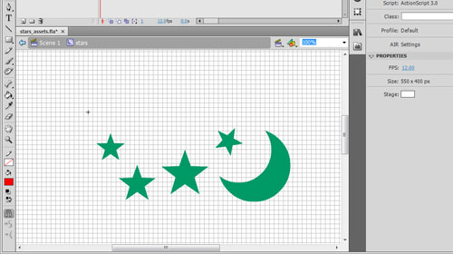

 \[kml_flashembed movie="http://uploads.psyked.co.uk/2010/01/CurvedShapeExample.swf" height="280" width="500" /\]

(The image above this text is actually the Flash movie, if you hadn't guessed.  Try using your mouse to interact.  If it's blank, then something's gone wrong!)

I've been busy working on my Box2D classes again. (As before [here](http://www.psyked.co.uk/actionscript/simplifying-box2das3.htm) and [here](http://www.psyked.co.uk/box2d/simple-box2d-custom-polygon-creation.htm).)  I'm not quite ready to go through the code with some tutorials yet, but you can [download the source for this demo here](http://uploads.psyked.co.uk/2010/01/simplebox2d_demo_100113.zip).  This version has had a bit more of a proper code cleanup - I've un-hacked some hacks I did earlier in development, and added a few more utility functions, but most importantly this version supports SWF library asset importing of multiple shapes, and shapes with curved edges (which it couldn't do previously).

I feel like I should put that in bold or something, because it's probably my most-clever bit of code to date.  I'm going to settle for saying it twice though: You can import library objects with multiple shapes, and shapes with curved and straight edges.  Have a look at the screenshot below and compare it with the Box2D display;

**In Flash IDE:**

**[**

**In Box2D:**

**[**

You can [download the source for this demo here](http://uploads.psyked.co.uk/2010/01/simplebox2d_demo_100113.zip).

I'm going to get this as a project on some publicly-available source repository soon.  I'd love to hear feedback on it now though!