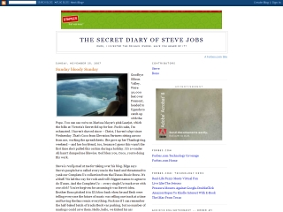
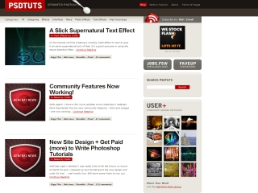
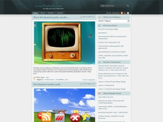

### Introduction

Web design enevitably has some hangovers from the early days. The web is, and always has been, really nothing more than a network of documents. Ok so the documents are often cleverly generated on-the-fly by computer systems, but they're still documents. That's one thing a lot of people don't seem to realise, one of the obsticles to understanding 'how it all works'. The only unique thing about documents on the web is the hyperlink and by extension, the concept of navigation.

### Backstory

With no precident set for navigations, and tables being such a dominant aspect of page construction, they more-or-less defined what the web could look like. From this came the standard 3-area division of the page, with side-navigation, top-navigation and content. Perhaps because of browser behaviour - like the default 10 pixel page padding - or more likely because fluid-width designs were a real pain in the rear, fixed-width layouts were predominent, and this led to the standard 'boxed' page idea. Or, the idea that a webpage should have a visibly limited width, enclosed within a box and surrounded by a different coloured background.

### Technological Ideals…

The W3C - bless them - have been stubbornly refusing to cave into web designers demands, making it difficult to create flexible column-based layouts - like those that are so easy to produce with tables - in CSS and (X)HTML. This has a knock-on effect on the design of websites, and how they're treated.

### Full circle?

The design idea seems to be going full circle, text documents - the most raw representations of a peice of paper - became their own entity, the navigable website. This evolved, but ultimately web design became a very different beast from print-based design. People forgot that they were viewing documents online, and treated them in an entirely different manner when designing. The idea was that websites were stand-alone, individual, unique. The design would emphasize this, promoting the local navigation and splashing graphics around, sometimes overpowering the content. And now it's on the way back.

### Who's king?

'Content is King' is making a comeback, with an increasing number of designs becoming more minimalist and going back to the raw content. The prime screen real-estate - top and left - is no longer the domain of the navigation and branding - both of which are shrinking - and now belong to the content. Which after all, is what the visitor is here for.

I guess we've got the rise of social networking to thank for this - amongst others - bringing an altogether less patient audience, who know what they want to read, and often follow external links straight into the content. Navigation is a non-issue, barely used for them, so why not give more screen space to your content?

### Blogger.

I think [Blogger](www.blogger.com) is a pretty big influence on the current designs that are out there.

Visit any blogger site and you can't help but notice the bar at the top. Branded yes, but subtle, and it doesn't detract from the blogs it hosts. Now take a look at the recent redesigns of [Smashing Magazine](http://www.smashingmagazine.com "smashingmagazine") or [PSDTuts](http://www.psdtuts.com "psdtuts").

 and is quite brilliant at scaling for different resolutions, not least I suspect, because of the lack of a bulky left-hand navigation.

PSDTuts quite recently dropped their memorable brown-on-brown design for one like this. It's nice, but have they sacrificed too much uniqueness in favour of content?

Where has the navigation gone? It's all in the top. Up there, with the logo. And content. Where everyone can see it.

The web seems to be shaking off its' historic top-nav / side-nav / content in a centre-aligned box look and feel, and going back to the document / content ideal.Pity too, I've only just finished redesigning THIS website…

