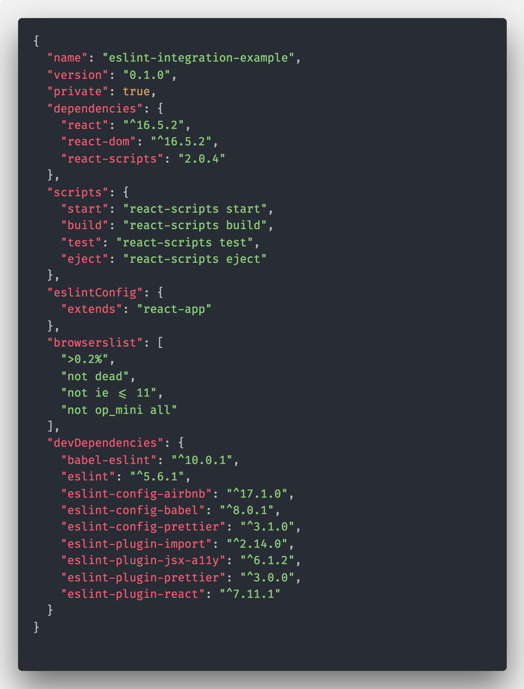
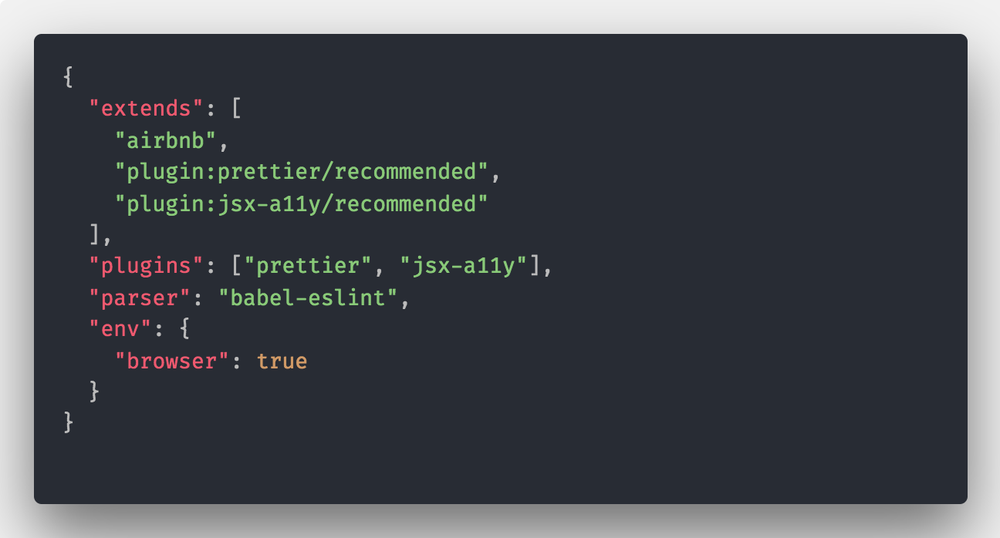
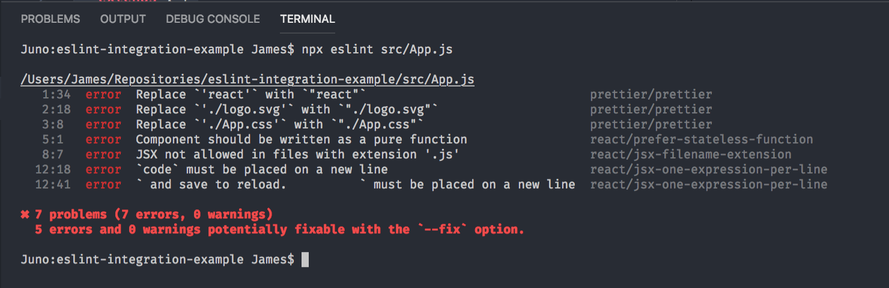
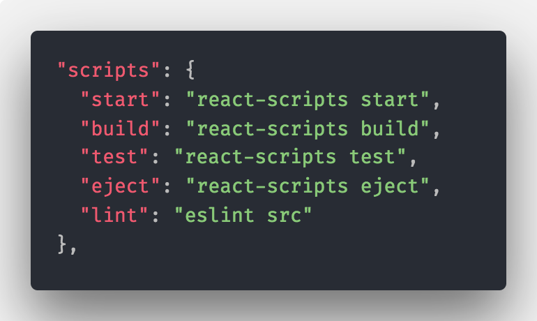
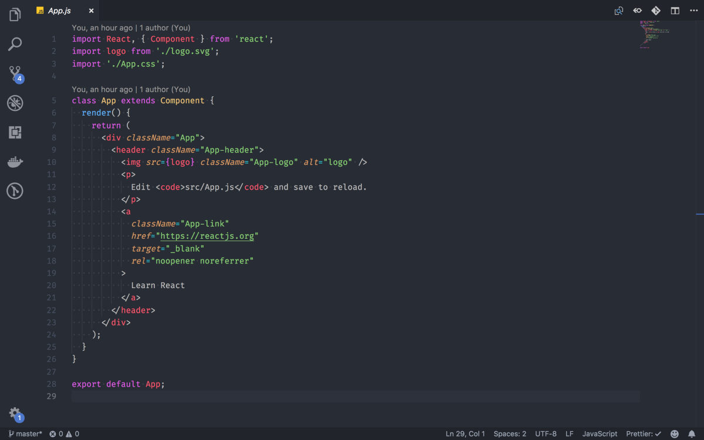
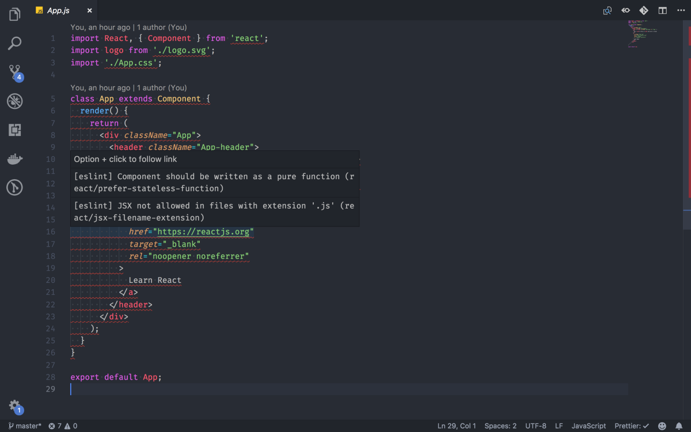
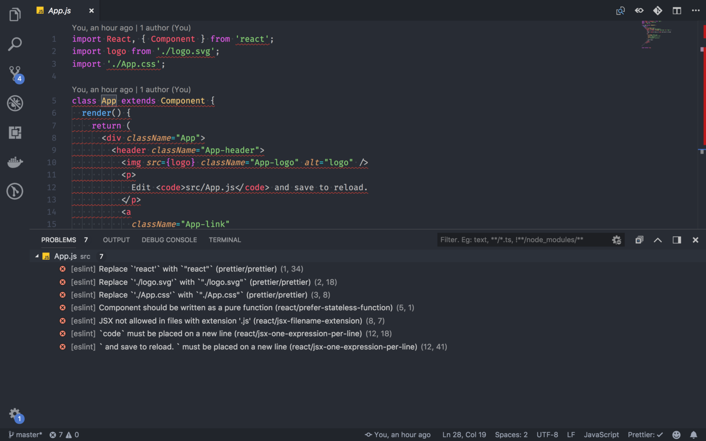

Coding is complicated — there are loads of best practices to remember, guidelines to follow and ‘known issues’ to avoid — so it helps to have a ‘helping hand’ while you work.

ESLint — [https://eslint.org/](https://eslint.org/)

[**ESLint - Pluggable JavaScript linter**  
\_A pluggable and configurable linter tool for identifying and reporting on patterns in JavaScript. Maintain your code…\_eslint.org](https://eslint.org/ 'https://eslint.org/')

[ESLint](https://eslint.org/) is an extendible linter — or code checking tool — that can be set up as a standalone tool or integrated into the Visual Studio Code editor.

> ‘A linter or lint refers to tools that analyze source code to flag programming errors, bugs, stylistic errors, and suspicious constructs.’ [\[Wikipedia\]](https://en.wikipedia.org/wiki/Lint_%28software%29)

With ESLint properly configured in your editor, your development experience can be almost as-if you’re continually pair-programming with (an insufferably polite and knowledgeable) know-it-all. And as daunting as that might be, it’ll help you produce better quality code and teach you as you work.

---

### Configuring Visual Studio Code with ESLint

First, a preamble: I’m going to start by setting up a React project using `create-react-app`, which gives me a `package.json` at the root of the project and manages dependencies through NPM.

To get a new project set up, run the following commands:

[**facebook/create-react-app**  
\_Create React apps with no build configuration. Contribute to facebook/create-react-app development by creating an…\_github.com](https://github.com/facebook/create-react-app 'https://github.com/facebook/create-react-app')

First, install [create-react-app](https://github.com/facebook/create-react-app):

    npm i -g create-react-app

Then, to create a new project:

    create-react-app eslint-integration-example

And when we want to, we can run the project like so:

    cd eslint-integration-example
    npm start

#### Setting up ESLint

ESLint could be installed globally, but for better portability and resilience let’s add it, and some plugins and settings, to the project, with the following command:

    npm install --save-dev \
    eslint \
    babel-eslint \
    eslint-config-airbnb \
    eslint-config-babel \
    eslint-config-prettier \
    eslint-plugin-import \
    eslint-plugin-react

With all of those plugins installed, my `package.json` file looks like this:

The package.json file with ESLint configs and plugins

Strictly speaking, the necessary plugins for adding ESLint is only actually eslint, but I’ve added the other plugins in this example because they’re the ones I’m currently using in my active projects.

Alongside these npm packages, we’ll also add a configuration file to the root of the project, called `.eslintrc`, which looks like this:

My .eslintrc file

This tells ESLint to import the **airbnb**, **prettier** and **jsx-a11y** configurations (that we installed in the previous command) as a starting point, and gives us a springboard from which to extend the configuration in the future.

To run eslint against our code we can use the following command:

npx eslint src/App.js

Which gives the following output in the terminal:

Test output from the terminal

To make things a little easier to run, we can also add this command to the scripts section of the `package.json` file, making it look like this:

The scripts section of the package.json file

It’s already pretty neat to be able to run ESLint and highlight issues with our code like this, but what really takes it to the next level is editor integration.

#### Integrating with Visual Studio Code

The ESLint plugin can be installed from the Visual Studio Marketplace, and gives easy integration with Visual Studio Code.

[**ESLint - Visual Studio Marketplace**  
\_Extension for Visual Studio Code - Integrates ESLint JavaScript into VS Code.\_marketplace.visualstudio.com](https://marketplace.visualstudio.com/items?itemName=dbaeumer.vscode-eslint 'https://marketplace.visualstudio.com/items?itemName=dbaeumer.vscode-eslint')

What does it actually do though? It adds inline code error highlighting, which transforms your editing experience (as illustrated below)

On the left: Without ESLint integration, On the right: With ESLint integration

With the plugin set up, rather than having the ESLint as a task that needs to be invoked manually, it runs automatically, displays the results inline with your code, and updates as you type so you get the kind of user experience you’d expect from a spell-checker but with the complexity of your ESLint rules.

It’s not all about inline validation though, there’s also some sweet integration with the rest of the editor, such as the ‘Problems’ panel:

(above) ESLint integration with the ‘Problems’ panel

#### Extension Suggestions

Seeing this editor integration does rely on having the correct plugin installed though, which can be a bit of a tedious task to maintain if you’re on a development team. To assist with this, we can add a VSCode extensions configuration file, which will prompt Visual Studio Code to suggest the installation of extensions when appropriate.

Create a file called `extensions.json` in a directory named `.vscode` in the root of the project, with the following content:

    {
      "recommendations": \[
        "dbaeumer.vscode-eslint",
        "esbenp.prettier-vscode",
        "dzannotti.vscode-babel-coloring"
      \]
    }

The official documentation for this feature can be found here:

[**Managing Extensions in Visual Studio Code**  
\_The features that Visual Studio Code includes out-of-the-box are just the start. VS Code extensions let you add…\_code.visualstudio.com](https://code.visualstudio.com/docs/editor/extension-gallery#_workspace-recommended-extensions 'https://code.visualstudio.com/docs/editor/extension-gallery#_workspace-recommended-extensions')

---

#### Why ESLint?

What makes ESLint cool is that it’s something that can be extended to check for more than just logical code errors, it can check for things like accessibility issues or inconsistent code formatting, which is why I’ve added [react-jsx-a11y](https://github.com/evcohen/eslint-plugin-jsx-a11y) and the [prettier](https://github.com/prettier/prettier-eslint) plugins to plugins list.

And with all of that setup, you can experience what it’s like to Pair Program with a stickler for consistency and best practices, without actually having to be pairing.

Photo by [Mimi Thian](https://unsplash.com/photos/ZKBzlifgkgw?utm_source=unsplash&utm_medium=referral&utm_content=creditCopyText) on [Unsplash](https://unsplash.com/search/photos/pointing-at-code?utm_source=unsplash&utm_medium=referral&utm_content=creditCopyText)
