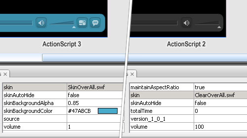

The FLVPlayback component that comes with Flash CS3 has been given a bit of a facelift, you know. (Well, the AS3 one has anyway - the older AS2 version is still the same old Flash 8 one).

Both versions have support for FullScreen, High-Def video and embedded Captioning, but what 'excites' me is that the ActionScript 3 version of the FLVPlayback component has the FullScreen and Captioning features built right into the default skin and moreover, the skin is far more flexible;

Nice, eh? You should be able to see that, in the ActionScript 3 version of the component, you are able to pick the background colour and opacity of the skin - no more messing around with custom skins for simple jobs - as well as the new component buttons in your Flash Video arsenal.

Getting all excited about nothing much, you think? Well, it gets better - for fullscreen mode, in any case;

> Assuming that Flash Player 9 Update 3 has been applied, the prerequisites are met, and the `FLVPlayback.fullScreenTakeOver` property is set to `true`, which is the default setting, Flash Player uses hardware acceleration to scale the video file, rather than scaling it through software.

If you tried watching Flash Videos in large or FullScreen modes before, you might've noticed tearing in the image - flash (and your computer / browser / flash plugin) not being able to scale the video at a fast enough rate. Lucky then, that hardware scaling support will/should solve this issue. Because, you know hardware scaling is much better than software scaling. There's practically no difference between performance when you compare the fullscreen mode to the smallscreen mode. Huzzah!

## Resources / sources;

- [Adobe : Using the FLVPlayback component with Flash Player 9 Update 3](http://www.adobe.com/devnet/flash/articles/flvplayback_fplayer9u3_02.html 'Open link in a new window')
