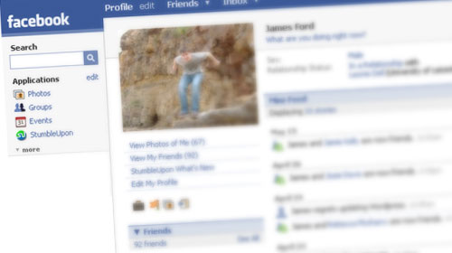
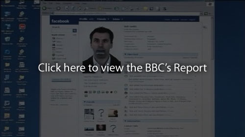

Ah [Facebook](http://www.facebook.com). As a rule of thumb you shouldn't really add any more personal information than's nessessary to a website - but people tend to just forget that, especially on social networking sites. And noone really reads the legal & privacy notices - because they're about as flexible as the EULA on your videogames, just explain in very careful words just how much they are allowing themselves to abuse your trust.

Just how safe is your data on Facebook then? When you start out, there's a lot of inital restriction using the website, having to have 'friends' or 'groups'. The most any stranger can see is a small thumbnail, your name and perhaps a few groups or your country. Think that's safe enough? Wait until you've listened to a bit of scaremongering about the third-party applications...

[

Eesh, that sounds bad, doesn't it?

### **Point**

How true is it? well actually, it's all accurate. A quick look at the Development API demonstrates that you can access - pretty much without restriction - the information of any Facebook user, provided you know their unique identifying number for Facebook.

How do you get this information? - well, for starters you can get the number of someone who's added the application. And then you can get the numbers of all of their friends, and then their friends, or a group, and then the numbers of everyone in the group. So you don't have to have anything to do with the application. You can block it, sure, but that doesn't guarantee that your data hasn't already been harvested.

In essence, much like the internet, the Facebook platform can be spidered - this time by its 'Applications'. So the friend-based access control system is really just a facade of security, it stops the average user from poking around, but doesn't stop the techies one bit (except the fact that it's probably against the EULA and the developer would get chucked off the platform for doing it maliciously).

### **Counterpoint**

Of course, there is a lot of hoops to jump through to make public Facebook API's, there's a whole team of Facebook people checking applications for malicious purposes, and there is a lot of stuff that is hard or impossible to do on the Facebook platform - these guys do a lot to actively protect their users. Developers and journalists just tend to think a lot about the outside possibilities...

Oh, and of all the data that an application can extract, they can't get your e-mail address. Count your blessings.

### **Bottom line - your Facebook profile is a webpage.**

Once you're informations' out there, consider it insecure. And ready the privacy policy if you're worried about that kinda thing!

## References;

- [BBC News: BBC Exposes Facebook flaw](http://news.bbc.co.uk/1/hi/technology/7376738.stm)
- [BBC News: Identity 'at risk' on Facebook](http://news.bbc.co.uk/1/hi/programmes/click_online/7375772.stm)
- [Facebook Developer Wiki: Platform Policy](http://wiki.developers.facebook.com/index.php/Platform_Policy)
- [Facebook Developer Homepage](http://developers.facebook.com/get_started.php)
