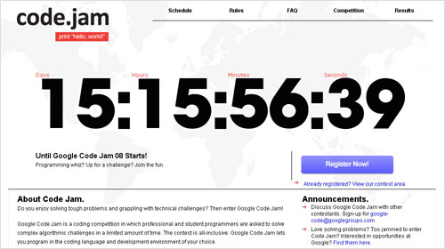

[

Google Code Jam is a pretty much a coding competition.  You can use any programming language you like, they'll give you a problem, and you have to solve it.  Sound fun?  Well, you have between four and eight minutes to submit your answers, and you'll get three to six problems per round.  Still sound like fun?

Well, the 24 hr Qualification Round Begins on Wednesday July 16th, and you can [register here](http://code.google.com/codejam/contest/registration).

I think I'm going to attempt the qualification round, but I have no illusions about the accuracy of my speed-coding.  The guys at Google wouldn't make things too difficult - would they?