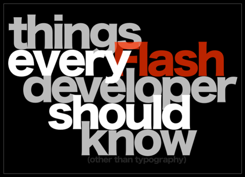

Ok, so it's a bit belated.  I was trying to do the whole geeky blogging thing after each day of Flash on the Beach, but guess what got in the way?  Work.  Work and parties.  Ok, maybe parties and _then_ work, but I'm blaming both equally.

Unfortunately I also forgot to take my notes off the company laptop before I handed it back in, and James C forgot to give me back my scribbled pad of paper after the final session, so we're doing this summary from memory!  I'm so disorganised...

There were lots of interesting sessions over those last two days, on Tueday we had 'The business side of AIR: how to sell your clients on AIR apps' by Mike Downey, 'Things Every ActionScript Developer should know' by Grant Skinner. Lee Brimelows 'Platform Jiu-Jitsu' was fun - a combined introduction to UFC and Flash CS4. The final inspire session in the evening was, well, inspiring - with Robert Hodgin's 'The Best 8 to 12 Hours of my Life.' in which he talks about drugs having a lot to do with his inspiration. Which seemed to be a common theme amongst the arty types.

Here's a couple of resources I've found from that day...

### Things every Flash developer should know

[

### The Best 8 to 12 Hours of my Life.

 [FOTB 2008 - Brighton - Robert Hodgin - 01](http://vimeo.com/1882582?pg=embed&sec=1882582) from [Jon MacDonald](http://vimeo.com/jonmacdonald?pg=embed&sec=1882582) on [Vimeo](http://vimeo.com?pg=embed&sec=1882582).

I didn't get to the party on Monday night thanks to having to work - but I got there on Tuesday night. A nightclub with over 1000 flash developers in - certainly not the nightclub experience I remember from University!

Following that on Wednesday we had another couple of great sessions - 'Advanced Flexing for Flash Developers' delivered by what I assume was a hungover Ben Stucki, and the massively popular 'Papervision3D Simplified' by Seb Lee-Delisle. Those were rounded off in the afternoon with 'The Ying and Yang of Flash' - a look at the behind-the-scenes development of the Flash player by Paul Betlem, before Jonathan Harris went and finished the whole thing up with his 'Beyond Flash' talk - which was kinda depressing. ([Lee Brimelow's summary explains things a bit better](http://theflashblog.com/?p=447))

Again, here's some videos and links I found from the final day...

### **Papervision3D Simplified**

 [Seb Lee-Delisle - Papervision3D Simplified](http://vimeo.com/1872932?pg=embed&sec=1872932) from [Peter Elst](http://vimeo.com/user433078?pg=embed&sec=1872932) on [Vimeo](http://vimeo.com?pg=embed&sec=1872932).

### **The Ying and Yang of Flash - FlaCC**

 [Paul Betlem - FlaCC](http://vimeo.com/1878579?pg=embed&sec=1878579) from [Peter Elst](http://vimeo.com/user433078?pg=embed&sec=1878579) on [Vimeo](http://vimeo.com?pg=embed&sec=1878579).

## Resources;

I've tried to track down files from the various sessions online, and here's what I've found.  It's not much I know, given the amount we actually saw at FOTB, but maybe I'll find more stuff once I find my conference notes again...

*   [Adobe AIR - Beyond the Basics](http://www.peterelst.com/blog/2008/10/03/air-beyond-the-basics/) \[Peter Elst's blog post - link to source files at bottom\]
*   [Flash on the Beach 2008 Recap](http://theflashblog.com/?p=447)
*   The slides for ["Things Every Flash Developer should know."](http://gskinner.com/talks/thingseveryflash/) are available from [gskinner.com/talks](http://gskinner.com/talks)