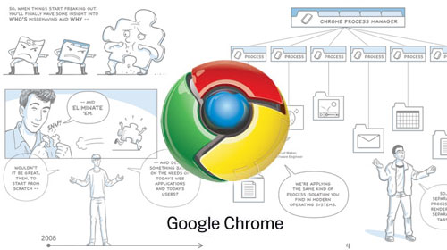

If you've been living under a rock for the past week - or maybe just been on holiday - you might not've heard about Google's new web browser called [Google Chrome](http://www.google.com/chrome).  Chrome is a direct competitior to other browsers such as Internet Explorer, Firefox or Safari.

The first I heard about Google Chrome was on [Techcrunch](http://www.techcrunch.com/2008/09/01/first-public-screen-captures-of-google-chrome/) the day before it was revealed, and then one of the guys at work downloaded it the next day. News sources all over the place were raving about it - which just shows you the what a link on the homepage of Google can do.

As for Chrome itself, there's a few things I really like about it - like no total-browser crashes, better performance, its own task manager and the fact that it uses the Webkit rendering engine - which is the same as the one used by the Adobe Integrated Runtime (AIR).  Oh, and the fact that I don't have to endure repeated crashes all day long - like I do with Internet Explorer and Firefox.

The design something a little different, with a few new takes on old ideas, like tabs and the browser status bar.  But what's really quite interesting is the underlying architecture and the way that they've implimented the javascript - something called jittered JavaScript or JavaVM.  Whatever the hell that is, it apparently means its really fast ([read an article about it on cNet](http://news.cnet.com/8301-1001_3-10034365-92.html?part=rss&subj=news&tag=2547-1_3-0-5)) \- and hopefully it also means that old annoyances like javascript locking up the browser will be less of an issue!

## Can Chrome replace browser x?

**Not right now** \- I don't think.  It's certainly fast and pretty, but for me there's a good deal of things it can't do that other browsers can do.  Like RSS feeds, or the development plugins that I use at work.  These things might be 3rd party extensions to my other browser, but at least they're there. As soon as I can however, I can see myself switching default browsers.

Of course, Chrome is still in Beta so it'll be exciting to see it when it goes Gold...