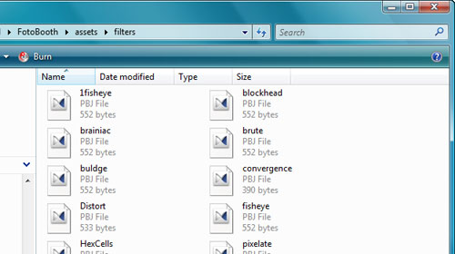

Pixel Bender is awesome - but I just haven't got into it yet, so I have no idea how to make my own useful or impressive filters.  Nevermind, there's always the [Pixel Bender Exchange](http://www.adobe.com/cfusion/exchange/index.cfm?event=productHome&exc=26) from Adobe.  Not enough?  Well, one thing I like about AIR applications is that - moreoften than not - there's a lot of raw source files available, if you know where to look.

Pixel Bender files fall into this class.  [BlackBookSafe](http://www.adobe.com/devnet/air/ajax/articles/blackbooksafe_anatomy.html) is where I first pinched Pixel Bender source files from, simply by looking at the folder created for the application in my 'Program Files' folder.  [Fotobooth](http://www.adobe.com/cfusion/marketplace/index.cfm?event=marketplace.offering&offeringid=10080&marketplaceid=1) is another example - a little more difficult - but the source files for all those clever Pixel Bender filters are just sitting, waiting for you to hack around with them...

### Enough yammering, tell me something useful!

So, when an AIR application is installed on your machine it places all of the files it needs in your 'Applications' or 'Program Files' directory. Usually external assets like Pixel Bender are available in the source files in a standalone format, and that's all you really need to incorporate those filters into your own projects.

Well, almost.  The two types of source files you're likely to get are .pbj or .pbk.  If you get .pbk files you can use them directly in the Pixel Bender Toolkit.  If you get .pbj files - check out this [blog post](http://blog.minim.pl/?p=32) and [Flex application](http://blog.minim.pl/PBJtoAS/) which can help you get started converting those files into usable Actionscript classes.