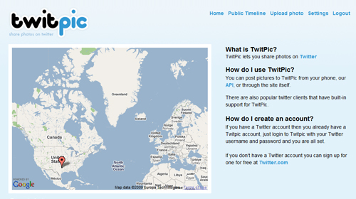

Uploading images to services like [TwitPic](http://twitpic.com/) is actually as easy as sending a HTTP POST request, which means its also pretty darned simple to upload something from Flash Player 10 or AIR. This is an example for AIR, but doing something similar in Flash Player 10 should also be possible - you just need to swap the references to the File class to FileReference.

So, how do we get our photos on TwitPic?  Well, let's check the API: [TwitPic API](http://twitpic.com/api.do). According to the API, it's just a case of posting an image file with additional parameters of **username**, **password** and if you like, **message**. And the upload location is pretty simple too - _http://twitpic.com/api/upload_ or _http://twitpic.com/api/uploadAndPost_. One for just uploading, and the other for posting things to your twitter feed at the same time.

If you're posting automatically to twitter, TwitPic will automatically add the url to your image to the start of your tweet.

So, let's check out some basic code:

### The code:

    var urlVars:URLVariables = new URLVariables();
        urlVars.username = "username";
        urlVars.password = "password";

    var urlRequest:URLRequest = new URLRequest("http://twitpic.com/api/upload"); 
        urlRequest.method = URLRequestMethod.POST; 
        urlRequest.data = urlVars;

    var file:File = File.desktopDirectory.resolvePath("test.jpg"); 
        file.upload(urlRequest, 'media');

In a nutshell, that code will upload an image file (called "test.jpg") from the desktop, to TwitPic.

We create an URLVariables object (which contains the additional parameters required for the POST request), create an URLRequest object with the target http request, set the method, assign the URLVariables to the URLRequest, and then finally grab a reference to our file and call the upload method on the file, passing in the URLRequest.

Ok, URLVariables and URLRequests are simple enough - but the thing that was difficult for me to get my head around was the **file.upload()** method. What it actually does is convert the File (or FileReference) to binary data, and sends that as an additional URLVariable in the URLRequest.  The first parameter it takes is an URLRequest, and the second is the name of the variable that the binary data is assigned to.  I'd kinda assumed that a single URLVariables object would contain all of the data you're sending in your request, but when you're using the File.upload method, it seems to be compositing a new set of variables from the method and the URLRequests' existing data.  Confusing, to start with.