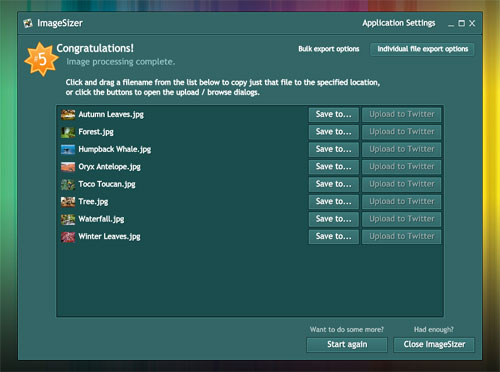
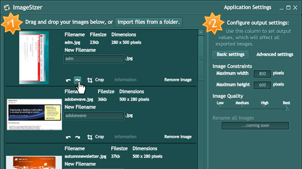
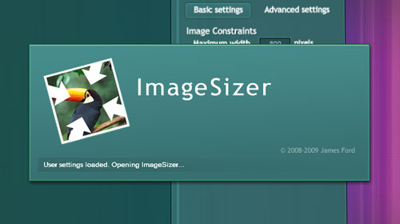

Wow.  Because I'm so lazy at actually blogging about things, at least two full versions of ImageSizer have come and gone since my last post, so this is going to be a round-up of all of the cool things that've been introduced to ImageSizer recently.

### Individual files output

> "Hey, that sounds like a good idea."

ImageSizer initially started as a batch image resizer, and still is, but it seems a little over-restrictive to only be able to export files in a folder or compressed archive.  So now we have an individual files output panel.  Tacked onto the previous encoding output screen is a new option in the top left corner, labelled "**Individual file export options"** (perhaps that needs rephrasing).  Click that and the view will shift, showing you a list of the files that've just been resized, so you can grab individual files, instead of a single folder.

It seems to work well for what I often want ImageSizer to be able to do when I'm using it day-to-day, so that's what prompted this option!  That, and trying to figure out how to introduce the long-awaited 'Upload to Twitter' option.  (Not available yet, but coming very soon!)

### Image rotation

Image rotation!  Ok, at the moment it's a limited 90-degree step rotation, but I'm sure that's useful for a lot of situations.  Images can easily be rotated using the buttons illustrated in the image above.

### A Splash Screen.

It hasn't been easy developing ImageSizer, and as a result - I'm sad to say - it hasn't always been smooth sailing.  My tendency to finish coding in the wee hours of the morning and immediately release exciting new things can often be blamed for the introduction of new issues.  ImageSizer has had its fair share of bugs, and those bugs tended to focus on the startup processes of the application, which makes an application Splash Screen sound like a good idea.  At least this way you can see the application is running, even if it hangs a bit while it fetches your settings.

### Performance, memory usage, and Alchemy.

Oh yes.  This is the biggie, but it's one of those things that no-one really notices. It's the main reason development on ImageSizer might've been seen to come to a halt.  I actually ended up spending over two months (well, my evenings for two months) rewriting just about everything - this time actually doing such things as Profiling the application, removing memory leaks and cutting down on the general memory footprint.

Being an image-resizing application, ImageSizer needs to take a certain chunk of memory when it's working, but the difference between the latest versions and the earlier versions is that it will now not only give the memory back to the system, but will also try and cap the amount of memory it uses, without impeding performance.  'Course I never took a benchmark at the start, but I assure you, it runs much better now!

### Alchemy?

Goodbye ASyncJPEGEncoder, you served us well.  Unfortunately, Alchemy-powered JPEG encoders trump you hands down.  I'm a novice at this stuff still, but I can at least follow tutorials and examples (I love you, Flash developer community!).  So ImageSizer's JPEG encoding is now done by an Alchemy encoder, which encodes your images anywhere between 4 and 100 times faster than the previous code, achieves a smaller file size on average, and retains the other settings, like the original Metadata.  Once we got that working, there was no contest.

The only thing lacking at the moment is progress messages from the encoder, but I figure we can live with that until I get better at this Alchemy malarky.  Most of the time the delay in encoding is minimal, I just need to make the encoding progress screen a little more pretty.

### Anything else?

It's also been written in PureMVC, so hopefully that structured development approach will help make it easier for me to develop more features in the future.

And of course I'm always looking to make the application more useful, even if we're not talking about new features.  A few visual elements have been tweaked, and the interface is moving to be more dynamic.  Most noticeable is probably the ouput settings panel on the first page, which has been split a little into a tabbed layout, or the options for the System Tray Icon, the Dock Menu, or the Screenshot detection and naming formats.  Doesn't sound very exciting, but all of these are either more intelligent in what they display (and thus, more useful) or are more customisable, to suit the users' requirements.

### GetSatisfaction

Oh yes.  I've set up a community-powered support page on [GetSatistfaction.com/ImageSizer](http://getsatisfaction.com/imagesizer).
