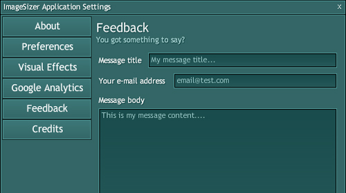

This is a 'public service announcement'.  Basically, the ImageSizer feedback screen hasn't always been working.  If you've used it already to send your feedback, there's a good chance that the message wasn't delivered, regardless of the confirmation screen you may have seen.

It's all fixed now, but if you've sent feedback or have a burning comment to make then please, send it again. (And sorry for the trouble.)

I'm planning on a few further updates for ImageSizer soon, to make this process a little better...
