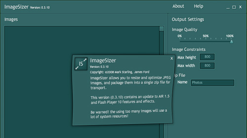

I'll try not to be boring and post _every single time_ I make an update, but what the hell, I kinda like this update - even if it introduces nothing useful on the functionality front.

Version 0.3.10 of ImageSizer is now upgraded to use the AIR 1.5 runtime, and introduces my first working attempt at Pixel Bender filters. The Application Information window (in the above screenshot) now has a wavy effect - taken straight from the source code of the [BlackBookSafe AIR application](http://www.adobe.com/devnet/air/ajax/samples.html#blackbooksafe).

[BlackBookSafe: Anatomy of an AIR 1.5 application](http://www.adobe.com/devnet/air/ajax/articles/blackbooksafe_anatomy.html) was a very useful starting point for both getting Pixel Bender filters on the application, as well as animating them. Until I get around to doing a bit more of a tutorial on Pixel Bender, check it out!

If you've [ImageSizer 0.3.9](http://www.psyked.co.uk/adobe/apollo/imagesizer-updated-to-version-039.htm) installed, then just run the application and you'll get an update available message when you start the application. If you haven't got 0.3.9 or haven't even got ImageSizer, use the AIR badge below to install it.

Oh, and source view is still enabled.

<object classid="clsid:d27cdb6e-ae6d-11cf-96b8-444553540000" width="215" height="180" codebase="http://download.macromedia.com/pub/shockwave/cabs/flash/swflash.cab#version=6,0,40,0"><param name="flashvars" value="airversion=1.5&amp;appname=ImageSizer&amp;appurl=http://psyked.co.uk/airapps/ImageSizer0310.air&amp;appid=couk.psyked.ImageSizer&amp;pubid=07510AB144CCA2FB1C33EE50283E9A7AD43F7966.1&amp;appversion=0.3.10&amp;titlecolor=#339999" /><param name="src" value="/airapps/AIRInstallBadge.swf" /><embed type="application/x-shockwave-flash" width="215" height="180" src="/airapps/AIRInstallBadge.swf" flashvars="airversion=1.5&amp;appname=ImageSizer&amp;appurl=http://psyked.co.uk/airapps/ImageSizer0310.air&amp;appid=couk.psyked.ImageSizer&amp;pubid=07510AB144CCA2FB1C33EE50283E9A7AD43F7966.1&amp;appversion=0.3.10&amp;titlecolor=#339999"></embed></object>
