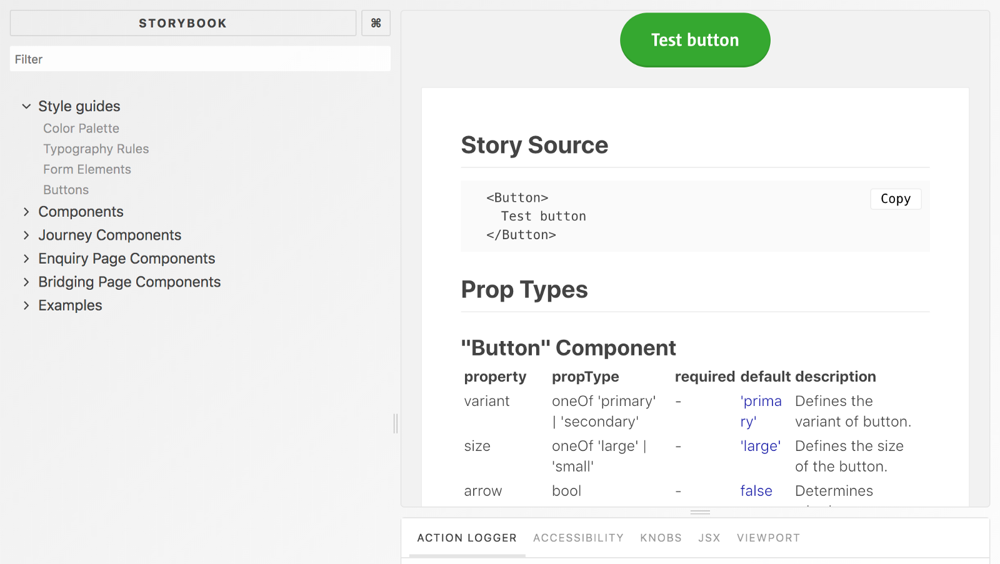
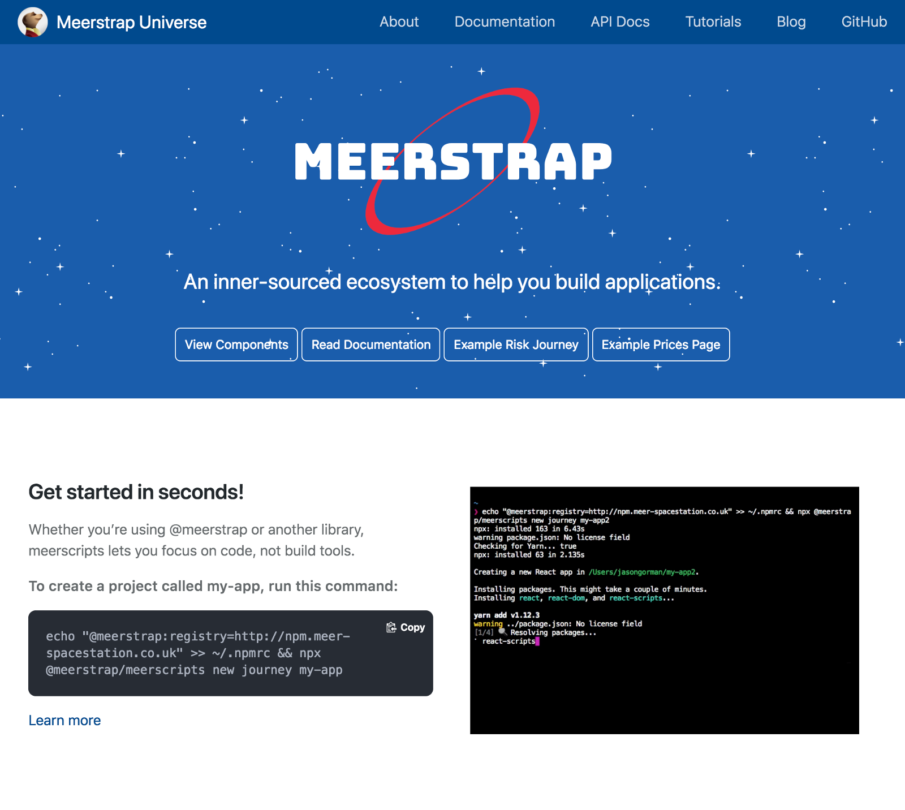
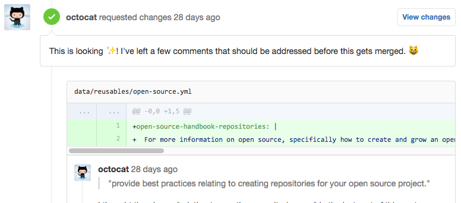
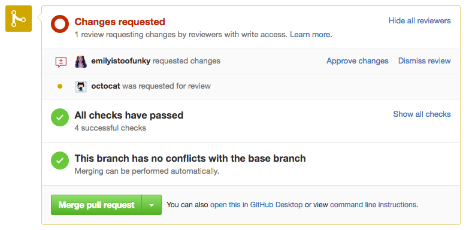
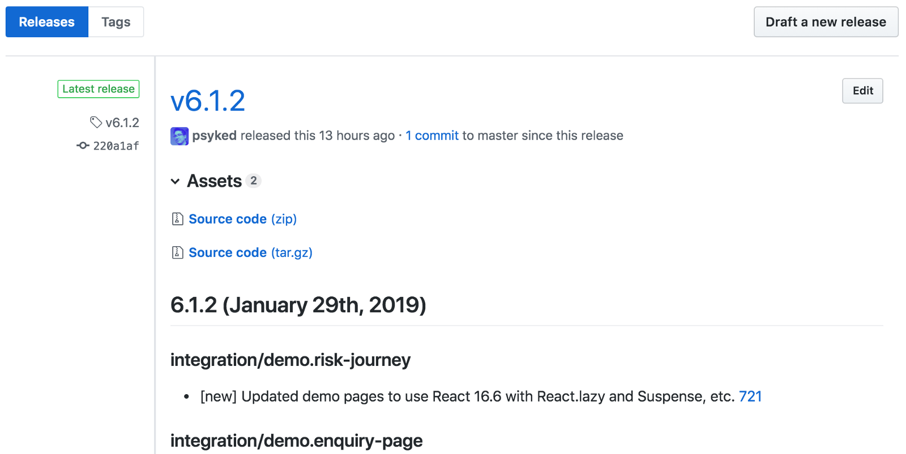
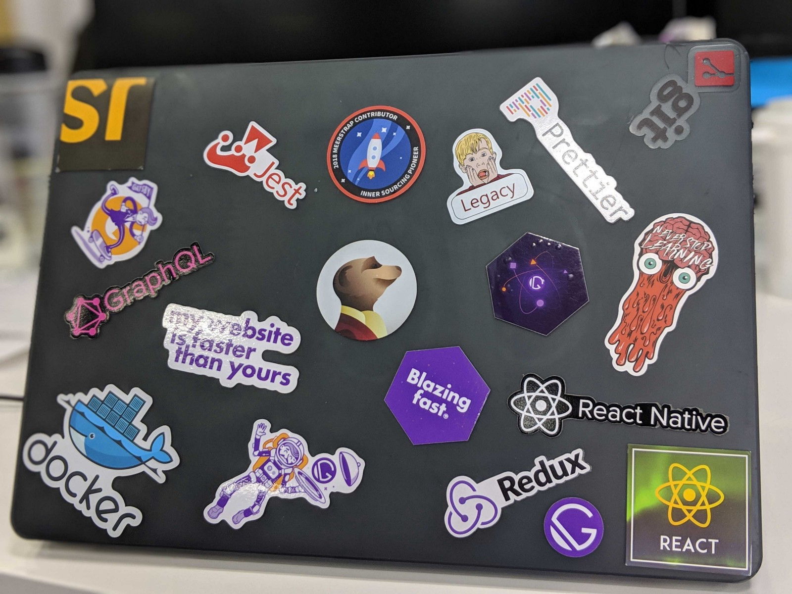

The Open Source community is an inspiration for us at ComparetheMarket — how it operates, the quality of their output and the ways they manage and engage with the community — all of it raises our expectations and standards, and I love that. 😍

---

### Introduction

#### Inner Sourcing?

We’re unlikely to ever really be able to take our internal code and make it open source, but inspired by the open-source community and in particular by Paypal’s inner-sourcing initiative we’ve created our own ‘inner-sourcing’ initiative, to take our internal collaboration to “the next level.”

[**InnerSource Commons**  
\_InnerSource applies the lessons of Open Source to all software engineering, using collaboration and transparency to…\_paypal.github.io](https://paypal.github.io/InnerSourceCommons/ 'https://paypal.github.io/InnerSourceCommons/')

Next Level, here we come…

#### Embracing GitHub

As a business we’ve traditionally used JIRA to track projects, but the GitHub UI feels more suited to open source style (collaborative) projects. We made the decision early on to embrace GitHub, and as much as possible stick to using only a single platform. We’ve incrementally adopted more and more features available through GitHub, and although other platforms are available, we always tried to work with the platforms we had available than introduce anything new.

Without further ado, here’s a few of things that our team has adopted, inspired by open source…

---

### Documentation

Yeah, everyone has documentation. But what format, what kind, what quality and for which audience is the documentation produced? Projects like [React](https://reactjs.org/) set the gold standard here, with a broad coverage of different kinds of docs tailored to different audiences: starting with introductory concepts, tutorials, and moving through to highly detailed technical specifications.

Our existing Storybook — based component documentation

We already had [Storybook](https://storybook.js.org/) for documenting our project, but now we’ve introduced our own hand-authored web-based documentation pages built with the aid of [Docusaurus.](https://docusaurus.io/)

[**Docusaurus · _Easy to Maintain Open Source Documentation Websites_**  
Easy to Maintain Open Source Documentation Websitesdocusaurus.io](https://docusaurus.io/ 'https://docusaurus.io/')

Our Docusaurus — powered documentation pages.

Of course, the technology that drives a system isn’t important, it’s the content and how it’s written that matters most. We channel all of our contributors to a single website for our documentation, and for everything we produce we try to include:

- High-level conceptual overviews,
- Contributor guidelines,
- Manually-authored documentation,
- Auto-generated API documentation,
- ‘Quick start’ instructions,
- Detailed step-by-step tutorials and a few bits more.

What’s really neat is Docusaurus’s own integration for editing pages via GitHub Pull Requests, making it really easy for readers to make their own contributions to the docs and expand or correct things as they work.

---

### Semantic Versioning

Adopting semantic versioning was almost a no-brainer. Almost every open source library uses it, so it’s already an accepted part of the developer consciousness, and it’s a useful framework for the team because it really makes us reflect on the importance and severity of changes that we make when we release new versions of our code.

[**Semantic Versioning 2.0.0**  
\_Semantic Versioning spec and website_semver.org](https://semver.org/ 'https://semver.org/')

It took us a little while to properly understand how to apply Semantic Versioning to our library and we made a few mistakes at the start, but we wouldn’t be without it now. We took a lot of ideas and attitudes towards versioning from the [React](https://reactjs.org/) team and embedded them into our workflow, and have established our own set of scripts to give us an element of automation and a set of workspace pre-release checks before we publish, to avoid repeating any common errors when publishing versions.

---

### Monorepos

When we begin planning our new library we started off with multiple projects, each with their own separate GitHub repository, but that quickly started to become difficult and tedious to manage.

Before long we were in a situation where feature requests, issue reports and pull requests were being raised against multiple repositories, or the wrong repository, or would have knock-on effects on others and the administrative overhead of keeping everything compatible and up-to-date became overwhelming. What we needed was to establish a ‘single source of truth’ and find a way of collating feedback and disseminating updates.

Fortunately others like [Babel 🐠](https://lernajs.io/) have already encountered this challenge and solved it with the help of Monorepos — single repositories with multiple output packages — so it made a lot of sense for us to explore adopting the same approach for our own project. We did that with a project called [Lerna.](https://lernajs.io/)

[**Lerna · _A tool for managing JavaScript projects with multiple packages._**  
A tool for managing JavaScript projects with multiple packages.lernajs.io](https://lernajs.io/ 'https://lernajs.io/')

---

### Pull Requests

Pull Requests are our strategy for contributing to the codebase, from people both internal and external to the core dev team. They serve as the nexus for our discussions about code, motivations for a change, making our work as transparent as possible.

Pull Request comments image, from the GitHub docs

The core team remain the only ones able to merge code into the main branch and to publish releases (more on that in a moment) but Pull Requests allow anyone in the company to propose a code change, at any point, without going through other formal processes.

In addition, we work in a tightly regulated industry and so have legal and compliance considerations for most things we do, and Pull Requests give us the ability to easily peer review and ‘sign off’ on technical changes before adopting them and allow for reviews and refinement before incorporating anything into the main development branch.

On the practical side of things we use branch-level permissions, required status checks, automated testing and commit squashing to keep things manageable. We keep as many of these checks as possible automated and they come from sources like the GitHub Marketplace (more on that in a moment.) Branch-level permissions and required status checks give us a balance of flexibility — the ability to restrict anyone from pushing to the master branch without approval from another human, for example.

[**About required status checks - User Documentation**  
\_Required status checks ensure that all required CI tests are passing before collaborators can make changes to a…\_help.github.com](https://help.github.com/articles/about-required-status-checks/ 'https://help.github.com/articles/about-required-status-checks/')

---

### (GitHub) Webhooks

Manual reviews of code are one thing, but we also have a series of automated checks and triggers that come from Pull Requests and commits.

To make our reviews easier we automate as much as we can, and as such we’ve adopted GitHub webhook integrations with systems like GoCD, Jenkins and our own homemade tools.

We use these tools to run automated unit tests, code linting checks, avoid committing work-in-progress code, ensure that change log files are updated and integrate with our JIRA systems.

Required status checks image, from the GitHub docs

For the future we’ve got our sights set on adding things like automated visual regression and accessibility testing, cross-browser and integration tests, code styles and linting, just to make it that little bit easier to keep our standards high.

At the moment, we’re currently using [changelog,](https://github.com/apps/probot-changelog) [WIP](https://github.com/marketplace/wip) and [Auto-comment,](https://probot.github.io/apps/auto-comment/) as well as our own GoCD server integration and [Github-JIRA-integration](https://github.com/psyked/github-jira-integration) plugins:

[**Build software better, together**  
\_GitHub is where people build software. More than 28 million people use GitHub to discover, fork, and contribute to over…\_github.com](https://github.com/apps/probot-changelog 'https://github.com/apps/probot-changelog')

[**Work In Progress**  
\_Prevent merging of Pull Requests with "WIP" in the title_probot.github.io](https://probot.github.io/apps/wip/ 'https://probot.github.io/apps/wip/')

[**Auto-comment**  
\_Comments on new issues and pull requests based on your configuration.\_probot.github.io](https://probot.github.io/apps/auto-comment/ 'https://probot.github.io/apps/auto-comment/')

[**psyked/github-jira-integration**  
\_GitHub and JIRA, sitting in a tree, S-Y-N-C-ING. Contribute to psyked/github-jira-integration development by creating…\_github.com](https://github.com/psyked/github-jira-integration 'https://github.com/psyked/github-jira-integration')

In the future, we’d love to get involved with something like CodeCov and/or GitHub Actions. As Yoda once said, _“Always in motion, the future is…”_

[**Code Coverage Done Right | Codecov**  
\_Code coverage done right. Hosted coverage report highly integrated with GitHub, Bitbucket and GitLab. Awesome pull…\_codecov.io](https://codecov.io/ 'https://codecov.io/')

[**GitHub Actions**  
\_Get started with one of our guides, or jump straight into the API documentation.\_developer.github.com](https://developer.github.com/actions/ 'https://developer.github.com/actions/')

---

### Releases (on GitHub)

Hot on the heels of Semantic Versioning is GitHub releases. Arguably this seems like a small thing, but let me tell you why it has a significant impact…

As we build our library of code we periodically publish releases. We use semantic versioning and we publish releases to an internal NPM Registry, and then we communicate this to dependent project teams. So we have our changelog, our documentation, and our semantic versioning. On top of this there’s also our internal NPM Registry and Slack channel where we publicise our releases. All of these channels also have a lot of other things also happening in them, so there’s a lot of noise to filter through if you only want to discover the latest releases.

With a little bit of post-publish scripting we’ve tied together the GitHub Releases interface with our actual release process. Now whenever we publish to NPM we auto-update the release and release notes on GitHub, and this becomes a good long-term record of releases that’s slightly easier to work with than the changelog alone.

Screenshot from the GitHub releases interface

---

And finally…

### Contributor Swag

All the best projects have stickers and contributor swag as incentives and rewards, and everyone\* loves to display their allegiance via laptop stickers.

Pictured: One cool laptop.

We want to encourage contributions from as many people as possible in our inner sourcing strategy, but sometimes just saying ‘thanks’ doesn’t seem enough. So as an extra surprise for our contributors, we’ve arranged for some limited-edition contributor swag to be produced and distributed to everyone that has contributed to our project 😄
