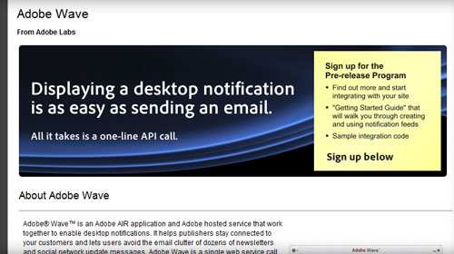

[

[Adobe Wave](http://labs.adobe.com/wiki/index.php/Adobe_Wave) is just one of the interesting projects on the Adobe Labs site - a "one-line API call" for displaying desktop notifications, built on Adobe AIR and hosted by Adobe.  Adobe are certainly committed to making AIR a success, and one of the ways they're doing this is by developing and releasing applications like this.

Like what?  Well, AIR as a platform can be driven by several factors, and one of those is a mix of commercial and community applications.  There's quite a few commerical applications out there, but the community ones seem a little slower coming - natural really, as you spend more time working on the commerical stuff!

Looking at Adobe Wave, it fills a bit of a niché - desktop notification system - but by getting there first Adobe should (hopefully) keep things open and unbiased (than if it had been developed by a commercial company).  I don't know, maybe I'm reading a little too much into their project...

Anyway, it's an interesting project, and opens up new advertising and notification methods for both commercial and community websites, applications, systems - a bit of support from all of those and you've got a whole load more people with AIR installed!