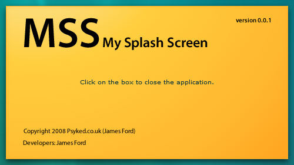

Ah, the old splash screen - a familiar thing for anyone using Adobe products, I should imagine.

I'm going to skip the arguements for and against a splash screen on your application, and assume there's a valid reason for having one - this is mainly a 'show and tell' with my code, followed by a few technical musings, and links to the project files.

### Show and tell.

As Flex / AIR applications go, this is very basic.  We're using the default WindowedApplication because it's easy, adding a transparent-backgrounded png image to the stage, and a small ActionScript function, which positions the window in the centre of the users' main screen.

      <?xml version="1.0" encoding="utf-8"?>
      <mx:WindowedApplication xmlns:mx="http://www.adobe.com/2006/mxml"
      layout="absolute" title="My Splash Screen" cornerRadius="0"
      showFlexChrome="false" height="280" width="500"
      applicationComplete="init();">
      <mx:Script>
      <!\[CDATA\[
      private function init():void {
            var splashScreen:NativeWindow = this.nativeWindow;
            splashScreen.x = (Screen.mainScreen.visibleBounds.width -
      splashScreen.width) / 2;
            splashScreen.y = (Screen.mainScreen.visibleBounds.height -
      splashScreen.height) / 2;
      }
      \]\]>
      </mx:Script>
      <mx:Image x="0" y="0" source="images/splash/splash-bg.png" width="100%" 
      height="100%" creationCompleteEffect="Fade" click="NativeApplication.nativeApplication.exit();"/>
      <mx:Label text="Click on the box to close the application."
      horizontalCenter="0" verticalCenter="0"/>
      </mx:WindowedApplication>

The main things to note are that:

*   Our WindowedApplication has a cornerRadius of 0 - which removes the default rounded corners effect so we can use squared corners on our image.
*   To make things more pretty I've added a Fade effect to the image on creationComplete.  - Note that the effect has to be added to the image or a container on the stage, rather than the applicationComplete function of the parent WindowedApplication component.
*   The window is positioned on the users' scren with Script, rather than properties. - It gives a little more flexibility to do things like this with scripts rather than properties.
*   To get the nice drop shadow effect, the drop shadow is actually on the png image.  Transparency is enabled by modifying the -app.xml settings of the main MXML file in Flex.

### Technical Musings,

**Disclaimer:** I'm still getting into Flex (heck, after 2 years doing Flash full time, I only just get the idea that I'm doing things the 'right' way) and so I might not have the most sensible application architecture ideas...

A splash screen has two main purposes;

The first, practical benefit is that a splash screen can load and display faster than the rest of the application.  I get the impression that this isn't going to help if your AIR application hangs while loading, because the whole application is connected, but if you're transferring data over network connections, decrypting or unpacking files in an asyncronous way, then a splash screen is likely to have a percieved performance boost.

The other 'benefit' I can see is from an organisational point of view, (and this is where I lack practical experience) - the inital Class of an AIR application doesn't have to be the one that contains _everything_.  It is almost just a gateway for initalizing the other Classes that make up the application.  I'm sure there's a whole Design Pattern around this sort of thing, but I think that if you make your applications' default window the one that initalises the other windows and classes used by the application, it makes a whole lot more sense.

So my advice would be to make the applications' default class the splash screen, and have the splash screen initalise all other windows.  Does anyone have an opinion on this? I'd love to know...

### Source files:

*   [Click here to download the Flex Project Archive.](http://uploads.psyked.co.uk/2008/11/splash-screen-demo.zip)

### Future Development...

Given a little more time, you could incorporate more things, like status messages and event handlers, to update the splash screen as the application loads - kinda like Photoshop - or you could (should?) extend parts of the display - like the version number - to read in variables dynamically from the application settings file.  All things for a followup tutorial, methinks.