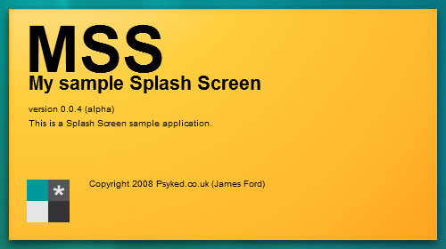

As I've been playing around with the ApplicationInfo class, I thought my Splash Screen stuff would be so much nicer if it were a little more... generic?

So with that in mind, I've updated my Flex Splash screen project to impliment the [ApplicationInfo class](http://psyked-as-classes.googlecode.com/files/applicationinfo.zip), and use that to load information such as the version numbers, application names and application icons.  Maybe it's not the most efficent way to do things, but what the hell, it's a good example for implimenting the ApplicationInfo class.

[Download the updated Splash Screen example Flex project here.](http://uploads.psyked.co.uk/2008/12/splash-screen-demo-2.zip)
