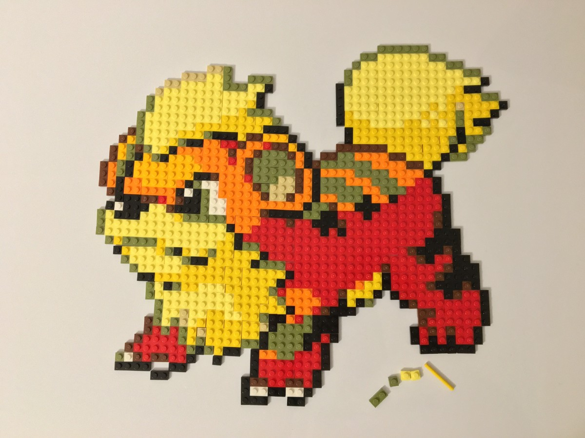

A while ago now, I set out on a side project adventure, which I’ve previously documented [in Part 1,](https://medium.com/@psyked/pok%C3%A9project-adventures-with-lego-bricks-7f24c02f6d9d) [Part 2](https://medium.com/@psyked/pok%C3%A9project-adventures-with-lego-bricks-cd9401091239) and [Part 3.](https://medium.com/@psyked/pok%C3%A9project-adventures-with-lego-bricks-c7b9b8385276) Finally though it’s time to make the leap into the real world and “eat my own dog food,” so to speak.

---

For my first real world experiment I decided to recreate the Growlithe sprite in LEGO, using the plans and shopping list generated by the page: [https://www.pokeproject.co.uk/lego/growlithe](https://www.pokeproject.co.uk/lego/growlithe)

I placed the order through the LEGO website, some nice people picked out all of the pieces I needed and shipped them over to me, and a week or so later I received the following package:

A whole bag of goodies, waiting to be assembled.

Where to start? Knowing where to position the pieces is one of the first challenges — can’t go putting them straight onto a backing board if you’re not sure where the centre point is!

Making a start…

Piece-by-piece and eventually recognisable shapes start to appear from the chaos.

It’s actually the work of more than a few evenings to put this together.

Finally — ta-dah! — it’s finally visible at full size.

And there we have it; finally transferred onto backing boards, and at an imposing size, roughly 48 x 48cm, and unfortunately possibly too big to display on the wall as intended!

---

#### Concluding

It’s been a fun journey creating [PokéProject,](https://www.pokeproject.co.uk/) and I’m pleased by the results of the conversion from Sprite to LEGO. Not all of the sprites work and produce the same quality of output, but part of my reason for picking Growlithe as my real world test was to see how well it looks in the flesh — with a mix of Olive Greens used in the place of Grey, and Orange and Yellows in the place of lighter Reds.

Each ‘pixel’ in the final image are 8mm in real life, and this size makes it particularly good as an image to be viewed from a distance, but it also puts a limit on the size of the images you can use. Finding a source image that works with such scale is a challenge!