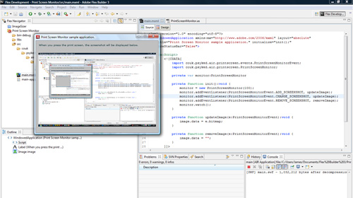

Here's a little something I've been working on recently - Print Screen support in AIR. It has to be AIR because only AIR allows you to access the OS clipboard, and only AIR seems to have access to the full keyboard. There's a few things I've looked at and various snippets of code, so I'll cover them in roughly the order I figured it all out...

### Getting your Print Screen data.

This is actually easy enough - use the Clipboard class (available in AIR) .

    import flash.desktop.Clipboard;
    import flash.desktop.ClipboardFormats;
    import flash.display.BitmapData;

    Clipboard.generalClipboard.getData(ClipboardFormats.BITMAP_ FORMAT) as BitmapData;

If we want to use that on the stage, wrap the BitmapData in Bitmap:

    new Bitmap(Clipboard.generalClipboard.getData(ClipboardFormats.BITMAP_FORMAT) as BitmapData);

That's easy enough, isn't it? Create a button or whatnot and you can grab your screenshot data.  But what if there's no BitmapData in the clipboard? That's easy too - use the _hasFormat_ function of the Clipboard class: `Clipboard.generalClipboard.hasFormat(ClipboardFormats. BITMAP_FORMAT)` returns a boolean value - you'd never guess.

### Detecting Print Screen keypresses?

So, how about updating automatically?  Well, how about detecting keypresses - if we go have a little look in the AIR documentation \[[link](http://help.adobe.com/en_US/AS3LCR/Flash_10.0/flash/ui/Keyboard.html)\] you'll see references to `Keyboard.KEYNAME_PRINTSCREEN`.  Sounds perfect, yes? Just make a key listener?

Well no luck with that - AIR can't detect all non-glyph printing characters - it detects things like the Ctrl, Alt, Shift keys - but not the Print Screen key. Those events just don't fire. Makes you wonder what on earth the static constants are in the documentation and the classes for, because as far as I can tell, nothing is ever going to use those events...

### Detecting changes to the Clipboard

Ok, so how about this for a solution: We can't detect the keypress of the Print Screen key - but we could poll the clipboard and watch for changes to it.  Mike Chambers' Volume Monitor class does something similar \[[link](http://www.mikechambers.com/blog/2009/02/24/monitoring-system-volume-changes-with-adobe-air/)\] with watching the local storage drives, so I've stolen that idea. I'm not going to go into full explainations of the code, but I've put together a PrintScreenMonitor class.  It watches the clipboard  - dispatching an event when a new screenshot is added to the clipboard, another event when the screenshot changes, and another when the screenshot is removed from the clipboard.

Here's a look at the implementation;

    import couk.psyked.air.printscreen.events.PrintScreenMonitorEvent;
    import couk.psyked.air.printscreen.PrintScreenMonitor;

    private var monitor:PrintScreenMonitor

    private function init():void {
        monitor = new PrintScreenMonitor(100);
        monitor.addEventListener(PrintScreenMonitorEvent.ADD\_SCREENSHOT, updateImage);
        monitor.addEventListener(PrintScreenMonitorEvent.CHANGE\_SCREENSHOT, updateImage);
        monitor.addEventListener(PrintScreenMonitorEvent.REMOVE_SCREENSHOT, removeImage);
        monitor.watch();
    }

    private function updateImage(e:PrintScreenMonitorEvent):void {
        image.data = e.bitmap;
    }

    private function removeImage(e:PrintScreenMonitorEvent):void {
        image.data = "";
    }

So, there's 3 events - the PrintScreenMonitorEvent is the same as a normal event with an additional bitmap parameter and contains a Bitmap object. Unless of course the event type is a REMOVE_SCREENSHOT event!  The only other problematic thing I've encountered is scope with the PrintScreenMonitor. The above example works, and there's a couple of downloadable examples here.

### Downloads / Samples.

- [Flex sample project.](http://www.psyked.co.uk/wp-content/uploads/2009/04/print_screen_monitor1.zip)
- [Actionscript classes as a zip file.](/wp-content/uploads/2009/04/AS3 Classes.zip)
