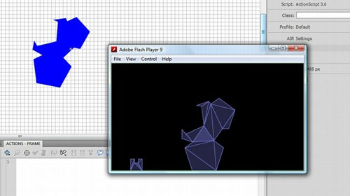

I've been working on some classes to simplify Box2D for Actionscript developers (See [previous post](http://www.psyked.co.uk/actionscript/simplifying-box2das3.htm) for a quick intro).  The latest update to these classes introduces couple of minor ideas, and one gosh-darned awesome idea, if I do say so myself.  Let's start with the awesome things, and move on from there...

### Awesome thing: Creating Custom Polygons

Or rather the methods for creating them.  Shapes in Box2D come in three basic flavours - circle, rectangle and custom polygon.  Moreover, everything must be convex (no inny bits), have no more than 8 sides, and can't have holes.  On the plus side you can still make larger, more complex objects out of smaller ones - but it all involves a lot of thinking.

So, here's the solution - or rather, the options.

**Polygon creation option #1 - Creating a polygon from an array of points.**

Using some clever triangulation code from [Splashdust.net](http://www.splashdust.net/2009/10/box2d-mouse-drawing-now-with-ear-clipping/), there's a simple method for creating any custom shape from an array of Point objects.  With this method you can create a shape with any number of sides, and not worry about whether the shape is concave or convex.  It'll still break if the edges of your shape interest each other, and doesn't support holes in the objects you're creating, but it's a start.

<object width="500" height="280">
<param name="movie" value="/content/images/2010/01/ComplexPolygonExample.swf">
<embed src="/content/images/2010/01/ComplexPolygonExample.swf" width="500" height="280">
</embed>
</object>

    var array:Array = [ 
        new Point( 0, 0 ), 
        new Point( 10, 0 ),
        new Point( 10, 10 ), 
        new Point( 20, 10 ), 
        new Point( 20, 0 ), 
        new Point( 30, 0 ), 
        new Point( 30, 30 ), 
        new Point( 0, 30 ) 
    ];

    world.createComplexPolygon( 50, 50, array );

**Polygon creation option #2 - Creating a polygon from a shape in a library.**

****

This is where things get cool.  Creating a shape from a series of points is all well and good, but it's a laborious process to set up and modify.  You can create a shape in the Flash IDE, add your symbol to your library and import it to Box2D.  Currently this method only supports single shapes on a single layer, and only straight edges - but multiple shapes, layers and curved edges are definitely on the list for the future.

<object width="500" height="280">
<param name="movie" value="/content/images/2010/01/LibraryShapeExample.swf">
<embed src="/content/images/2010/01/LibraryShapeExample.swf" width="500" height="280">
</embed>
</object>

    world.createPolyFromLibraryShape( 300, 100, "sampleShape", "vectorassets.swf" );

### Minor thing #1: Mouse interaction

What fun is a simulation if you can't interact with it? So we now have an easy way to add mouse joints to move things about.  In the next version it's my plan to add a method for filtering out objects, presumably based on each bodies userData.

    world.mouseInteraction = true;

### Minor thing #2: Framerate-independent animation.

I stole this idea wholeheartedly from [QuickBox2D](http://actionsnippet.com/?p=1471).  Too good an idea to pass up I'm afraid, this just means that the simulation of the Box2D world is based on a timer, not a framerate.  In theory then, the simulation doesn't slow down or speed up depending on the framerate - which is useful for many things, like graphic-intensive applications and/or memory optimisation.

    world.framerateIndependantAnimation = true;

And here's some code for a quick example with framerate independent animation and mouse interaction enabled;

    var options:Box2DWorldOptions = new Box2DWorldOptions( 500, 280, 30, 9.8 );
        options.setWorldEdges( true, true, true, true );
    var world:Box2DWorld = Box2DUtils.createBoxedWorld( options );
        world.debugDraw = true;
        world.mouseInteractExclusions = new Array();
        world.mouseInteraction = true;
        world.framerateIndependantAnimation = true;
    addChild( world );

I've compiled all of my source files into a handy project file if you want to take a look.  Documentation and comments are a bit sparse, but hopefully it'll prove useful!

## [Download the project files \[Zip, 48kb\]](/content/images/2010/01/box2dutils.zip)

Simples!