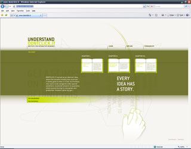
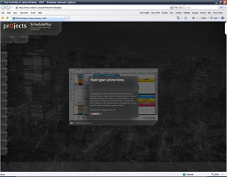

[DONTCLICK.IT](http://www.dontclick.it "Open link in a new window") and [pr_0_jects](http://www.pr0jects.com/portfolio/ "Open link in a new window") are a couple of outstanding Flash-based sites I've come across this month.

[

Don't Click.it, as the name may suggest, is all about not clicking. Trying to break the habits, and go with purely gesture related interaction. It's certainly thought provoking and a bit sci-fi-come-to-life, but what it really demonstrated to me is how much more appropriate clicking actually is. Lots of work has gone into making this baby a functional reality, but without more tangible / tactile interaction, the whole experience is a little too alien. By all means, go give it a whirl though.

[

pr_0_jects, or _The Portfolio of Jason Hickner, 2007_ is a neat little flash portfolio. The kind of portfolio I wish I had. _(maybe one day...)_ It's very slick, natural to use, even as its' slightly quirky. It makes impressive use of filters, flash deeplinking, and has some good ideas regarding window focus. Certainly an inspiration to give my 'portfolio' a kick up the ass.