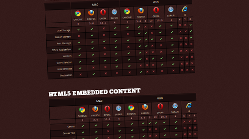

For all the buzz it's getting, you'd think HTML5 was an avalanche of new features crashing around the web.  Seems more like the first snow of the year - you know; the one everyone hopes will herald days off work and snowball fights, but then melts away overnight.  So I thought it was time I got off my ass and learned a bit more about HTML5 to see if it's really all people say it is.

First things first - **what features actually make up HTML5, and how widely supported are they? Turns out, there's already a site which tracks the features and their browser support:**

[http://www.findmebyip.com/litmus](http://www.findmebyip.com/litmus)

HTML5 is made up of a lot of things - storage, offline modes, video, audio, dynamic drawing, clever forms.  Make sense I guess - HTML5 is a cherry-picked set of features we can implement already with plugins and javascript.  Reading through the checklist it's clear that there's a couple of hands down winners on the adoption front, and total losers too.  None of them implement everything just yet though.

CSS 3 is the most kick-ass part of the specification in my opinion - finally bringing things like native rounded corners, drop shadows and advanced dynamic graphics to the web.  The rest of it is all 'meh' as it currently exists in acceptable formats.

## Is it practical? No.

> "Oh Internet Explorer, how your legacy haunts us." 

If the [browser adoption statistics](http://en.wikipedia.org/wiki/Usage_share_of_web_browsers) are to be believed - even the most pessimistic ones - Internet Explorer's market share is not something to take lightly.  You can't ignore 40-60% of your users because they use a browser that isn't up to the same standard as its competitors.  I'd dearly like too, but I can't.  Which means everything has to be developed without HTML5 & CSS 3, either using browser targeting and using multiple styles and coding options, or developed to the lowest common denominator - IE.

You might say that things will eventually catch up - but considering IE6 is still at 10% market share, you're always going to be developing something for IE6, or IE7, or IE8.  None of which have very much HTML5 support at all.  IE9 isn't going to be available for users on Windows XP, which means the best they'll ever get is IE8, which means... argh, this really isn't going to work.

If we're ever going to accept HTML5 as a development language for the web we're just going to have to adopt a more fractured development style than we use right now - develop twice, deploy once (with browser targeting).  HTML5 is effectively never coming to Internet Explorer, and if it does; by the time it's arrived it'll be too late for the party.