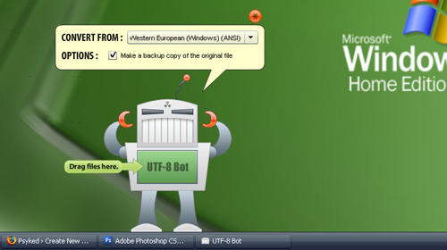

Well, here it is, my first Adobe AIR application from Flash.

What does it do? Well, it takes an ANSI or Latin1 encoded text file, and spits it out in UTF-8 format. The need is pretty basic, and as is the core code, but it did give me an opportunity to delve into some of the ActionScript libraries that come with AIR. Mainly connected with the **FileSystem**, **NativeDragDrop** and classes related to custom chromes.

I particulary like the drag and drop classes - they turned out to be far easier than I'd expected. FileSystem on the other hand, turned out to be a bit more of a bugger to get working correctly. I was also mildly surprised how easy it was to lock the application to the bottom of the screen, just with some cunning use of \`stage.maximise\` and \`stageAlign.BOTTOM\`.

Anyway, I hope I can write some more in detail 'tutorials' about a few of the things I've learnt at a later date, and take you through the code, but for now...

**[Download the AIR File](http://www.psyked.co.uk/downloads/UTF-8 Bot.air "Open link in a new window") (Requires the [Adobe AIR Runtime](http://get.adobe.com/air/ 'Open link in a new window'))**

**[Download the source code](http://www.psyked.co.uk/wp-content/uploads/2008/04/UTF-8_Bot_Source.zip 'Open link in a new window') (Requires Flash CS3)**

Oh, and a little disclaimer; I've tested this repeatedly, and not noticed any problems, but just you know, be careful and don't put anything crucial into the application. This is an experimental project, not a commercial one.
