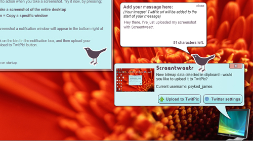

Screentweetr is my latest little side project; an AIR application for uploading desktop screenshots to twitter image services. You can download it now, from the [AIR Marketplace](http://www.adobe.com/cfusion/marketplace/index.cfm?event=marketplace.offering&marketplaceid=1&publisherid=10603&offeringid=13500).

[

### So, what is Screentweetr?

Screentweetr is an application built on AIR (Adobe Integrated Runtime). It uses the [TwitPic](http://twitpic.com/) service - which links in to your twitter account - and takes image data from your clipboard and allows you to quickly upload it directly to TwitPic, and the option to immediately tweet the same image on [Twitter](http://twitter.com/home).

### How does it work?

You might have seen my previous post: ["Print Screen detection in AIR"](http://www.psyked.co.uk/general-chit-chat/print-screen-detection-in-air.htm) \- that's the core functionality. Using the classes discussed in that post, the application listens for bitmap data on the clipboard.  Add in the JPEG encoder classes of the AIR framework to turn raw bitmaps into JPEG files, and then use the TwitPic API to post the JPEG data along with twitter credentials.

What the user sees, initially, is not much (apart from the welcome screen).  When you take a screenshot however, a chirpy little notification window appears and offers you a way to upload your screenshot.

The advantage really is in the process - no longer is it a case of "Print screen", \[paste into image software, save,\] open website, select file, upload, tag, post - it's now a case of "Print screen", tag, upload.  You don't even end up creating an actual file on your computer - it's all virtual. (Which maybe isn't all good, but hey).

### Why did I build it?

Well first of all, it doesn't look like anyones' made a similar application. In addition, the concept is really quite simple.  The core functionality took only a couple of days to put together from scratch.  (I've spent a lot more time in total on the development but hey, that's the fun of learning all the time.)

Building successful little applications relies on the application being a) good at what it does and b) focussed on its task.  Well, that's what I think.  Big companies with established multiple-task products have got there with many years and many developers - if you don't have that then you need to start small and focus on what you want the application do to, and do it well.

For example; [ImageSizer](http://www.psyked.co.uk/adobe/apollo/imagesizer-version-049-released.htm) takes images and resizes them.  That's its core function, and that's all its gonna do.  I know I haven't a hope of competing with professional software and all it's features, so I'm not trying to compete.  If I'm going to make an application that can add snazzy pixel bender effects to images, then it's going to be a separate application - and that's what Screentweetr is all about. It's taking a potential user scenario - the process of screenshot to twitter - and building an application to facilitate that.

### What's in store for the future?

Oh my, where do we start? Well, there's three key elements to the future development; Visuals, Services and User experience. Visuals and user experience are just generally improving the look and feel of the application, and how it works.  Services were suggested by [@destroytoday](http://twitter.com/destroytoday) and sounds like a good idea - basically adding support for more than one image uploading service. So, [TweetPhoto](http://www.tweetphoto.com/index.php) is on the list to go alongside support for TwitPic.

### Where can I download it?

That's simple.  Screentweetr is available for [download from the Adobe AIR Marketplace](http://www.adobe.com/cfusion/marketplace/index.cfm?event=marketplace.offering&marketplaceid=1&publisherid=10603&offeringid=13500 "Click here to visit the AIR Marketplace to download Screentweetr.").  I'll get an install badge up on here soon, but for now, just go to the AIR Marketplace.