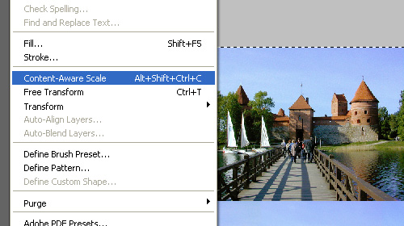
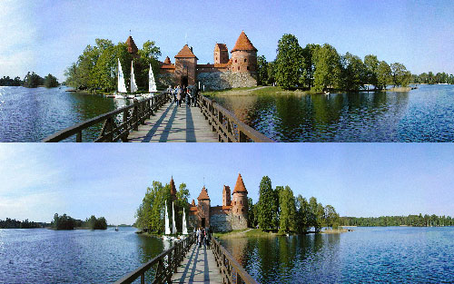

Here's one reason why Photoshop CS4 kicks ass (here's something completely new).

It's called "**Content-Aware Scale**".  Unlike the transform controls from previous iterations, this scaling mode is somehow aware of the contents of an image and can discern what elements you want to scale.

So when you start scaling up or down, only the elements like the sky, water, background elements stretch and the people and buildings maintain their perspective and float around the scaling background.  Pretty cool huh?

So here's an image I've grabbed from Google - a panorama of [Trakai Castle](http://en.wikipedia.org/wiki/Trakai_Island_Castle).  In the image below I've scaled it to 50% width - the top image is "Content-Aware Scale", and the bottom image is shrunk with the normal transform tools.

That took 30 seconds to do.  How long would you previously spend cleverly masking and cloning areas of the image by hand to do that?

How cool is that - it's image transformation, just like in the movies.  Next we'll be enhancing perfect images of suspects from pixellated CCTV footage, just like in CSI.