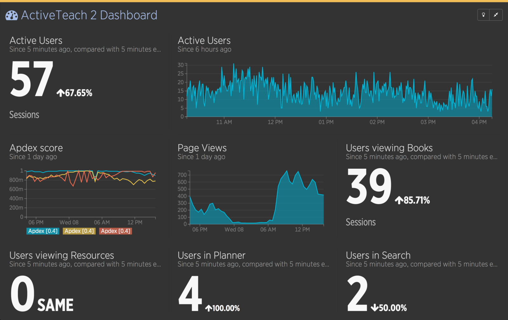
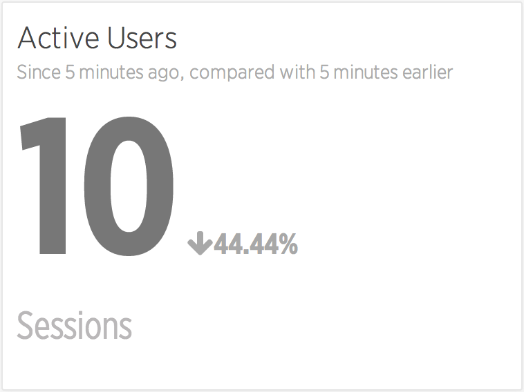
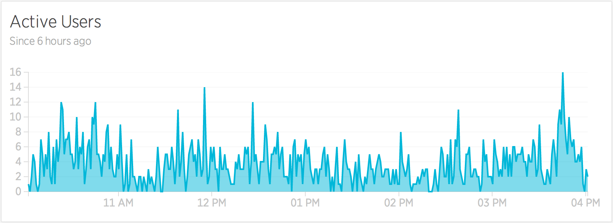
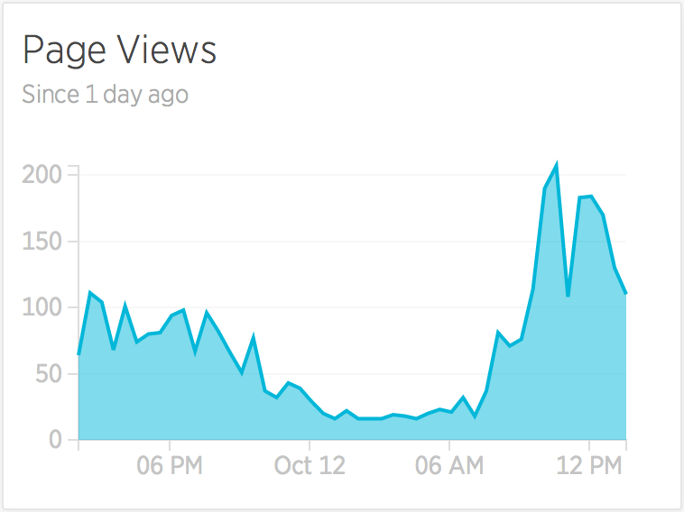
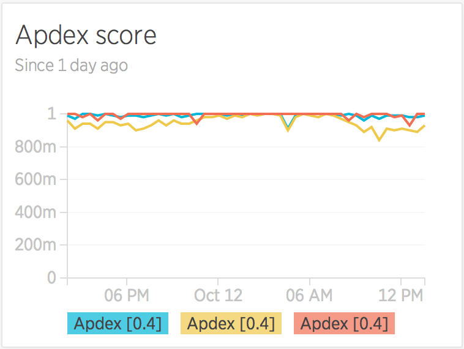
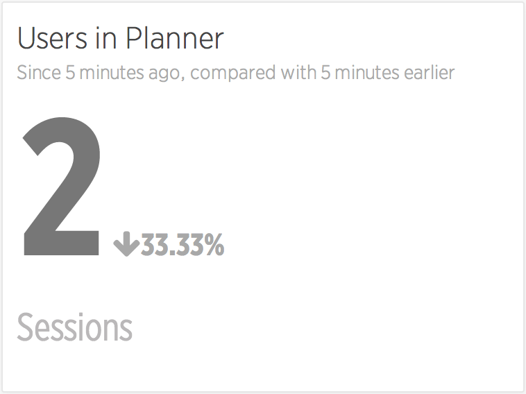
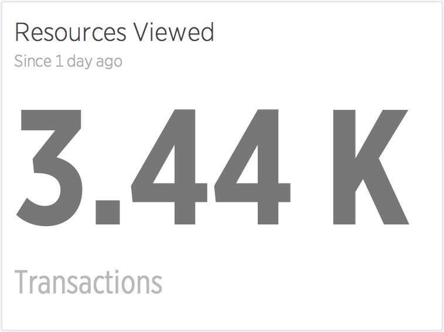
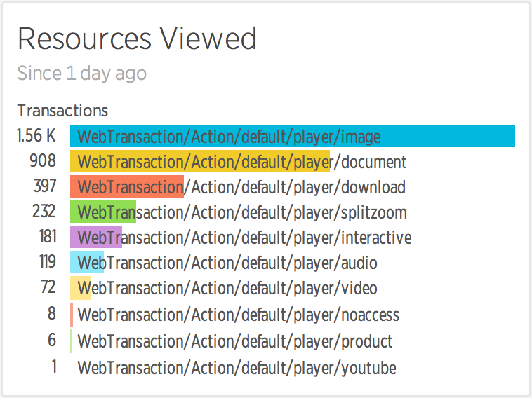
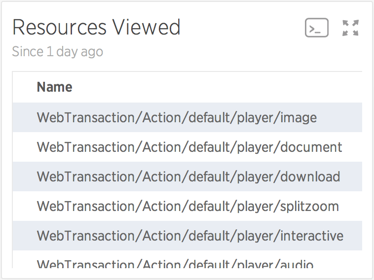
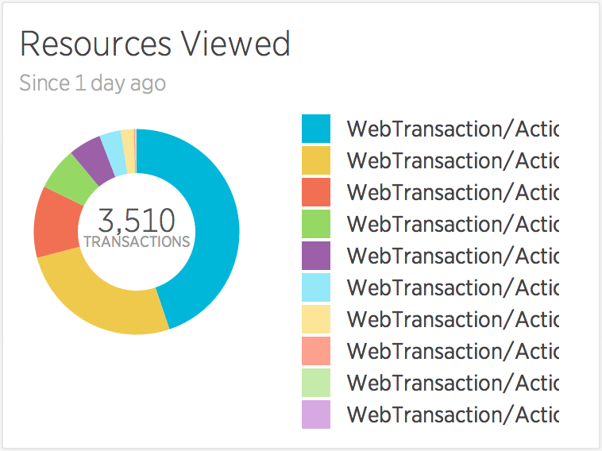

  
## with New Relic Insights

---

In the complicated world of software development there are many, many ways to achieve the same end result, and when those results are visually indistinguishable from one another we end up grasping for some solid (measurable) data for support and reassurance that we are in fact not _making things worse_.

In order to understand how well we’re doing we need to collect data, analyse it, extract the useful metrics and find a way to present that information. So, how do we go about that?

---

### Harvesting raw data

> _“Raw data has a strangely alluring quality — it has the power to answer all of your questions, as well as the power to ask even more.”_

For a few of our projects we’re using a SaaS product called **New Relic**_._ It works slightly like magic, but it essentially sits on our servers and monitors everything that the server does and transmits that data off to New Relic’s service from where you can then access that data.

---

### Extracting data from New Relic

After logging in to New Relic, we get an initial dashboard that gives us a basic overview of our servers’ status, some performance metrics and specific details of the longest or most active processes on the server.

This initial dashboard is great for exploring our data relatively quickly, but it’s often not focussed on the _business needs_, and it’s for that reason that we want to get our hands dirty, dig into the data and create our own custom dashboards that display only the metrics that we’re interested in and are suitable for a fancy permanently-visible display in the office.

Fortunately for us, creating such a dashboard is actually quite simple with [**NRQL**](https://docs.newrelic.com/docs/insights/new-relic-insights/using-new-relic-query-language/nrql-reference) and **New Relic _Insights_**, which gives us both an API to query the raw data and an easy way to generate auto-updating numbers, tables or charts. On top of that, we have a simple drag-and-drop dashboard creation tool that New Relic provides (shown above) and the ability to take each individual chart and display them on any HTML page as an iframe element, making them truly independant.

With our tools determined, let’s look into the process of creating our first project dashboard…

---

#### Business Need #1:

### Number of active users

On our website we’re already using _Google Analytics_, which tells us how many users there are on the website, and how much traffic we’re getting from those users. We’re looking to **only use** _New Relic_ for this data however, so the first thing we’re going to have to do is find a way of duplicating that real-time usage information.

The obvious way to get this information is to count the number of active user ‘sessions’ on the website. To do that we’ll send the following **NRQL** to the Insights API:

    SELECT uniqueCount(session) FROM PageView WHERE appName = '{name}'

Which in this case gives us **104 sessions**. That looks a little high for this website, but that’s because we haven’t specified a time range and it’s defaulting to 1 hour. _Google Analytics_ does their real-time data in 5 minute slices, so we’ll try that next:

    SELECT uniqueCount(session) FROM PageView WHERE appName = '{name}' SINCE 5 minutes ago

That gives us **10 sessions — **which is better — but it doesn’t quite compare to _Google Analytics_ yet, which actually gives you some trending information. So let’s try a comparison with the last 5 minutes instead.

    SELECT uniqueCount(session) FROM PageView WHERE appName = '{name}' SINCE 5 minutes ago COMPARE WITH 5 minutes ago

That’s a much better real-time view, and it matches up pretty well with our existing data that was coming from _Google Analytics_.

Simple numbers and comparisons are one way of looking at this data, but we can get a better idea of trends if we take larger slices of data and display them using charts. To get a simple chart of this data we can add a TIMESERIES, using this snippet of code:

    SELECT uniqueCount(session) FROM PageView WHERE appName = '{name}' SINCE 6 hours ago TIMESERIES 1 minute

Which will generate this graph of minute-by-minute active session data:

---

#### Business Need #2:

### Traffic and trending data

Knowing the number of users on our website is one part, but we also want to have an idea of how much content they’re interacting with while on our website, and for that we can simply count the number of PageViews:

    SELECT count(*) FROM PageView WHERE appName = '{name}' TIMESERIES auto SINCE 1 day ago

Which will generate a chart like this (below) — which in this case is particularly useful for showing us when our peak load times are during a single day.

> Who needs Google Analytics, eh?

---

#### Business Need #3:

### Server health-check

Our stats so far are just replicating what we can get elsewhere, so now it’s time to tap into the more unique data that _New Relic_ can offer us — what’s called the Apdex score — a measure of application response times and end-user satisfaction scores.

In this case, there’s three different sets of scores that we want to pull in — the score for the application server, for our database server, and another for external websites and services. To do that we can use a query like this:

    SELECT apdex(databaseDuration), apdex(duration), apdex(externalDuration) FROM Transaction WHERE appName ='{name}' TIMESERIES auto SINCE 1 day ago

Which will create a slightly different type of chart — by using commas to select three different sets of data, we get a multi-line chart.

---

#### Business Need #4:

### Most popular features & content

> This is where it starts to get _really_ interesting — what areas of your website are the most popular, and what are the most-used features?

Accurately determining the answers to this really depends on your application and its structure, and you may actually have to start logging custom data with _New Relic_ in order to find your answers more easily — up until this point we’ve just been using data from the out-of-the-box installation, no custom data needed.

Our application has a few key areas, and these areas can — in part — be deduced by looking at the page URL and throwing a few wildcards into the query. To see the number of users in a section called ‘Planner’ we could add the condition…

    AND pageUrl LIKE '%planner%'

… to our existing query to create …

    SELECT uniqueCount(session) FROM PageView WHERE appName = '{name}' AND pageUrl LIKE '%planner%' SINCE 5 minutes ago COMPARE WITH 5 minutes ago

Which — when compared with our previous query — starts to give us a better picture of the proportional usage of certain features.

Assuming we’re interested in the usage of _specific_ features like this, we can use the same technique out as many times as we want to get a loose idea of the popularity of our URLs.

But what if we _can’t_ determine the feature usage by URLs alone? What if we’re loading content using AJAX, or another technique that isn’t identifiable through the PageView metrics?

One such area of our website that we have is the ‘Resource Viewer’ which uses the same base URL structure to display many different types of content. To inspect this kind of data, we need to be looking at our applications’ transaction data, with a query like this:

    SELECT count(*) FROM Transaction WHERE appName = '{name}' AND name LIKE 'WebTransaction/Action/default/player/%'

Again we’re using wildcards and URL-like inspection of our data, but we’re instead using it on our internal PHP-applications’ routing structure, to inspect the data that isn’t otherwise available. The result of such a query looks like this:

Which, whilst vaguely interesting, doesn’t really tell us anything about the _types_ of resources that have been loaded. To do that, we need to give the API a little more information about how to group the results, by telling it the FACET of data that we’re interested in, like so:

    SELECT count(*) FROM Transaction WHERE appName = '{name}' AND name LIKE 'WebTransaction/Action/default/player/%' SINCE 1 day ago FACET name

Which gives us the much more useful and interesting specifics:

---

That’s the extent of my _New Relic Insights_ skills at the moment, so I’ll end with a final warning: make sure the stats you compare actually make sense, unlike some of the more [Spurious Correlations](http://tylervigen.com/) that can be drawn from data.