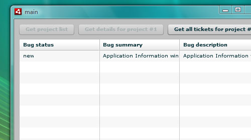
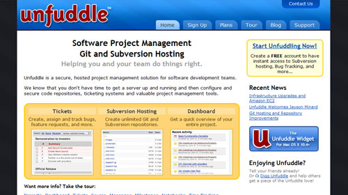

Ok, this isn't going to be a tutorial - not yet anyways.  So many projects, so little time to write about them.

As part of my attempts to improve the way I work, I've been on the look out for a private hosting solution for Subversion, that comes with project management tools like bug reporting, and - crucially - an API that I can work with in Actionscript.  My rather uninspired image above is the first draft of my bug tracking tool.

[

My searching has led me to a website called [Unfuddle](http://unfuddle.com/), which offers all of these things.  They have an API that works around url requests and HTTP headers authentication, which means that in theory (and practice) I can write Actionscript that can retrieve and write information to my unfuddle account.  All of their examples are in curl(!), but the principles are easy enough to translate, which is what I'm working on right now in Flex.  Once I have things a little more concrete, I'll post a proper tutorial of some sorts.

Unfuddle offers free accounts, as well as paid ones so if you wanna do the same as me, give it a whirl.  I've even posted a small [Flex example in the community forums](http://unfuddle.com/community/forums/6/topics/462) over at Unfuddle.