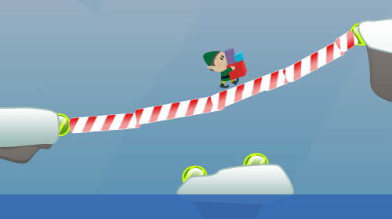
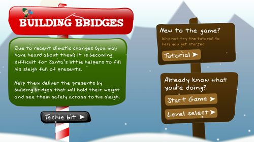

It's that time of year again - and after a week or so of furiously learning Box2D, we at MMT Digital have just released our seasonal Flash game into the wild.  The idea is all about building bridges across gaps in the terrain, using Box2D to simulate your resulting creation.

You can check it out here: [Play "Building_Bridges" now.](http://www.mmtdigital.co.uk/Flash/ChristmasGame2009/Building_Bridges.html)

[

This years' game is a bit of a geeky dream – and luckily one that also makes for a fun end game.  Under the hood, you see, ‘Building Bridges’ is all based off a realistic world physics simulator - called [Box2D](http://box2dflash.sourceforge.net/).  All of the interaction between the elves, bridges and environment is handled by the sort of physics engine you’d find in a proper Games Console game, and all of that is based on what would happen in a real Newtonian world.

[

It’s still complicated to put together a game on top of all that clever physics engine, but using Box2D has made things possible in the Flash Player that I couldn’t have even otherwise considered building.  And that’s all a testament to just how flexible and powerful the Flash Player runtime has become – Box2D for Flash is a ‘port’ (translation) of Box2D for C++ - which was originally made for full-on desktop applications and games, not bad when you consider that Flash runs in a browser, with only a fraction of your systems’ resources.  So it’s not all about animation, video and ‘skip intro’!

We’ve moulded Box2D to suit our needs for this game, but that’s only a small slice of what it’s capable of.  Go on, get back to playing the game – and don’t just ‘solve’ the levels, solve them with creativity!