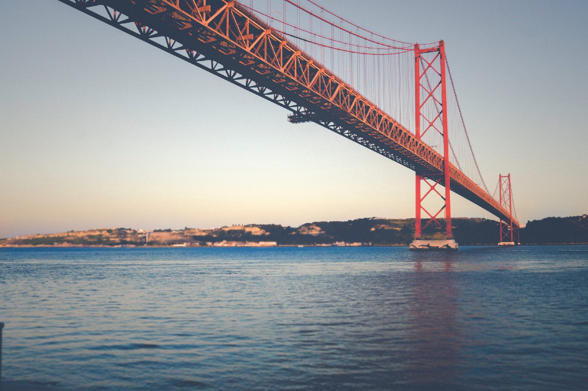

# Building “duotone”

## Applying filters to images and generating downloads with client-side Javascript

It all started with ^ this Tweet. ^

Whist stumbling through my reading list I was impressed by the image filtering capabilities of the humble SVG, as demonstrated by [Lentie Ward’s article: ‘Using SVG to Create a Duotone Effect on Images’](https://css-tricks.com/using-svg-to-create-a-duotone-image-effect/) and decided to explore this further.

The end result is a single page application that I’ve imaginatively called [Duotone](https://psyked.github.io/duotone/), which allows you to select an image, apply a filter from a selection of presets and then download the resulting image as a new image file.

Duotone, in all its version 1 glory!

#### How Duotone images work

Achieving this effect isn’t actually too difficult, and involves two steps. The first is to make the entire image greyscale, and the second is to map the resulting image palette to a new colour palette, which in this case is a gradient made from blending two colours.

Re-mapping the image gradient is different to applying a blend mode to an image or colourising it with a colour overlay, because it allows the output image to be constructed from more than a single colour.

Duotone on the left, Original image on the right

#### How I built Duotone (the application)

The [application itself](https://psyked.github.io/duotone/) is a single static HTML page, which is hosted on GitHub Pages. It uses [Vue.js](https://vuejs.org/) syntax with SASS for the page styling, [Nuxt.js](https://nuxtjs.org/) to generate the static HTML page and [FileSaver.js](https://github.com/eligrey/FileSaver.js) to generate the image downloads in the browser. And of course, the vast majority of the logic and techniques for actually achieving the effect in the first place was shamelessly appropriated from [Lentie Ward’s CSS Tricks article.](https://css-tricks.com/using-svg-to-create-a-duotone-image-effect/)

Thus far [Duotone](https://psyked.github.io/duotone/) has taken a few nights’ work to build. Nuxt.js has made the process of getting a working project template very simple and allowed me to concentrate on building working code and not on deployment processes or tooling.

#### What does the future hold?

Having a set number of templates hardcoded into the application is fairly limiting, so that’s the next thing to address — making the colour palettes completely customisable, and maybe even introducing an option for including more than two colours in the mapping gradient.

---

There we are then. [3 hour hack](https://medium.com/@psyked/3-hour-hacks-d22772439d04) #1 complete. 👍