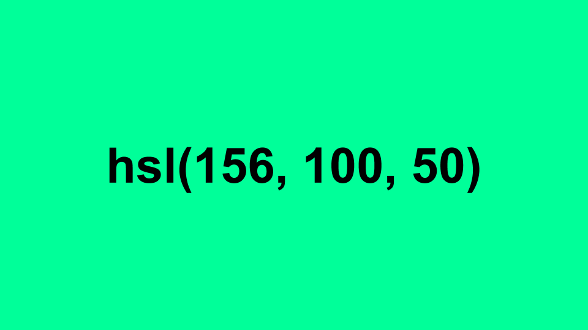

# Colours: A lightning Talk ⚡️

> I find colours fascinating, and I write code that goes into websites, so there’s bound to be a natural intersection between those two subjects.

At [Compare the Market](https://techjobs.comparethemarket.com/) we’ve kicked off a new round of Lightning Talks: internal speaking opportunities for employees to present on a topic that interests them. Here’s the slides and rough dialog from my talk, which was a slightly meandering talk all about colours.

---

### Defining Colours

Defining Colours

Let’s start where I started, with website development and what we can achieve with HTML and CSS. In particular, let’s look at the ways we can define colours for the computer to display.

#FF0066

We’ve started with hex codes. #FF0066 is the background colour of the image above. How does that work? Well, it’s actually a number. Or rather, it’s a group of three numbers — one number for each of the Red, Green and Blue colour channels.

FF — red, 00 — green, 66 — blue

Interesting, but what does it all mean? As I mentioned earlier, it turns out colours are just numbers, and all these formats are just abstract ways of referencing that number.

A number? Yes. 0 to F are hexadecimal numbers for 0 to 16. Taken as a pair that’s 16 x 16, which makes 256. So it’s 0 to 256. Each of the Red, Blue or Green channel has a brightness of between zero and 256, and we mix the intensity of those channels to produce the colours we want, just like this classic diagram.

RGB colour mixing using light

So, how many colours are there?

256 x 256 x 256 = 16,777,216

Or to put it another way, there are 16.7 million colours.

16.7 million colours

It’s cool and all, but all that this actually means is that there’s 16.7 million unique colours we can reference using this approach.

#### Practical applications

Knowing that colours are just numbers, the obvious thing to do is to try and create a confetti simulator, generating random colours for your confetti using the following code:

Math.random() \* 0xFFFFFF

However, it quickly becomes apparent that most of the colours that you’ll generate with this method are fairly unappealing. 90% of the colours you’ll create using this method are either too light, too dark, or are a nasty shade of brownish-green.

---

rgb(153, 0, 255)

_(Obviously the colour different here. I’m trying to make things interesting.)_

The same principles as hexadecimal codes are at work here — it’s one colour for the Red, Green and Blue channels — but this time we’re not defining the colours in the more familiar decimal system.

Or we can define colours with percentages instead of numbers from 0 — 255:

rgb(0%, 40%, 100%)

But defining colours is not just RGB channels, oh no! We can also organise and define colours by Hue, Saturation and Lightness, like this:

A colour picker grid

And we can define those colours in CSS like this:

hsl(156, 100, 50)

And a slightly different version with Hue, Saturation and Value:

hsv(36, 100, 100)

What’s the difference between all of these? Nothing too special, it’s possible to define the same colour in a variety of ways, like with this example:

#ffcd00, rgb(255, 205, 0), rgb(100%, 80.4%, 0), hsl(48.2, 100, 50), hsv(36, 100, 100)

The benefit of having all of these different ways of defining the same colour is that it makes certain logical transformations easier. You want a slightly blacker yellow? Drop the ‘lightness’ value from a HSV declaration. You want a greyscale version of the colour? Drop the saturation value to zero.

---

### Displaying Colours

Displaying Colours

This knowledge was enough for me until I started getting a bit more interested in website accessibility testing, and in particular, checking things like colour contrast ratios.

Accessibility

As part of the web accessibility checks, we test combinations of colour to ensure that there’s enough difference between them for them to be perceptible to users with a visual impairment, and ideally those tests are good enough to pick up potential issues, such as a lack of tonal difference in colours. But, how does colour contrast checking work?

Back to the CIE Chromacity diagram

This chart (above) — that’s what the factory-default human eye can see.

sRGB colour space inside the CIE Chromacity diagram

This (above) is actually what RGB (or sRGB) colour definitions represent against the range of perceptible colours — in reality it’s just a subset of the visible colours. A normal monitor can accurately display most of this colour set. An IPS calibrated screen gets you a bigger slice of this subset, usually 99% rather than something like 95% of those colours.

> Mind-blowing as it is, computer monitors aren’t even designed to represent all of the colours that your eye can see.

Have you ever presented slides on a projector or looked at your website on a cheap or poorly-calibrated monitor? Chances are you the display is washed out, and you lose details, and this is because your colour representation chart would in reality look more like this:

How a really bad colour calibration setup could affect available colours

#### Practical applications

How can this understanding be useful? Let’s look at a practical example by looking at a bug report for a previous project of mine:

“The background pattern isn’t showing on some of the (new) computers in the office.”

This (below) is a screenshot of the current website. The background pattern is a repeating background pattern that’s generated from SVG. At first we thought it was a browser-support issue, then a build issue, or a versioning issue.

derby.ac.uk website screenshot

Eventually we discovered that the issue varied from monitor to monitor on the same machine, and then we worked out it was a certain brand of monitors. Monitors which came with a particularly poor default colour calibration.

As designers and developers, we never saw this issue because we have decent monitors! We were able to do some math and work out the minimum acceptable contrast levels for our background image based on the monitor specifications, and fixed this by making the grey pattern darker.

---

### Perceiving Colours

Perceiving Colours

Let’s move on from defining colours and displaying colours and onto perceiving and comparing colours.

The CIE Colour System diagram

Comparing colours. How do we compare colours, and what does that mean? There’s a lot (16.7 million) of them, and when you think about it, it’s not as simple as measuring distance between two values. For a start, even representing the all of the available colours on a screen at once is difficult because it’s a three-dimensional thing: there’s three main colour channels and their intensities, which is better suited to representing as a cube, like this:

A three-dimensional colour cube

To make it more obvious, there’s this lovely animation I found on the web:

An animated, three-dimensional colour cube

Knowing that colours are a ‘cube’ might help you work out the Euclidean distance between them, but the human eye doesn’t quite work that way. Your colour sensitivity tapers off at the light and dark extremes, and it’s less sensitive to certain colour channels.

A cube works as a representation for the equal-sided sRGB colour space, but the reality of ‘3D’ human colour perception is that it’s more like this:

Let’s skip out a lot of research here and just say that _Calculating Perceived Colour Is Hard._ It involves measuring distances between two points in the shape shown above.

Calculating Perceived Colour Is Hard.

Fortunately, lots of smart people have already spent a lot of time figuring it out for us, and made formulas available to work things out, like the CIE Delta-E formula. Let’s take a quick look at some of them, for fun.

Delta-E, version 1976

The earliest, and simplest version of the formula. It’s good at comparing most colours, but not so good at detecting differences between two values with similar levels of saturation.

Delta-E, version 1994

This is version 2, from 1994. It’s better, but gets a little muddled by colours which are very light.

Delta-E, version 2000

This is the third and currently the final version of this formula, which is as accurate as anything currently out there.

Unfortunately I don’t understand even half of the Math used in any of those iterations of the formulas. Fortunately other smart people do, and have implemented the formulas and then made them easily available as code modules online. An example, and the code I’ve used in my projects, is available here: [http://zschuessler.github.io/DeltaE/learn/](http://zschuessler.github.io/DeltaE/learn/)

### Side Projects

I’ve got two projects which have made use of the Delta-E colour comparison calculations, which I’ll mention briefly.

#### CSS Colour Comparisons

The idea started with this issue: [https://github.com/internetarchive/openlibrary/issues/968](https://github.com/internetarchive/openlibrary/issues/968)

[https://github.com/internetarchive/openlibrary/issues/968](https://github.com/internetarchive/openlibrary/issues/968)

Over time, Open Library has accumulated roughly 80 different colours in their CSS file, and it’s not completely clear which of those colours are on-brand and which are incorrect. To tackle this issue and reduce the number of colours I thought it would be good to compare each of those colours against each other and identify which colours were perceptually indistinct using the Delta-E library.

#### Pop Quiz time! 🎉

How many CSS colours can you see on this website?

Compare the Market’s Motor Insurance website

The answer, at the current time, is roughly 141 different colours! 😱

Looking at [https://psyked.github.io/iris-css-color-analysis/?source=https://m.quote.comparethemarket.com/style.desktop.1.1.201.0.css](https://psyked.github.io/iris-css-color-analysis/?source=https://m.quote.comparethemarket.com/style.desktop.1.1.201.0.css) we can see that there’s a lot of almost-similar colours on the page, and we can also explore the similar colour groupings and highlight the most numerous use of those colours.

The tool is very ‘rough and ready’ at the moment, but it’s hosted on GitHub Pages and is ready to use now if you’re interested.

[https://psyked.github.io/iris-css-color-analysis/](https://psyked.github.io/iris-css-color-analysis/)

#### Pokemon Sprite to LEGO™ conversion

A little while ago I thought it would be a neat idea to convert pixel art into LEGO patterns, and part of that conversion involves remapping pixel colour palettes which feature around 256 colours into a more limited palette of roughly 40 possible brick colours.

I’ve written about this process before on Medium, and the links to the more in-depth articles are available at these links:

[**PokéProject: Adventures with LEGO Bricks**  
\_Part 1: Using JavaScript and HTML5 canvas elements to convert images into 2 dimensional LEGO brick plans.\_medium.com](https://medium.com/@psyked/pok%C3%A9project-adventures-with-lego-bricks-7f24c02f6d9d 'https://medium.com/@psyked/pok%C3%A9project-adventures-with-lego-bricks-7f24c02f6d9d')

[**PokéProject: Adventures with LEGO Bricks**  
\_Part 2: Making optimal use of the available bricks.\_medium.com](https://medium.com/@psyked/pok%C3%A9project-adventures-with-lego-bricks-cd9401091239 'https://medium.com/@psyked/pok%C3%A9project-adventures-with-lego-bricks-cd9401091239')

[**PokéProject: Adventures with LEGO Bricks**  
\_Part 3: From a theory to the real world.\_medium.com](https://medium.com/@psyked/pok%C3%A9project-adventures-with-lego-bricks-c7b9b8385276 'https://medium.com/@psyked/pok%C3%A9project-adventures-with-lego-bricks-c7b9b8385276')

[**PokéProject: Adventures with LEGO Bricks**  
\_Part Four: Into the real world.\_medium.com](https://medium.com/@psyked/pok%C3%A9project-adventures-with-lego-bricks-5ffefc875a8f 'https://medium.com/@psyked/pok%C3%A9project-adventures-with-lego-bricks-5ffefc875a8f')

Colour Palette remapping examples

With such a limited colour palette available it’s important to get the best colour matches possible. As you can see in the image above, Delta-E clearly gives the best perceptual colour matching for the pixel sprites, which really makes a difference and produces the best quality output.

A screenshot of the planning tool…

… and the final output

---

And that’s it from me! Colours are an interesting topic to explore, and knowing just that little bit more about how they work and what they actually mean can help in unexpected ways.
