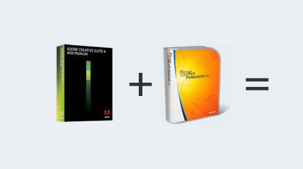

It's a fast-paced industry, with Digital Production studios (like us) transforming all manner of content from clients into wide variety of other formats. We'll take school textbooks for example and transform them into interactive textbooks, or spreadsheets of contact details and translate them into Google Map pages.  A labour-intensive task?  It doesn't have to be, if you're clever about things (and a little flexible, and willing to get your hands dirty with alien programming languages).

Most companies have crossed into the realms of digital (who even works with paper anymore?) but that doesn't mean that they are using formats that are compatable with web development - quite the opposite - they'll mostly be Word documents, Excel spreadsheets or Powerpoint presentations. Likewise, images you're supplied will be full-resolution megapixel camera shots, not web-optimised graphics. So, just how do you turn work around in an efficent, reliable way - in the easiest way possible for both you _and_ the client?

### \[What is a\] desktop mashup?

Well technically, I just made the term up.  Everyone's banging on about online mashups - connecting data services to this and that, to do something new or special.  A desktop mashup is the same idea, connecting Visual Basic macros authored in Microsoft Office or the .Net framework to applications and scripts written in Adobe Bridge, ExtendScript or just plain old (Flash/Flex/AIR/Director) to whatever other format you require.

That way, a client can compile all their data in Excel or write everything up in Word (in a completely non-technical way) and we can efficently analysize it and transform it into a solid data structure. I would never have thought a couple of years ago that I might be refreshing my old A-Level VBA stuff, but here I am, turning lists of office data into html and xml data structures.

### Working outside the box

A lot more possibilities open up when you look outside the box - don't just stick to Adobe Creative Suite for production, check out VBA macros and what they can do for you. And if a job looks like it requires manual repetitive work, look for a way to make the computer do the work for you - that's what they're good at.