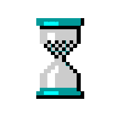

Your next big idea might very well be your greatest success.

# Explorative Prototyping

I’ve been making a lot of simple prototypes recently. Each one has at least one feature that is unique and uses a technology that is new to me, and each explores an idea that I’ve come up with myself.

I’m pleased with my prototypes and the fact that I’ve created them. Their success — and my apparent boost in prolificity by creating them — is owed to a few simple concepts;

1.  Understand the key goals.
2.  Maintain a narrow scope.
3.  Set a short timeframe.

That’s it. But let’s take a few moments to delve deeper into what’s actually meant by those principles.

---

#### Understand the key goals.

The crux of a successful prototype is in setting goals. To spend your time effectively you need to know both the ‘_why’_ and have an idea of the ‘_how’_ before you begin. Sometimes you’ll only know the technology you want to explore (your _how_), and other times you’ll have a goal (your _why_) but no idea of _how_ to achieve it. You need to know both before you start because:

*   A prototype\[the _how_\] without a reason\[the _why_\] will inevitably fizzle out to a simple proof-of-concept application.
*   A challenge\[the _why_\] without a solution\[the _how_\] isn’t ready for you to begin working on.

Start with a single high-level primary goal and a few secondary goals, and admit that some of those secondary goals might have to be sacrificed during development to limit your scope or keep within your time constraints.

Primary goal: Escape. Secondary goal: Build kick-ass Iron Man suit.

For example, here’s some of my recent project goals:

Name: Project Stats v1  
Primary: Encourage Source Control Best Practices in Team  
   Secondary: Collect data from Bitbucket  
   Secondary: Make data explorable with interactive charts

Name: Work Resourcing v2  
Primary: Make weekly resourcing more user friendly  
   Secondary: Parse XLS files with Node.js  
   Secondary: Generate and send emails with Node.js  
   Secondary: Authenticate with Office 365 with Node.js

Name: Monolithic.js  
Primary: Make upgrading Javascript to ES6 easier  
   Secondary: Build a tool to rewrite/reformat Javascript  
   Secondary: Break large legacy JS file into multiple files  
   Secondary: Don't break functionality of legacy Javascript  
   Secondary: Use rollup.js in build process

> Clear goals make it easier to control the scope of your prototype; anything that doesn’t actively contribute to meeting your core goals — however ‘neat’ the feature might be — can be shelved until the prototype is complete.

---

#### Maintain a narrow scope.

Although it’s great fun to plan a project with all the bells and whistles, you can actually move faster and explore a more varied set of features if you tackle them in isolation. Essentially, limit your work-in-progress at the conceptual level.

Your high-level goal is often something that could be solved in lots of different ways, so refine what you’re doing, focus on a single feature at a time, deliver it and _then_ move onto the next. If you don’t you risk scope creep taking over your project, and complexity of everything you’re try to build starts to compromise your ability to finish any of it.

> Scope creep is the bane of all software development, exponentially increasing the levels of complexity and timeframes of a project.

---

#### Set a short timeframe.

And know how much time you want to spend exploring your idea.

I limit my prototypes to timeframes measured in hours, not days or weeks. A prototype is a proof of concept. It doesn’t need to be beautifully coded, have unit tests or rock-solid deployment pipelines, it needs to _work_, and in doing so make some measurable progress towards the initial goals.

After a few hours’ work you should be in a position to estimate how much longer it’s going to take to finish the first version. If it’s over your initial time budget, seriously consider how you could simplify things to release something in your initial timeframe.

Of course, timeframes vary depending on what you’re attempting, and by whatever works for you. A few hours a day for a few concurrent days is roughly my attention span for new prototypes. Any longer and finishing the prototype stops being fun and becomes a chore. Nobody likes chores.

---

#### Examples

I didn’t really build my prototypes with the intention of including them in this post, but I feel compelled to link to the publicly-available ones now that I’ve (indirectly) written about them.

**ProjectStats:** [https://github.com/psyked/ProjectStats](https://github.com/psyked/ProjectStats)  
The combined result of several prototypes, this has included using RequireJS for the first time, exploring the Bitbucket APIs, using D3.js, using C3.js, creating a Chromecast application, using Flexbox properly and setting up nightly scheduled tasks on a linux box.

[

ProjectStats, in all its brightly-coloured glory!

**Magic: The Gathering card data:** [https://github.com/psyked/MTG-NodeJS](https://github.com/psyked/MTG-NodeJS)  
Can I use Node.js to scrape a website and extract data and images from it? Yes, I can!

**DashyTheBoard:** [https://github.com/psyked/DashyTheBoard](https://github.com/psyked/DashyTheBoard)  
Exploring Google Analytics APIs in Node.js, using C3.js for custom charts and experimenting with creating more user-friendly charts than the default Google Analytics ones. Also experimenting with the design principles of Google’s Material UI.

#### Finally

When it comes to new technologies, you don’t _really_ know how to properly build something until you’ve built it once already, which is what makes prototyping a great practice for honing your development skills.

Building a prototype can be an exciting way to explore something new, an opportunity to hone your development skills and a chance to explore an idea that you wouldn’t normally — all at the same time.