## Hacking away at the Mapbox and Fitbit data APIs

#### The big idea 💡

I joined [Deeson](https://www.deeson.co.uk/) as a remote worker about six months ago, and to accompany this change in lifestyle I decided to take up running. Fast-forward a couple of months and I’ve signed myself up for my first half-marathon.

Working on the assumption that I do actually manage to survive the half-marathon I thought it would be a great idea to create a poster — something individual and unique — to commemorate the occasion.

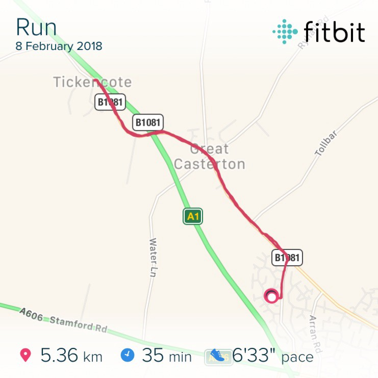

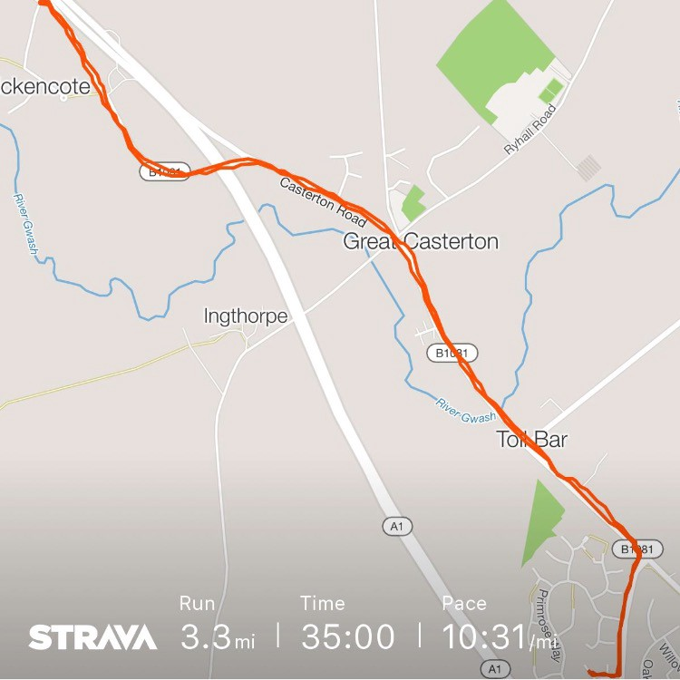

As inspiration, here’s an example route from Fitbit and Strava

The idea I have in mind is one that features the actual route data and statistics from my run; much like an improved version of the route snapshots offered by the Fitbit or Strava apps, and combining that with overlaid graphics and the actual maps.

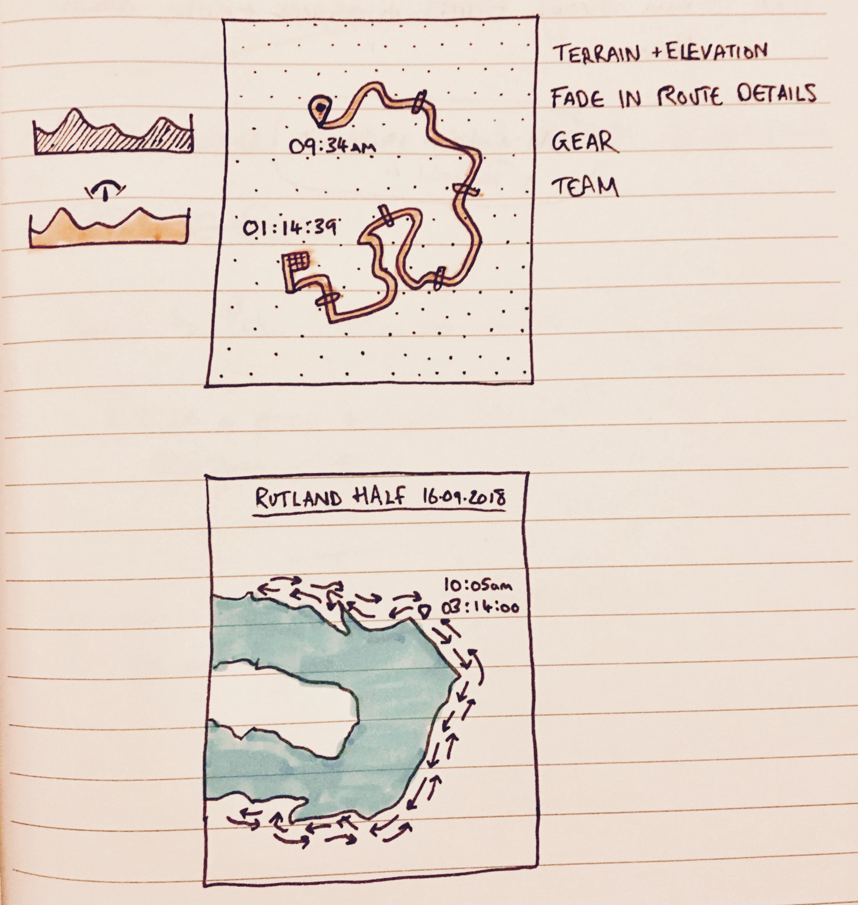

Early early sketchbook ideas for the final output.

With an idea set, it’s time to start working on some code. Obviously as a one-off poster it would be more efficient to have a tool like Illustrator to make something special, but I’m more interested in the coding and development side of things, so I’m going to build the whole project in Javascript.

#### Getting route data 📍

I’m not really interested in plotting a route manually. I’m already using my Fitbit to track my routes, so it makes sense to try and use that existing data. As it transpires that’s pretty easy because Fitbit allows you to export your own data as a [TCX file.](https://en.wikipedia.org/wiki/Training_Center_XML)

That TCX file is fairly easy to read with Javascript, it’s just an XML document ([example here](https://developer.garmin.com/downloads/connect-api/sample_file.tcx)) which can be loaded using the [xml2js](https://github.com/Leonidas-from-XIV/node-xml2js) package. From that file I can extract the geolocation coordinates from the run, one data point for each minute of the run.

#### Validating the extracted route data

Next I need to look at rendering that data in a meaningful way. To sanity check the data I’ve extracted from the TCX file, I’m going to combine it with an existing mapping tool and see what it looks like.

#### Getting static image maps

I’ve ended up using [Mapbox](https://www.mapbox.com/) as my data source for the actual maps. For a first pass I want to try something simple, like grabbing a static image of the relevant part of my route. Mapbox has a static maps API, which means that all I really need to do is specify a centerpoint for the map and a zoom level, and it will return me an image for that location.

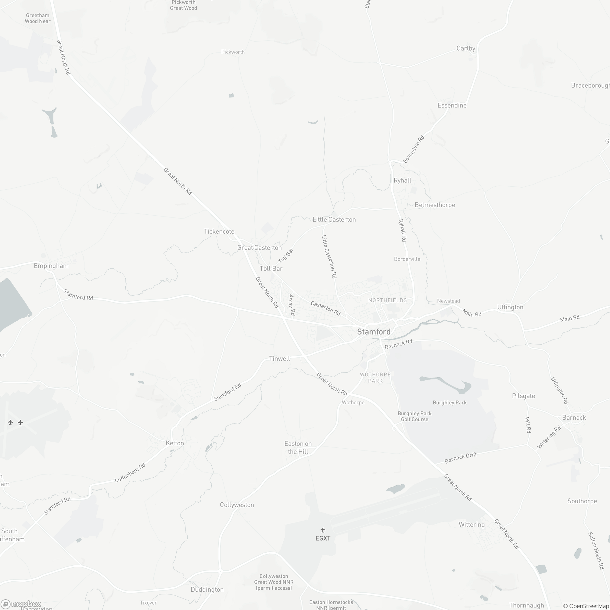

An example static map downloaded from Mapbox.

I passed the extracted TCX route data through the [Node.js geolib library](https://github.com/manuelbieh/Geolib), which calculated the exact centre from my list of coordinates and the appropriate zoom level for a map that contained those coordinates, and received the image shown above. No actual ‘route’ overlay yet, but that proves that the extracted geolocation data from the TCX file is accurate.

Unfortunately, for generating maps that are of a high enough quality to print as an A2 poster, static bitmaps aren’t good enough. What I really need is vector-based maps instead of image tiles, so that’s where I’m going next.

#### Moving to vector map tiles

In addition to its Static Maps API, Mapbox also has an endpoint for Vector Tiles data, which is where it starts to get interesting. Vector-based maps should scale flawlessly to whatever size are needed for printing, and if I could render these map tiles then adding new markers to those maps and plotting the route itself should be a much simpler process. Much simpler than accurately drawing an overlay over a static background image, anyway.

#### Vector Map data

Bitmap images work great at the resolution they’re designed for, but they don’t scale well. And although I could theoretically generate bitmap images at the correct resolution to print at 300 DPI, I’d rather have a proper vector output to go for really high-quality professional printing — something like a Encapsulated PostScript (EPS) sounds ideal, but Scalable Vector Graphics (SVG) would also do fine.

Taking a look at Mapbox’s own Javascript-powered browser based library [(Mapbox GL JS)](https://www.mapbox.com/mapbox-gl-js/api/), what they’re doing is rendering the maps to an HTML Canvas element and getting the source data from the Vector Tiles API. Dynamically rendering the map tiles to a canvas element makes the output highly performant, but it also means that the output is also well insulated and impossible for me to simply extract from any existing renderer. The challenge then is to take whatever data the Vector Tiles API provides and convert that into something I can work with — essentially, my own stripped-down renderer.

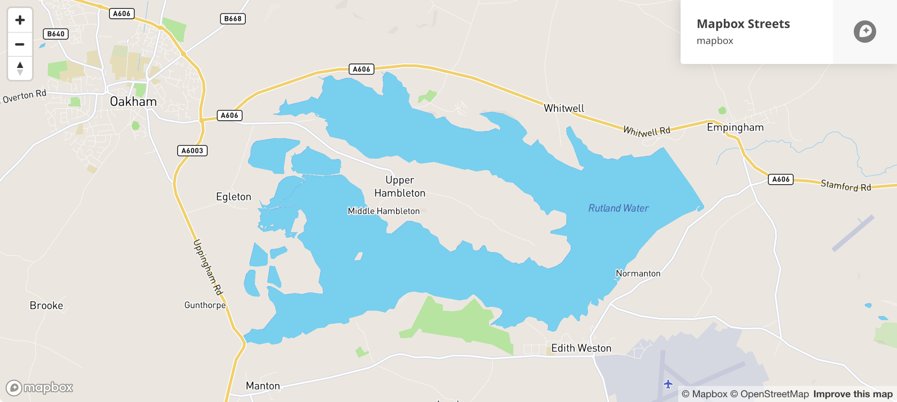

A snapshot of the Mapbox GL JS output.

If I was interested enough, I’d go and read something like the [Vector Tiles specification,](https://github.com/mapbox/vector-tile-spec/tree/master/2.1) but that’s a bit hardcore. Instead I’m going to just start hacking away, and see where it all ends up.

#### Unpacking MVT data responses

Foolishly I assumed that the API response from Mapbox would be comprehensible with normal Javascript. I was expecting to see something like an SVG or GeoJSON data response, but instead I get this:

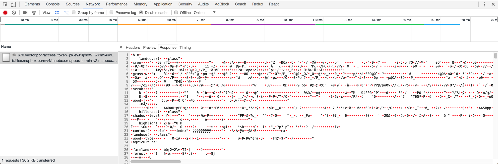

Ugh. Total gibberish.

Fortunately this is actually explained in [the documentation](https://www.mapbox.com/vector-tiles/specification/#format). The API response is apparently an encoded [Protobuf](https://github.com/google/protobuf) format, which is a clever way of serializing structured data. So all I’ve got to do is deserialize that data and it should be comprehensible. There’s actually a fascinatingly complex amount of optimisation that goes into the MVT format used by Mapbox, which I’d recommend reading more about in [the documentation,](https://www.mapbox.com/vector-tiles/specification/#encoding-geom) if you’re so inclined.

Naturally there’s an existing library (or two or three) to help with that conversion process from MVT to GeoJSON. After a few false starts I ended up using the [vt2geojson](https://github.com/mapbox/vt2geojson) library, which automagically unpacks the API responses and delivers them as GeoJSON objects that I can work with in Javascript. [(See an example decoded response as a Gist here.)](https://gist.github.com/psyked/e531f079f2462637fc976274a283141b)

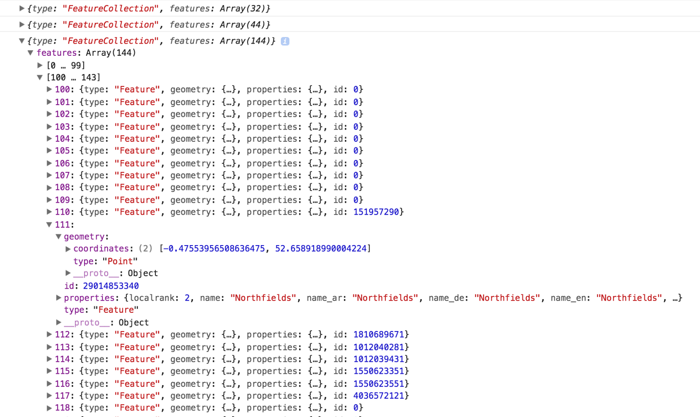

The resulting decoded GeoJSON data object from a MVT response.

The decoded GeoJSON data has an amazing level of detail to it and is composed of geometry information, identifying labels, categorisation and a few other things — everything you could need to render a map.

#### Plotting a basic map with D3

At last, I have enough data to start drawing something useful. The big question is… how? What I’ve got is a load of data points which are all longitude and latitude coordinates, but that doesn’t naturally translate into normal x and y coordinates for rendering on screen.

It’s unlikely to really matter at the scales my map is going to be drawn, but projecting geography to a 2D plane is not quite as straightforward as you might imagine.

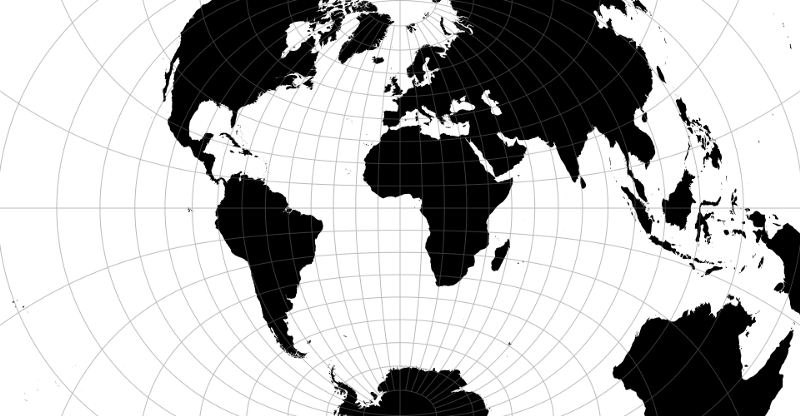

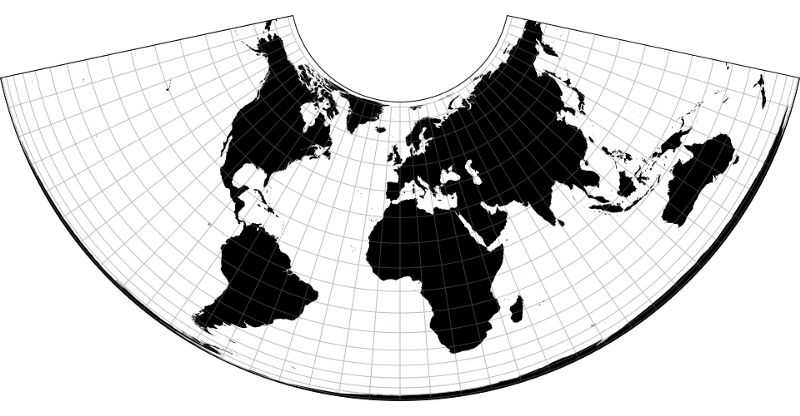

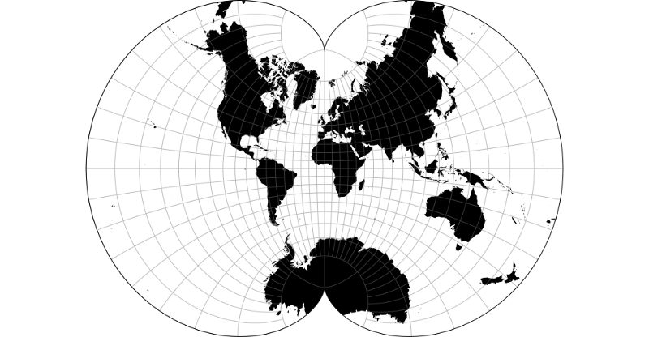

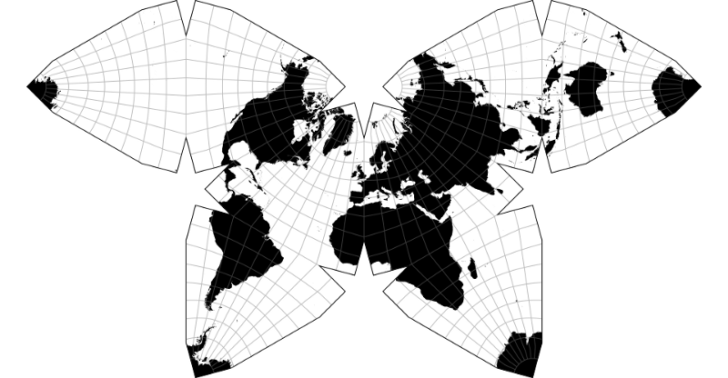

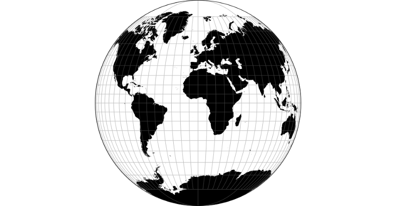

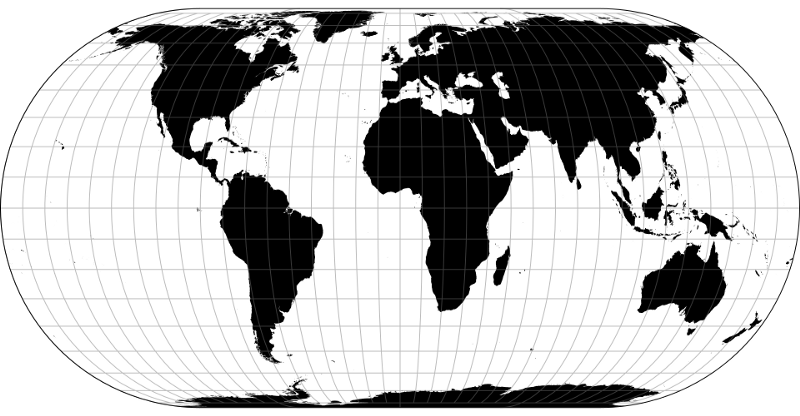

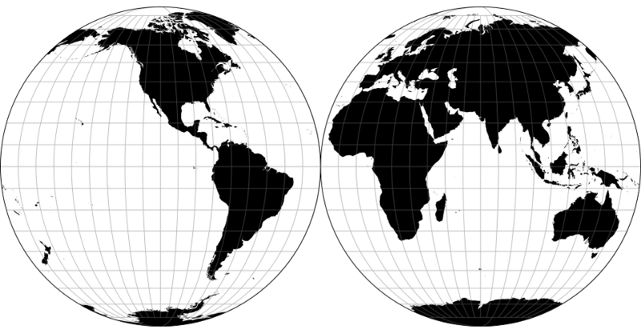

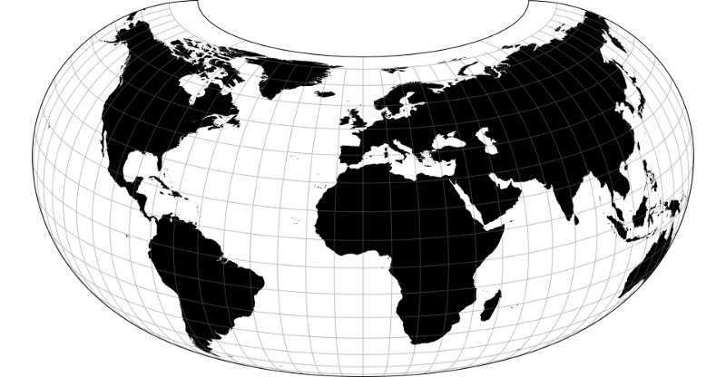

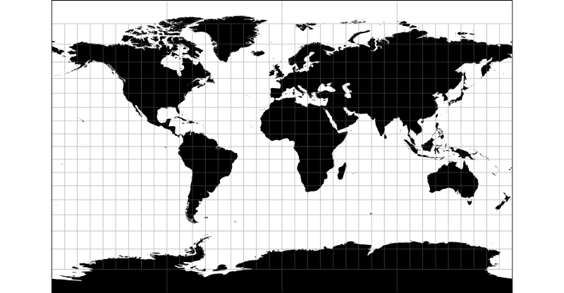

A few of the map projections available from the D3 Geo Projection library, because they’re visually interesting.

[D3.js](https://d3js.org/) has a lot of useful utilities, with map projection and tile slice helpers amongst them, along with plenty of tools geared towards working with and generating SVG assets. Compared to the complexity of writing my own code, and the amount of things I don’t understand about how to draw a map with code, D3 offers the tantalising promise of making things ludicrously simple.

The downside to D3 is that I can’t seem to make it work with Node.js. Yes, it’s all still Javascript, but D3 is geared towards running in a browser and not on a server, so quite a few bits of code don’t work as expected. All of my code so far has been server-side, but to make any progress it seems like I need to switch.

Borrowing heavily from some examples from the D3 documentation I’m able to draw a map in the browser, one that uses GeoJSON data converted from the MVT formatted response extracted from the Mapbox API.

GeoJSON generated from Mapbox Vector Tiles, and rendered as SVG by D3.js

The output is an SVG image containing path elements and basic shapes, but at the moment it’s just a jumbled mess of geography, completely free of any styling to make the map actually readable. To make anything visible, I’ve added the some basic CSS styles, which the generated SVG inherits.

path {  
    fill: none;  
    stroke: #000;  
    stroke-linejoin: round;  
    stroke-linecap: round;  
    stroke-width: .5px;  
}

#### Rendering a half-decent map

It’s getting tantalisingly close, now that I can start recognising geography. But there’s also a lot of noise and unwanted information, and no weighting or visual indicators of what the map actually contains.

Fortunately the GeoJSON data still contains this information, and with a few tweaks to the D3 code I can generate SVG shapes with classes that reflect their type, and then start expanding the CSS stylesheet with styles like these:

.river,.canal {  
    stroke-width: 2px;  
}  
.stream_intermittent,.track,.fence {  
    stroke-dasharray: 3, 3;  
}  
.river,.canal,.stream,.stream_intermittent,.drain,.ditch {  
    stroke: #1C8FE8;  
}  
.major_rail {  
    stroke: #F45B69;  
}

With enough styles and tweaking, I can eventually produce an output map that’s way more aesthetically pleasing, like this:

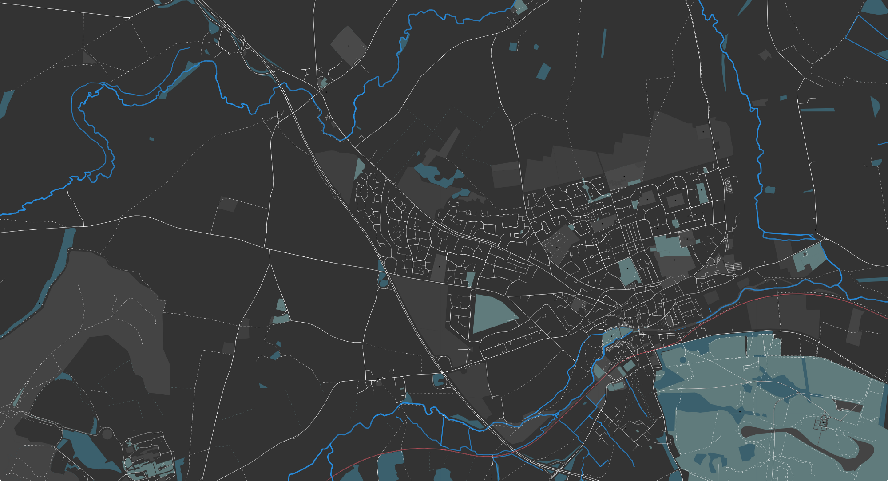

The same SVG as before, with some better CSS styles attached

#### Plotting a route overlay

Now that I’ve got a decent map, I can get on to plotting my route data from Fitbit on top of it. Refreshingly that’s actually turned out to be quite easy, no small thanks to everything I’ve learnt so far in this process.

If you recall, before I even looked at drawing the underlying map I’d already extracted a list of geolocation data points from the TCX file that I got from Fitbit. With the help of D3 it’s a simple process to create a new path element from those data points and insert it into the existing SVG map, give it a custom class and styles, just like the map has classes for roads and rivers, and just like that, I have my route data plotted as an overlay. ✨

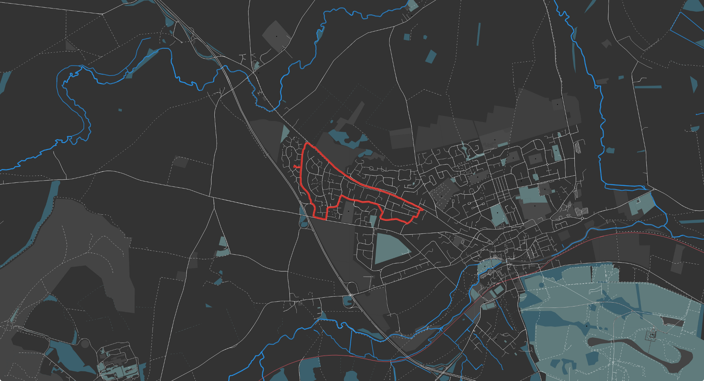

The ‘final’ generated map, complete with route data exported from Fitbit

### What’s next?

This is as far as I’ve got with this little side project. My original objective of having something that’s print-worthy still remains, but the visuals are still a long way off where I’d like them to be for the final poster.

Iconography and labels are my next big challenges, I think. Plotting a few icons on the map sounds easy enough, but I’d like to be able to automatically, intelligently annotate any route I upload. Something like that sounds complicated though — it would require going a step further and doing some kind of shape hitbox detection to avoid overlapping icons with the route, or with other icons. And labels. I’d never quite appreciated how complex labelling a road or a point of interest would be on a map, if you want to avoid overlapping labels or if you want labels to follow a road. This is going to take some effort to progress further!

---

That’s the end of it for now. I’ve paused this project in favour of some other new and shiny side-project ideas, but I hope that at some point in the future I hope to come back to this project, finish it and get my own lovingly-generated poster printed.