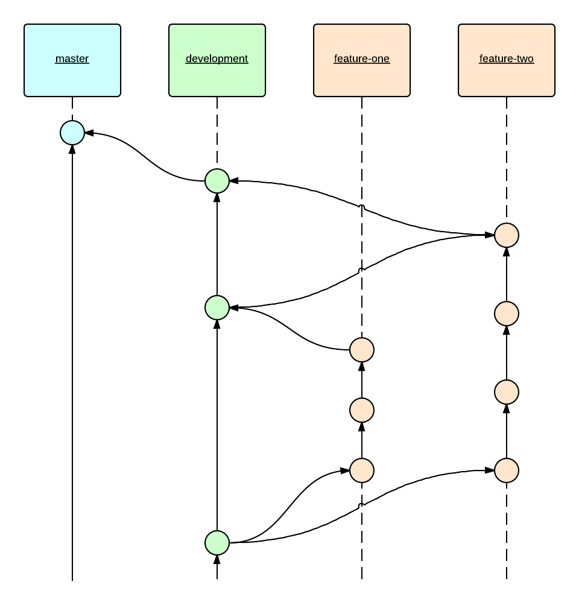

  

# Git Zero to Git Hero

## Mastering git requires a mentor. Let me be yours.

---

### Getting started with git

If reading is your thing, be sure to check out these ‘git basics’ guides. All of them cover the same content, but with a slightly different angle.

[**Hello World**  
_The Hello World project is a time-honored tradition in computer programming. It is a simple exercise that gets you…_guides.github.com](/media/58e65ed920f507c169efa0796735d1fe/href "/media/58e65ed920f507c169efa0796735d1fe/href")

[**Get Started with Git**  
_Version control: It isn't just for coders anymore. If you're a writer, editor, or a designer who works iteratively on…_alistapart.com](/media/53f2738abfe700c0382b55f3f2268b2d/href "/media/53f2738abfe700c0382b55f3f2268b2d/href")

[**git - the simple guide**  
_just a simple guide for getting started with git. no deep shit ;)_rogerdudler.github.io](/media/d2d4b521c465fac945bc66f0f6cf51e4/href "/media/d2d4b521c465fac945bc66f0f6cf51e4/href")

[**Git Basics Course**  
_If you're serious about pursuing a career as a software developer or designer, at some point, you will need to learn a…_teamtreehouse.com](/media/b39b5cff0d1c976708c8cbe59e3de05b/href "/media/b39b5cff0d1c976708c8cbe59e3de05b/href")

Okay, so you’ve got the basics. The next question is, how do you improve your git technique and become a git master?

### Write better commit messages

Your commit messages exist for _you_ and _your benefit_, so you’re doing yourself a disservice to not be writing them in a way that will actually be useful to you in a year, six months, a week, a day or even an hour.

Go out and write yourself the best darn messages you can, all the time, with the help of this post from Tim Pope:

[**A Note About Git Commit Messages**  
_I want to take a moment to elaborate on what makes a well formed commit message. I think the best practices for commit…_tbaggery.com](/media/7b777ea6d7eaf587890e2fb9046e5d67/href "/media/7b777ea6d7eaf587890e2fb9046e5d67/href")

### Branches and branching strategy

A solid understanding of branching will make sure that your commit logs actually make sense historically, allows you to work with parallel versions of your source code and keep your master branch focussed, neat and tidy.

Our recommended branching ‘strategy’ is:

*   The **master** branch represents your _stable_ release.
*   The **development** branch is for your _work in progress._
*   Individual **features** should be developed in their own branch.
*   **Features** are branched from the **development** branch.
*   _Completed_ **features** are merged into the **development** branch.
*   _Stable_ **development** branches get merged into the **master** branch.

To help solidify your knowledge about branches, have a play with this tool:

[**Learn Git Branching**  
_A interactive Git visualization tool to educate and challenge!_pcottle.github.io](/media/aa4eedfaa49a2021a756d048590a572d/href "/media/aa4eedfaa49a2021a756d048590a572d/href")

### Craft your commits

> “A commit, like a well-designed function or class, should represent a single concept. A distinct, cohesive commit is easy to understand, review, and, if necessary, revert.”

The real world of development is a little messy, but your source code and your git commits don’t have to represent this, and you can perfect the contents of your commit as you make it, so that your commit meets these goals — distinct, cohesive and focussed.

[**Crafting Commits in Git**  
_A commit, like a well-designed function or class, should represent a single concept. A distinct, cohesive commit is…_blog.carbonfive.com](/media/88a3f2bb89a9828647ec8230824ce7a0/href "/media/88a3f2bb89a9828647ec8230824ce7a0/href")

[**Git - Interactive Staging**  
_Interactive Staging Git comes with a couple of scripts that make some command-line tasks easier. Here, you'll look at a…_git-scm.com](/media/2d4732534c6ac26bd77330b17ae46fa8/href "/media/2d4732534c6ac26bd77330b17ae46fa8/href")

### Use an IDE, like SourceTree

Does branching get you down, and crafting commit messages seem a little overly complex? Learning the basics with the ‘good old console’ has its advantages, but you don’t have to suffer doing things the _hard way_ all the time. Using a more advanced desktop application gives you a much easier way to visualise your code changes and craft your commits, without all the complexity of its command-line counterpart.

[**Free Mercurial and Git Client for Windows and Mac | Atlassian SourceTree**  
_SourceTree is a free Mercurial and Git Client for Windows and Mac that provides a graphical interface for your Hg and…_www.sourcetreeapp.com](/media/29ff2f4ddc8ea24a9a337da2166b951d/href "/media/29ff2f4ddc8ea24a9a337da2166b951d/href")