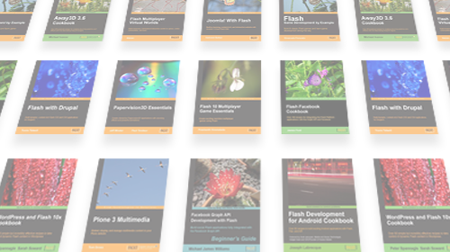

Is there a book you'd like to see about Flash or ActionScript development?

Well, now's your chance to make it happen - they've a call for suggestions open to everyone, which you can participate in by visiting the URL [http://www.google.com/moderator/#16/e=8e0cc](http://www.google.com/moderator/#16/e=8e0cc "Open the Packt Flash call for suggestions in a new window.") and signing up. It uses **Google Moderator**, which allows you to vote for, and submit new suggestions for new book titles.