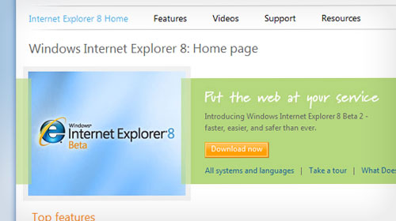

### Or to be more specific, what the hell are the "Accelerators" and the "Web Slices"?

You can download the Internet Explorer 8 Beta from [http://www.microsoft.com/windows/internet-explorer/beta/default.aspx](http://www.microsoft.com/windows/internet-explorer/beta/default.aspx).  Overall, it's quite an interesting update - and most noticeably it shows a distinct push on the innovation front.  Since I'm talking about it, I'll go over a few of the noticeable new features, and then get onto the specifics of the "accelerator" and "web slices" features.

### Imitation

Is the sincerest form of flattery, you know.  IE8 maintains a lot of the IE7 layout, but it has a lot of features that look like they've been ripped right out of Google Chrome - right down to the naming conventions and feature sets.  They've even toned down the shiny 'Web 2.0' graphics for more flat graphics, and used colour-coded tabs and warnings.  It's looking promising for developers too - instead of the development tools being an add-on, they're built into the application.  There's a developer panel with the hierarchical information and inheritance patterns like which Firebug gives Firefox, and the system memory profiling that Chrome offers users.  It's like Christmas come early.

Oh, and there's 'InPrivate' browsing, aka 'Incognito', aka 'porn-mode'.

### Innovation

It appears that Microsoft aren't content to just sit around poaching ideas from other browsers, either.  Some of the new features are called '[Accelerators](http://www.microsoft.com/windows/internet-explorer/beta/features/accelerators.aspx)' and '[Web Slices](http://www.microsoft.com/windows/internet-explorer/beta/features/web-slices.aspx)'.  Never heard of them?  Nope, neither had I.  And neither had many other people - presumably because this appears to all be powered by a new Microsoft-invented technology.

### What are Accelerators?

Well, it seems like Accelerators are an enhanced form of the [OpenSearch](http://www.opensearch.org/Home) microformat - the one that powers that search box in the top right hand of Internet Explorer and Firefox.  Only now, with a bit of browser integration jiggery-pokery, you can have your search results accessible from the right-click menu of the browser.

You can read all about the technology behind Accelerators (imaginatively called OpenService) at the MSDN site: [http://msdn.microsoft.com/en-us/library/cc304166(VS.85).aspx](http://msdn.microsoft.com/en-us/library/cc304166(VS.85).aspx)

### What are Web Slices?

It looks like these are an enhanced form of the good old bookmark.  They certainly seem to appear in the same place as the good old bookmark.  What's different is that they have a preview window associated with them, and presumably from the development side of things you first have to make a stand-alone portion of the page that can be loaded (much like you would an AJAX page I guess) and then add the IE-specific browser integration stuff to your HTML pages.

You can read the Microsoft Developer Network documentation and tutorials at: [http://msdn.microsoft.com/en-us/library/cc956158(VS.85).aspx](http://msdn.microsoft.com/en-us/library/cc956158(VS.85).aspx)

### Demo:

If you've got Internet Explorer 8, then you might want to check out the IE8-enabled ebay demo page: [http://ie8.ebay.com/](http://ie8.ebay.com/)

### What do I think of them?

I'm a bit wary of these new features, and what they represent for developers.  We bemoan Internet Explorer for not innovating, but when they do start innovating they bring in all kinds of new formats and technologies which they've made themselves.  Which then means we have to go making browser-specific scripts and hacks to make everything work... which we'll moan even more about - after all, we've spent years building around the existing differences in browsers, and have only recently managed to lumber into the light of universal, cross platform, technologies.  And then they throw more in the mix!

In addition to that, I find the whole iconised-rollover thing that the Web Slices have going on is a bit over the top, and will likely annoy the hell out of me if I start seeing it pop up everywhere.  Maybe that's just the Ebay demo page, but I don't like the idea.  But then, maybe I'm just disliking change because it's change.

And the Accelerators?  Nice idea, but a little over the top on the right-click menu, if you ask me.

That's not to say the ideas are bad or not useful, just more that I don't like them.  Yet.