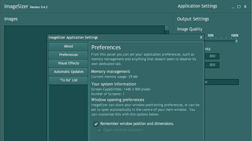
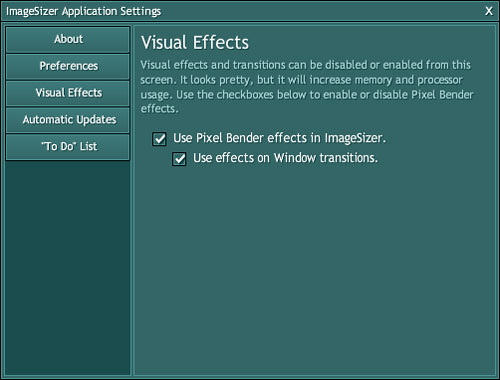
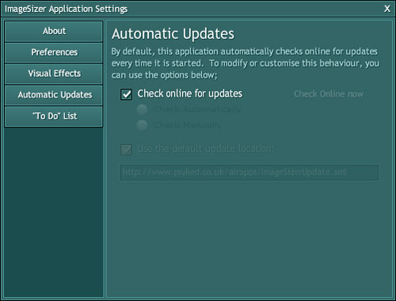

Well, I'm a bit slack on the whole updates front - ImageSizer 0.4.0 and 0.4.1 have already slipped under the radar without a blog post - but with the latest release I thought I'd draw a little attention to it, not least because it fixes a bit an annoying bug that I introduced in version 0.4.1!

### So, what's new in the latest version?

Well, one of the things that I've found a lot of AIR applications are missing at the moment, is the ability to configure their settings - particulary those things mentioned by Serge Jespers in his post: **"6 AIR features that may annoy your users"** \[[link](http://www.webkitchen.be/2008/12/17/best-practices-6-air-features-that-may-annoy-your-users/)\].  Back with version 0.3.10 I introduced some Pixel Bender filters to the application.  Version 0.4 introduced the Application Settings window - although it only appeared to work.  Version 0.4.1 expanded on this by introducing some backend code that actually stored the settings, but had a glaring typo that meant the whole thing didn't work.  Version 0.4.2 in short, fixes this.

### So, what settings have we introduced?

**Remembering window position and dimensions;**
****

**Visual Effects;**

****

**Automatic Updates;**

****

### Download ImageSizer 0.4.2

<object width="215" height="180" data="/airapps/AIRInstallBadge.swf" type="application/x-shockwave-flash"><param name="flashvars" value="airversion=1.5&amp;appname=ImageSizer&amp;appurl=http://psyked.co.uk/airapps/ImageSizer042.air&amp;appid=couk.psyked.ImageSizer&amp;pubid=07510AB144CCA2FB1C33EE50283E9A7AD43F7966.1&amp;appversion=0.4.2&amp;titlecolor=#339999" /><param name="src" value="/airapps/AIRInstallBadge.swf" /></object>

### Known issues:

Unfortunately, no sooner than I'd released this version, I noticed another problem with it.  Or potential problem with it.  I haven't built in any defaults to the application.  So my clever code to enable users to turn off the automatic updates now means that - because there's no settings existing - the automatic updates will be turned off.  Ideally, it should remain turned on!  Darn those logical errors!

My next things to explore are **"Start on Login"**, **"System Tray/Dock Icons"** and **"Google Analytics tracking"**.