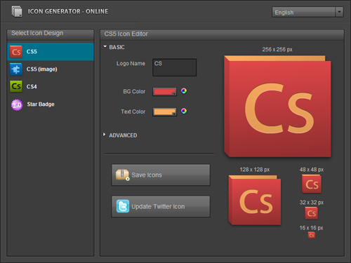

[

I love this application, Icon Generator Pro.  It's simple, but sometimes that's a good thing in an application, means it has focus - if you're going to do something, do it properly - that's one of the benefits of AIR, it makes it simple to create applications just like this.

What the application actually does is just generate images in a few specific formats, output the files (in a format useful for your own AIR applications) and even, from the looks of it, replace your Twitter icon with your new file.

If you haven't seen the earlier version of this application, its still available from the AIR Marketplace [\[link\]](http://www.adobe.com/cfusion/marketplace/index.cfm?event=marketplace.offering&offeringid=10313&marketplaceid=1), and the newer version, Icon Generator Pro is available from [http://icon-generator.net/](http://icon-generator.net/).