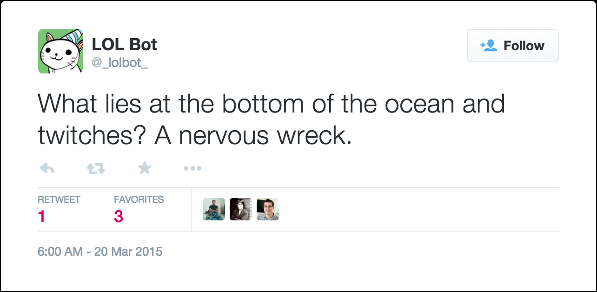
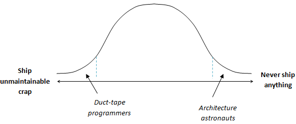
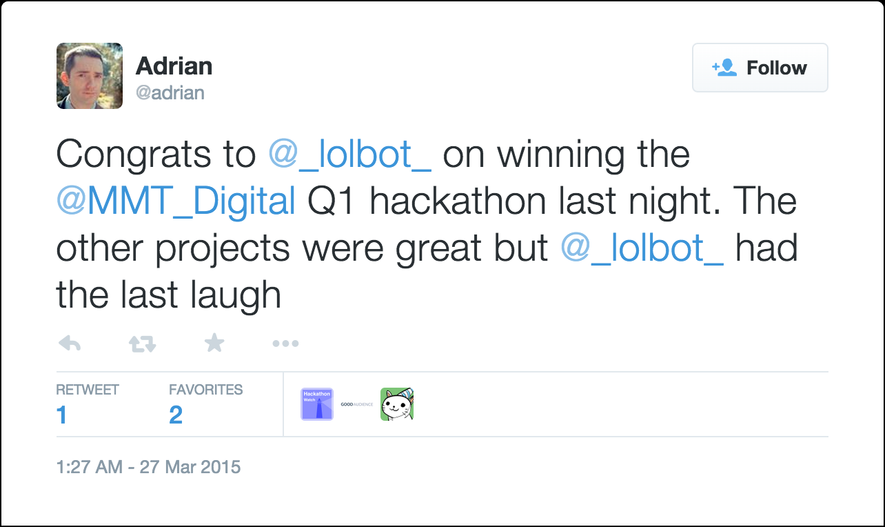

  

# Project LOLBot or: How I Learned to Stop Worrying and Love My M.V.P.

[Title image (c) 2010 Jonathunder](http://commons.wikimedia.org/wiki/File:SoapboxRace.jpg)

---

> It’s recently been Hackathon time again at MMT Digital, which gave [@ben_squire](https://twitter.com/ben_squire) and myself ([@psyked](https://twitter.com/psyked)) a fantastic opportunity to work together on something completely different and fun. This time we developed [@\_lolbot\_](https://twitter.com/_lolbot_), our own friendly joke-telling robot.

---

### Motivation(s)

Sometimes work gets a bit too dull and serious, and in those moments it’s refreshing and enjoyable to have something make you laugh out loud.

For our Hackathon, we decided to develop a joke-telling bot for Slack — and ideally, Twitter — using whatever technologies worked best.

Much LOLs were had: [https://twitter.com/\_lolbot\_/status/578903822652801024](https://twitter.com/_lolbot_/status/578903822652801024)

Neither the jokes themselves, nor the smartness of the bot, really matters at this point — we’ve never built a bot before, and never worked with Twitter or Slack, so it’s all new territory for us.

### Focus

When planning a project, particularly a ‘simple’ one, it’s all too easy to oversimplify the solution and underestimate its complexity. When that happens you end up planning a project which you don’t have time to complete, you (inadvertently) introduce feature creep and you introduce risks to your success.

  

> With the limited timescale presented by a 15-hour Hackathon, mastering the art of always delivering an M.V.P. is the logical route to success.

---

Working with a limited timeframe is where the idea of an M.V.P. _(Minimum Viable Product)_ really shines.

The theory is that by concentrating on developing an M.V.P. and shipping it, we’ll get our product to market as soon as possible, and maintaining the M.V.P. mentality during development we’ll be able to quickly adapt and change the scope of the project to ensure its success with customers.

I think it’s fair to say that software developers generally are not fans of being told they should develop _minimal_ code — we have too much pride in our own code to be satisfied with ‘cheap’ code, and are much more satisfied by things like pushing the boundaries of our knowledge and developing beautifully architected, elegant solutions to problems.

#### Fig 1: M.V.P. vs. Perfect code.

Richard Dingwall’s article on Duct-tape programmers discusses why we dislike shipping ‘cheap’ code: [http://richarddingwall.name/2009/09/24/duct-tape-programmers-ship-once/](http://richarddingwall.name/2009/09/24/duct-tape-programmers-ship-once/)

  

## The Results are in.

#### Best laid plans, as they say. So, how did it go?

---

As it happens, avoiding our instincts to develop _perfect code_ and just throw together code _that does the job_ worked really well. Where other teams spent the first three-hour session architecting and designing their solutions, we jumped straight into the code and actually got some releasable code in just under one session. It may not be pretty, but at least it’s out there!

---

Here’s a more detailed summary of what we achieved:

#### Week 1

*   Keyword detection
*   Integration with external, x3 public jokes API
*   Slack integration
*   Twitter integration
*   24/7 running on server

#### Week 2

*   Google Spreadsheets integration as database host
*   Per-channel de-duplication of jokes
*   Available jokes x4
*   New command: **tell {target} a joke**
*   Reply syntax improvements

#### Week 3

*   Scheduled jokes
*   Drop support for ‘yo momma’ & ‘chuck norris’ jokes
*   MongoDB Migration
*   New command: **/status**

#### Week 4

*   Submission & approval process
*   Channel targeting commands
*   Custom messages
*   Event / activity tracking via Google Analytics

#### Week 5

*   **/help** mode
*   Improvements to Google Analytics
*   More channel targeting

---

And the end result?

Ultimately it was a good experience — we smashed our initial project goal, we were able to focus on delivering a rapid series of releases, we changed and adapted the project to introduce features that your beta testers requested, and we had enormous amounts of fun doing so.

---

@lolbot is currently active and telling jokes in our company Slack account, and is publicly available on Twitter at [http://twitter.com/\_lolbot\_](http://twitter.com/_lolbot_)