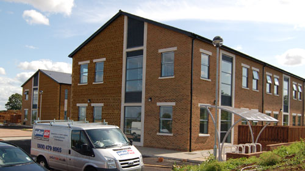

[

An event more entertaining than BBC's "Strictly come dancing", more thrilling than debugging year-old code, [MMT Digital](http://www.mmtdigital.co.uk) is moving to brand spanking new offices.

An official Press Release will be making its way online next week, with more pictures, but for now (and until I update again) check out what the site looked like [only 4 months ago...](http://www.mmtdigital.co.uk/RVE629007bff1284be79f1b3c1b3d0ef9ea,,.aspx)

Our old ones have served the company well for 8 years, played host to 47 different employees and seen us through the original dot-com bubble.  But now we've run out of room for expansion, got fed up with having the teams split across different rooms in the building, lost patience with the inability to get more than 512kb/s broadband - and have snapped up a block in a new business development a mile or so down the road in Uppingham.

Our shiny new offices have been built over the past 9 months, decked out by interior designers for four weeks, and will be ready to move into on Monday, all going to plan.  Goodbye old haunted house - hello shiny offices, with your glass partitions, WiFi compatible internal walls and, hopefully, decent internet connection!

As for what it looks like, it's all been kept a surprise by the interior decorators, so we'll see what it looks like on Monday - and just pray that we can get someone competent from BT to transfer our broadband account, or we're going to be a little stuck on Monday morning.