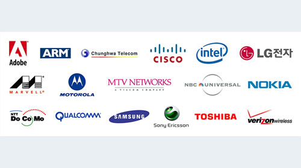

Madness in a good way, of course. Like all those people who queue outside stores before the sales? That's the good kind of madness. That's the madness I mean. (And I couldn't think of a more interesting Post title, and apparently, provocative Post titles are good for readership)

Adobe are at it again, it seems. You may remember that the [flex sdk went open-source](http://www.psyked.co.uk/adobe/flex/flex-goes-open-source-what-does-this-mean.htm "Open link in a new window") just over a year ago, and now the swf and flv formats themselves are going open source. Here is [the press-release](http://www.adobe.com/aboutadobe/pressroom/pressreleases/200804/050108AdobeOSP.html), and here's [the official site for the "Open Screen Project"](http://www.adobe.com/openscreenproject/ "Open link in a new window").

## So, what is the Open Screen Project, and why do we care?

Well, it's pretty exciting, especially for a Flash Developer. We've rapidly gone from animation to application, to desktop application. And before we've even got settled with that, we've got the potential to go truly universal.

## 1a : Open source.

That's interesting, but from my point of view the Flex SDK (although it's taken a year for me switch to using an Open Source editor) has already sorted this element. Don't get me wrong, its great that it's going Open Source - it's just that it takes a while for something exceptional to appear as a result of this \[- people have to develop them, you know!\] We can get excited about this later on. I imagine many more Video editing environments will start including FLV encoding options, but I can't see any obvious uses for the swf format.

## 1b : License restrictions removal.

Okay, this really goes hand-in-hand with the Open source - it just seems a logical step. Can you imagine the confusion that an open source project with license restrictions would cause? Besides, license restrictions would only hurt their "1 billion devices by 2009" target. But there's one point in particular that interests me, one I thought of almost immediately after reading the first announcement;

## 2 : Device porting.

> "\[Adobe is\] also planning to publish the device porting layer APIs for the Flash Player." ([Ryan Stewart](http://blog.digitalbackcountry.com/ "Open link in a new window"))

This is a major step out from their normal territory. The rapid advancement of technological devices means that shiny new phone you've got isn't far off that old desktop machine you had 8 years ago. The XBox 360, Playstation 3, your Digital TV recorder - they've all got the oomph to run Flash. Hell, if Apple and Adobe would agree you'd have it on your iPhone.

All that's lacking is support for whatever hardware / OS the device is running on. So if you imagine that Adobe would release some tools - any tools - and encourage other companies and manufacturers to develop their own specific versions of the Flash player, it shouldn't be long before we start seeing Flash everywhere.

> "The project is dedicated to driving rich Internet experiences across televisions, personal computers, mobile devices, and consumer electronics." ([Press Release](http://www.adobe.com/aboutadobe/pressroom/pressreleases/200804/050108AdobeOSP.html "Open link in a new window"))

I'd love a newer version of the Flash Player on my PS3, or a snazzy digi-box interface - or some Youtube flv's streaming directly to my phone. Now all we need is some companies /manufacturers to buy into it...

## 3 : The lineup.

*   BBC
*   Cisco
*   Intel
*   LG Electronics Inc.
*   Motorola
*   MTV Networks
*   NBC Universal
*   Nokia
*   Samsung Electronics Co.
*   Sony Ericsson
*   Toshiba
*   Verizon Wireless

That's an impressive lineup. And I think it's safe to say that if these guys are supporting Adobe in this, looking at their industries, then they're going into it like an arms race. LG sure won't want Samsung to develop something impressive without having their own, just like Nokia, Motorola and Sony Ericsson won't want their competition developing a better Mobile Flash player. So perhaps the developments won't be as slow as I first thought.

## What is it with Open-source, anyway?

Well you know, besides the community development, improvements, that sort of thing.

You might think that being the sole distributor/developer of a runtime which has 98% market distribution would be pretty sweet. I'm sure it is. But I guess there's a serious business reason for opening up your proprietary file formats - and it's not just to stop others from reverse-engineering your systems.

A single, universal, file-format would be a godsend as far as those that delve into the murky waters of HTML and CSS are concerned. Adobe is in the position - with its user base, development base, and the kudos of the company itself - to seriously establish the Flash player as a universal runtime.

**Have Adobe realised that the Flash player has grown beyond even Adobe?**

Flash has an entire subset of the web development industry devoted to it - broadening their capabilities is only get these guys more work - and the more they develop, the more people it reaches. If making things open source is the fastest, easiest way to make this happen, then so be it.

Or are they just deploying countermeasures to stave off the EU competition commission?

## External links / Sources

*   [Adobe drops restrictions on SWF, FLV formats](http://www.mikechambers.com/blog/2008/05/01/adobe-drops-restrictions-on-swf-flv-formats/ "Permanent Link to Adobe drops restrictions on SWF, FLV formats")
*   [Big news: Flash goes completely open!](http://aralbalkan.com/1332 "Permanent Link to ")
*   [Adobe Announces Open Screen Project 2008](http://flashmobileblog.com/?p=91 "Permanent Link to ")
*   [Adobe Open Screen Project - Open Specifications and Open Technology to Help Expand Flash Player Reach](http://blog.digitalbackcountry.com/?p=1404)
*   [Adobe and Industry Leaders Establish Open Screen Project](http://www.adobe.com/aboutadobe/pressroom/pressreleases/200804/050108AdobeOSP.html)
*   [Learn about Open Screen Project for designers and developers](http://www.adobe.com/openscreenproject/developers/)